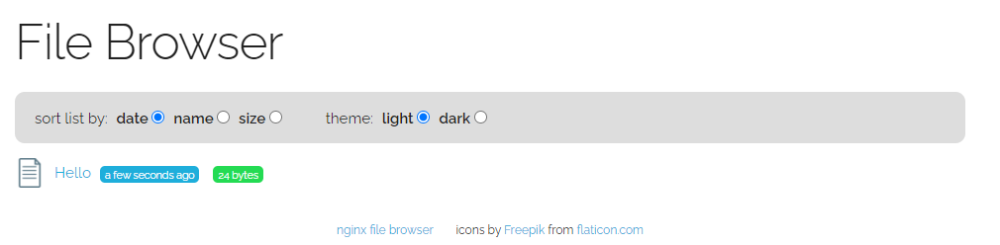

# Ocean Hands-on 에 사용할 App을 배포

Ocean Hands-on 에 사용할 app을 배포합니다.

1. [BastionHost에 ssh로 접속](../../QuickStart/ConnectToBastion.md)합니다.
2. [EKS 접속을 위해 kubeconfig 작성](../../QuickStart/ConnectedEKSforkubectl.md)합니다.
3. bastionhost 서버의 /opt/DeployTestapp/nginx-file-browser 폴더로 이동합니다.

```
cd /opt/DeployTestapp/nginx-file-browser
```

4. apply 명령을 어플리케이션을 배포합니다.

```
kubectl apply -f default-nginx-file-browser.yaml
```

```bash
[root@ip-172-30-0-109 ngrinder]# k apply -f default-nginx-file-browser.yaml
service/spotadmin-eks-alb created
deployment.apps/nginx-file-bro created
ingress.networking.k8s.io/spotadmin-eks-alb created
```

> ### 경고

> 이 파일은 VM 시작 시 s3에서 파일을 다운로드 하도록 있습니다. </br>
> 다운로드 되지 않은 경우 아래 명령을 통해 다운로드를 시도해주세요.</br>
```sudo su - ```</br>
```aws s3 cp s3://netappkr-wyahn-s3/public/Spot_Admin/DeployTestapp/ /opt/DeployTestapp --recursive```</br>
> 특수한 이유로 해당 명령을 사용하지 못하는 경우 편집기를 열고 해당 파일을 수동으로 작성하세요.</br>

## K8S definition file

### service

nginx-file-browser-service.yaml

```yaml
apiVersion: v1
kind: Service
metadata:
  name: spotadmin-eks-alb
  namespace: default
spec:
  ports:
    - port: 80
      targetPort: 80
      protocol: TCP
  type: NodePort
  selector:
    app: nginx-file-bro
```

### deployment

nginx-file-browser-deployment.yaml

```yaml
apiVersion: apps/v1
kind: Deployment
metadata:
  labels:
    app: nginx-file-bro
    alb: spotadmin-eks-alb
  name: nginx-file-bro
spec:
  replicas: 1
  selector:
    matchLabels:
      app: nginx-file-bro
  template:
    metadata:
      labels:
        app: nginx-file-bro
        alb: spotadmin-eks-alb
    spec:
      containers:
      - image: docker.io/mohamnag/nginx-file-browser:latest
        name: nginx-file-browser
      affinity:
        nodeAffinity:
          requiredDuringSchedulingIgnoredDuringExecution:
            nodeSelectorTerms:
            - matchExpressions:
              - operator: In
                key: purpose
                values:
                - test
```

```bash
kubectl get deployment -o wide
```

```bash
[root@ip-172-30-0-124 nginx-file-browser]# k get deployment -o wide
NAME             READY   UP-TO-DATE   AVAILABLE   AGE   CONTAINERS           IMAGES                                         SELECTOR
nginx-file-bro   1/1     1            1           49s   nginx-file-browser   docker.io/mohamnag/nginx-file-browser:latest   app=nginx-file-bro
```

```
kubectl get svc -o wide
```

```bash
[root@ip-172-30-0-29 ~]# kubectl get svc -o wide
NAME              TYPE        CLUSTER-IP      EXTERNAL-IP   PORT(S)        AGE   SELECTOR
spotadmin-eks-alb   NodePort    10.100.34.181   <none>        80:32085/TCP   10d   app=nginx-file-bro
kubernetes        ClusterIP   10.100.0.1      <none>        443/TCP        10d   <none>
```

### Ingress

nginx-file-browser-ingress.yaml

```yaml
apiVersion: networking.k8s.io/v1
kind: Ingress
metadata:
  annotations:
    alb.ingress.kubernetes.io/group.name: nginx
    alb.ingress.kubernetes.io/load-balancer-name: spotadmin-eks-alb
    alb.ingress.kubernetes.io/scheme: internet-facing
    alb.ingress.kubernetes.io/tags: Name=spotadmin-eks-alb,owner=spotadmin
    alb.ingress.kubernetes.io/target-type: instance
  name: spotadmin-eks-alb
  namespace: default
spec:
  ingressClassName: alb
  rules:
  - http:
      paths:
      - backend:
          service:
            name: spotadmin-eks-alb
            port:
              number: 80
        path: /
        pathType: Prefix
```

```
kubectl get ingress
```

7. kubectl get ingress 명령에서 출력된 외부 도메인을 브라우저에 입력합니다.

```
[ec2-user@ip-172-30-0-101 nginx-file-browser]$ kubectl get ingress
NAME                CLASS   HOSTS   ADDRESS                                                         PORTS   AGE
spotadmin-eks-alb   alb     *       spotadmin-eks-alb-1471538428.ap-northeast-1.elb.amazonaws.com   80      35s

```

8. 브라우저 접속시 Filebrowser 앱이 보입니다.</br>


# 다음 과정

Ocean 과 EKS를 연동합니다.</br>

- 다음 과정: [EKS와 Ocean 연동](./3-1_ConnectAnEKSCluster.md)

# 참고

- [K8S Doc](https://kubernetes.io/docs/home/)
