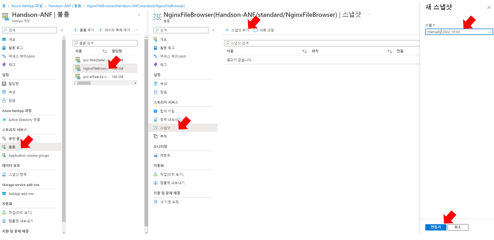
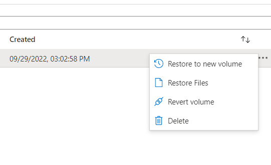

# NetApp Snapshot을 사용한 백업 및 복원

NetApp 스냅샷 복사본은 시스템 장애 또는 데이터 손실 시 복원에 사용할 수 있는 Unified Manager 데이터베이스 및 구성 파일의 시점 이미지를 생성합니다. 항상 최신 복사본을 사용할 수 있도록 ONTAP 클러스터 중 하나의 볼륨에 정기적으로 스냅샷 복사본을 기록하도록 예약합니다.

# 스냅샷 작동 방식


스냅샷을 만들면 데이터 블록에 대한 포인터가 복사되고 수정 내용이 새 데이터 위치에 기록됩니다. </br>
스냅샷 포인터는 스냅샷을 만들 때 파일이 점유한 원래 데이터 블록을 계속 가리키며 데이터에 대한 실시간 및 기록 보기를 제공합니다. </br>
새 스냅샷을 만들려는 경우 현재 포인터(즉, 가장 최근의 추가 및 수정 후에 만든 포인터)가 새 스냅샷 Snapshot2에 복사됩니다. </br>
이렇게 하면 전체 복사본 3개가 필요한 볼륨 공간을 차지하지 않고 3세대 데이터(라이브 데이터 Snapshot2및 Snapshot1연령순)에 액세스할 수 있습니다.

# Azure NetApp Files 스냅샷 백업

1. 볼륨 메뉴에서 볼륨을 선택합니다.
- 선택 된 볼륨 : ANFHandsonVolume

2. 스냅샷 메뉴에서 "스냅샷 추가"를 클릭하여 스냅샷을 생성합니다.</br>
- 이름 : maually-<"today yyyy-mm-dd">


3. 베스천 호스트에서 볼륨에 파일을 생성합니다.

```bash
root@HandsonBastion-vm:/ANF/ANFHandsonVolume# touch /ANF/ANFHandsonVolume/snapshottest.txt
root@HandsonBastion-vm:/ANF/ANFHandsonVolume# echo "Hello Netapp" > /ANF/ANFHandsonVolume/snapshottest.txt 
root@HandsonBastion-vm:/ANF/ANFHandsonVolume# cat /ANF/ANFHandsonVolume/snapshottest.txt 
Hello Netapp
```

4. 스냅샷 메뉴에서 "..." 버튼을 클릭하여 "Restore to new volume"을 클릭합니다.</br>


5. 복원될 볼륨의 정보를 입력하고 볼륨을 생성합니다.</br>

- 볼륨이름 : ANFHandsonVolume-Restore
- 용량 풀 : Premium
- 할당량(GiB) : 100</br>


6. 베스천 호스트에서 볼륨을 마운트하고 txt 파일을 만들기 전으로 복구되었는지 확인합니다.

```bash
mkdir -p /ANF/ANFHandsonVolumeRestore
sudo mount -t nfs -o rw,hard,rsize=262144,wsize=262144,sec=sys,vers=4.1,tcp 172.18.4.4:/ANFHandsonVolume-restore /ANF/ANFHandsonVolumeRestore
root@HandsonBastion-vm:/ANF/ANFHandsonVolumeRestore# ls
fio_test_file.0.0   fio_test_file.12.0  fio_test_file.2.0  fio_test_file.6.0
fio_test_file.1.0   fio_test_file.13.0  fio_test_file.3.0  fio_test_file.7.0
fio_test_file.10.0  fio_test_file.14.0  fio_test_file.4.0  fio_test_file.8.0
fio_test_file.11.0  fio_test_file.15.0  fio_test_file.5.0  fio_test_file.9.0
```

## 온라인 스냅샷을 현재 위치로 복원(되돌리기)

경우에 따라 새 볼륨에서 스토리지 용량을 사용하므로 스냅샷을 통해 새 볼륨을 만드는 것이 필요하지 않거나 적절하지 않을 수도 있습니다. 데이터 손상(예: 데이터베이스 손상 또는 랜섬웨어 공격)에서 신속하게 복구하려면 볼륨 자체 내에서 스냅샷을 복원하는 것이 더 적절할 수 있습니다. **이 작업은 Azure NetApp Files 스냅샷 되돌리기 기능을 사용하여 수행할 수 있습니다.** 이 기능을 사용하면 볼륨을 특정 스냅샷을 만들 때의 상태로 신속하게 되돌릴 수 있습니다. 대부분의 경우 볼륨을 되돌리는 것이 스냅샷에서 활성 파일 시스템으로 개별 파일을 복원하는 것보다 훨씬 빠릅니다. 특히 다중 TiB 볼륨이 큰 경우에는 더욱 그렇습니다.

볼륨 스냅샷 되돌리기는 거의 즉각적이며, 가장 큰 볼륨의 경우에도 완료하는 데 몇 초밖에 걸리지 않습니다. 활성 볼륨 메타데이터(inode 테이블)는스냅샷이 만들어진 시점의 스냅샷 메타데이터로 대체되므로 볼륨을 특정 시점으로 롤백합니다. 되돌리기를 적용하기 위해 데이터 블록을 복사할 필요가 없습니다. 따라서 스냅샷을 새 볼륨으로 복원하는 것보다 공간 효율적이고 더 빠릅니다.


1. 볼륨의 스냅샷 메뉴에서 볼륨 되돌리기를 선택합니다.

2. 볼륨을 되돌리기전 최종확인 창에 볼륨이름을 입력하고 볼륨을 되돌립니다.

- 볼륨이름 : ANFHandsonVolume

3. 베스천에서 txt 파일을 쓰기 전으로 복구되었는지 확인합니다.

```bash
root@HandsonBastion-vm:/ANF/ANFHandsonVolume# ls /ANF/ANFHandsonVolume
fio_test_file.0.0   fio_test_file.12.0  fio_test_file.2.0  fio_test_file.6.0
fio_test_file.1.0   fio_test_file.13.0  fio_test_file.3.0  fio_test_file.7.0
fio_test_file.10.0  fio_test_file.14.0  fio_test_file.4.0  fio_test_file.8.0
fio_test_file.11.0  fio_test_file.15.0  fio_test_file.5.0  fio_test_file.9.0
```

## 결과

스냅샷을 통해 이전 시점으로 볼륨을 복원할 수 있었습니다.


## 다음과정

수고하셨습니다.</br>

- 이전주제: [Volume Operation](./1-3_Volume_Operation.md)

# 참조

- [Azure NetApp Files 스냅샷 작동 방식](https://learn.microsoft.com/ko-kr/azure/azure-netapp-files/snapshots-introduction)
- [Azure NetApp Files 백업 이해](https://learn.microsoft.com/ko-kr/azure/azure-netapp-files/backup-introduction)
- [Azure NetApp Files 백업에 대한 요구 사항 및 고려 사항](https://learn.microsoft.com/ko-kr/azure/azure-netapp-files/backup-requirements-considerations)
