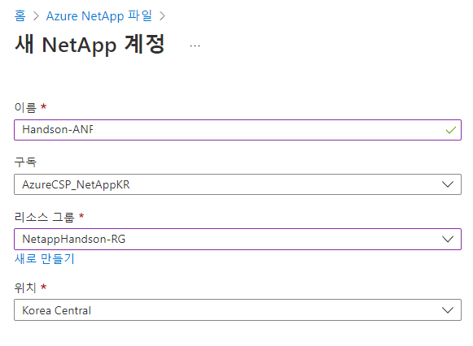
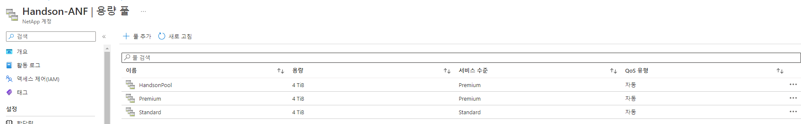

# Azure Netapp Files
AzureNetappFiles에 대해 간략히 소개합니다. 자세한 내용은 [여기](Readme.md)를 참조해주세요.

# Azure NetApp Files 생성
1. 다음과 같이 cloudshell 에서 Azure NetApp Files에 대해 승인된 구독을 지정합니다.
```
az account set --subscription <subscriptionId>
```
2. 다음과 같이 Azure 리소스 공급자를 등록합니다.
```
az provider register --namespace Microsoft.NetApp --wait
```
3. Azure Netapp Files 포털로 이동 후 "+만들기"를 클릭합니다.
4. 다음 항목을 입력하고 만들기를 수행합니다.
- 이름 : Handson-ANF
- 구독 : "your subscribtion"
- 리소스 그룹: NetappHandson-RG
- 위치 : Korea Central</br>


5. Azure NetApp Files 관리 블레이드에서 NetApp 계정(Handson-ANF)을 선택합니다
6. NetApp 계정의 Azure NetApp Files 관리 블레이드에서 용량 풀을 클릭합니다.
7. "+ 풀 추가"를 클릭합니다.
8. 5~7번 과정을 반복하여 총 두개의 풀을 추가합니다.
- Premium Pool
    - 이름 : Premium
    - 서비스 수준 : 프리미엄
    - 크기(TIB) : 4 (최소값)
    - QoS 유형: 자동
- Standard Pool
    - 이름 : Standard
    - 서비스 수준 : 표준
    - 크기(TIB) : 4 (최소값)
    - QoS 유형: 자동</br>
- Premium Pool
    - 이름 : HandsonPool
    - 서비스 수준 : 표준
    - 크기(TIB) : 4
    - QoS 유형: 자동


# 결과
Azure Netapp Files를 사용하실 준비가 되었습니다.

# 다음과정
Azure NetApp Files에 NFS 볼륨을 생성합니다. </br>
- 다음 주제 : [Azure NetApp Files에 NFS 볼륨 생성](./CreateVolmeinAzure.md)
- 이전 주제 : [클라우드매니저 배포](./AzureNetappFiles/Deploy_Cloudmanager.md) 

# 참고
[빠른 시작: Azure NetApp Files 설정 및 NFS 볼륨 만들기](https://learn.microsoft.com/ko-kr/azure/azure-netapp-files/azure-netapp-files-quickstart-set-up-account-create-volumes?tabs=azure-portal)
