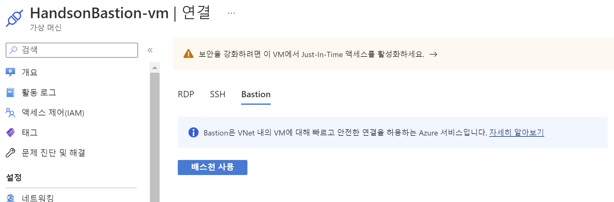

# Hand on Bastion

핸존 환경을 위한 Bastion 서버 생성 및 접속 가이드입니다.

## bastion Host 서버 접속

Handson Bastion 서버에 다음 중 하나의 방법을 이용해 접속합니다.</br>
**사용하고 계시는 SSH Tool을 활용하는것을 권장합니다.**

## SSH Tool 활용

1. KeyPair Download

- [handsonkey.pem](./keypair/handsonkey.pem)
- [handsonkey.pub](./keypair/handsonkey.pub)
- [Web download link](https://netappkr-wyahn-s3.s3.ap-northeast-2.amazonaws.com/public/Key/handsonkey.pem)
2. 사용하고 계신 ssh tool을 이용해 서버에 접속합니다.

```bash
ssh  -i handsonkey.pem azureuser@<"bastion server ip">
```
## Bastion Host에서 Vnet내 VM 접속
Hands on에 구성된 모든 VM의 pem키는 동일하게 구성되어 있습니다. </br>
다른 VM에 접속 시 아래 명령을 통해 키를 다운로드 받습니다.
```
wget https://netappkr-wyahn-s3.s3.ap-northeast-2.amazonaws.com/public/Key/handsonkey.pem
```

---
---
---
# 번외
## Azure Bation Host 활용

Azure Bastion 서비스를 사용하면 VM에서 공용 IP를 사용할 필요 없이 Azure Portal에서 직접 접근할 수 있습니다. </br>
추가 클라이언트/에이전트나 소프트웨어를 사용하지 않고도 Azure 가상 네트워크의 VM에 안전하고 원활하게 RDP & SSH를 사용할 수 있습니다. </br>
가상 네트워크에서 Azure Bastion 서비스를 프로비저닝하고 나면 같은 가상 네트워크의 모든 VM에서 원활한 RDP/SSH 환경을 사용할 수 있습니다. </br>



> ### 경고!
> 해당 과정은 비용 절약을 위해 Hands on 과정에서 삭제하였습니다. </br>
> 해당 서비스를 이용하시려는 경우 ```빠른 시작: 기본 설정을 사용하여 Azure Bastion 배포```를 확인하세요.

# 참조
- [빠른 시작: 기본 설정을 사용하여 Azure Bastion 배포](https://learn.microsoft.com/ko-kr/azure/bastion/quickstart-host-portal)