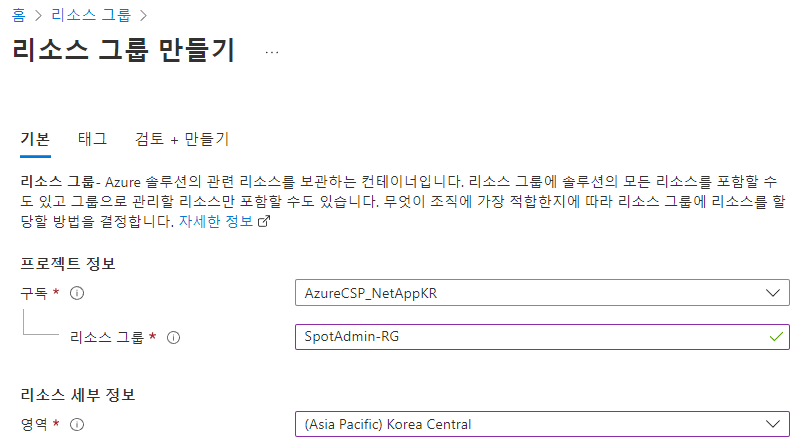
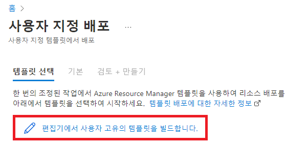
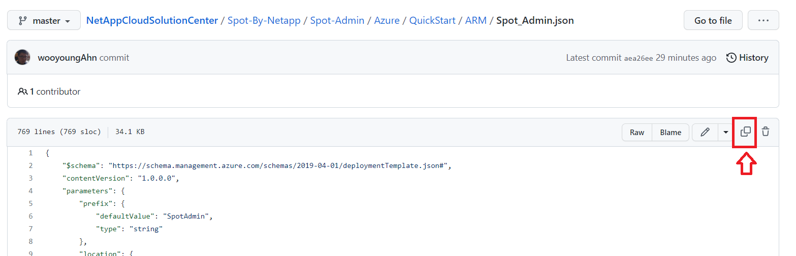
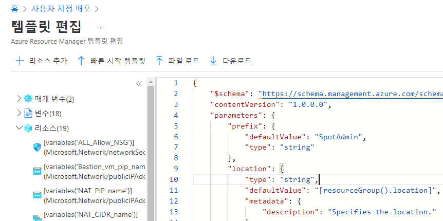
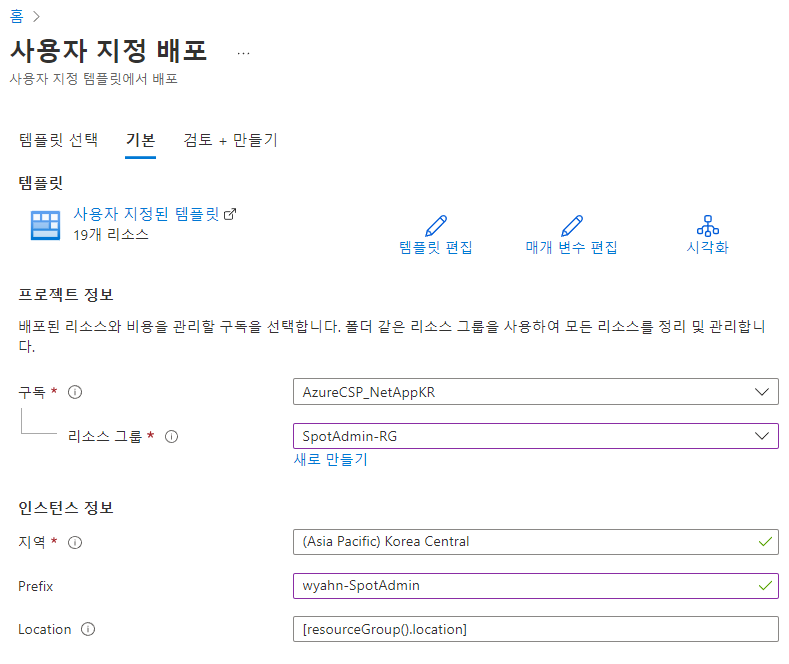
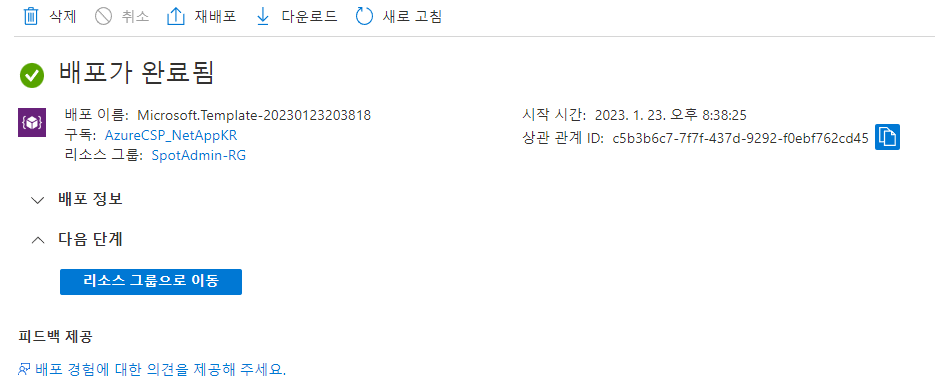

# Hands on 환경 생성

Azure Resource manager 를 이용해 Hands on 환경을 빠르게 생성합니다.

## 선행 조건

다음 사용조건을 만족해야 합니다.

### Cloudshell 사용

cloudshell 또는 AzureCLI가 미리 구성되지 않으셧다면 수행합니다.

### Provider 등록

```bash
wyahn1219 [ ~ ]$ az provider register --namespace Microsoft.OperationsManagement
Registering is still on-going. You can monitor using 'az provider show -n Microsoft.OperationsManagement'
wyahn1219 [ ~ ]$ az provider register --namespace Microsoft.OperationalInsights
Registering is still on-going. You can monitor using 'az provider show -n Microsoft.OperationalInsights'
```

## 사용자 지정 템플릿에서 배포

1. 리소스 그룹을 생성합니다.

```해당 가이드는 리소스 중복이 없다는 가정하에 생성되었습니다.``` </br>
```동일 테넌트와 구독에서 여러명이 동시에 시도하시는 경우 이름 이니셜을 추가로 넣어주시기 바랍니다.```</br>

- 이름: SpotAdmin-RG
- 위치: Korea Central</br>


2. Azure 콘솔의 상단 바에서 **사용자 지정 템플릿 배포**를 검색하여 클릭합니다.
3. **탬플릿 선택** > **편집기에서 사용자 고유 탬플릿을 빌드합니다** 를 선택합니다. </br>


4. 준비된 Spot_Admin 템플릿을 클릭하고 상단의 **Copy** 이미지를 클릭합니다.
- [Spot_Admin.json](./ARM/Spot_Admin.json)</br>


5. Azure 콘솔에 복사한 내용을 탬플릿에 붙여 넣습니다.</br>


6. 하단에 보이는 **저장** 버튼을 클릭합니다.
7. 파라미터를 확인합니다. 명시되지 않은값은 모두 기본값으로 지정합니다.

- 구독: '<준비해온 구독을 선택합니다.>',
- 리소스그룹: "생성한 리소스 그룹"
- Prefix : "SpotAdmin" </br>
```해당 가이드는 리소스 중복이 없다는 가정하에 생성되었습니다.```</br>
``` 동일 테넌트와 구독에서 여러명이 동시에 시도하시는 경우 Prefix에 이름 이니셜을 넣어주시기 바랍니다.```</br>


8. **검토 + 만들기** 버튼을 클릭합니다.
9. 유효성 검사가 성공하면 **만들기** 버튼을 클릭합니다.

> ### Tips
> Azure Resourc Manager를 통한 배포는 구독, 테넌트 환경에 따라 배포가 실패할 수 있습니다. </br>
> 문제해결이 필요한 경우 **실패한 작업 정보** 항목을 확인합니다. </br>
> 문제를 해결한 경우 리소스 그룹의 모든 리소스를 삭제 후 재시도 하시기 바랍니다.

# 결과

Hands on Lab 이 생성됩니다.



## 참조

- [Azure Doc AKS api](https://learn.microsoft.com/en-us/rest/api/aks/managed-clusters/create-or-update?tabs=HTTP)
- [Azure Doc 리소스 배포](https://learn.microsoft.com/ko-kr/azure/azure-resource-manager/templates/deploy-portal)
