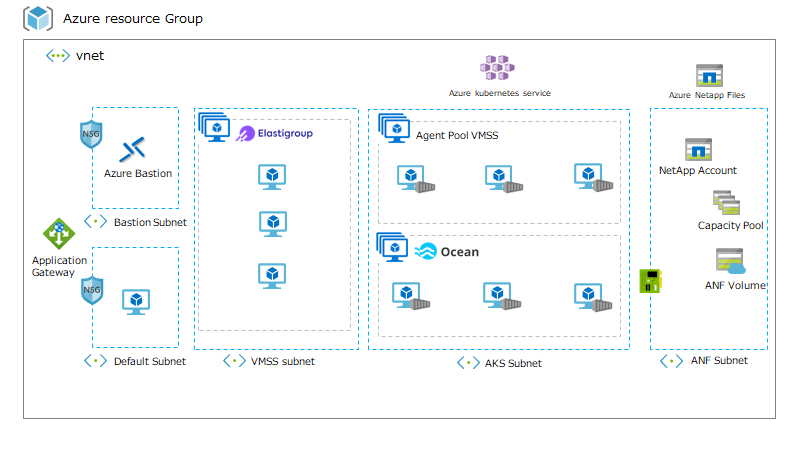

# Spot by Netapp Admin Cloud Hands-on
Spot by Netapp 관리자 Azure Hands on 가이드 입니다.
본 과정에서는 Spot by Netapp 계정 연동, Elastigroup, Ocean의 기능들을 실습할 수 있습니다.

## 실습 전 필요사항

- Azure 구독  
Azure Resource Manager Templeate을 이용하여 실습환경을 배포합니다. 
안타깝게도 본 과정에서는 실습에 필요한 클라우드 인프라 사용 비용을 지불해드리지 않습니다.

- AD 및 구독에 대한 소유자 권한  
본과정에서는 AD App 생성 및 구독에 대한 소유자의 권한이 필요합니다.

## 실습환경 배포

실습 전 Hands on 환경을 미리 배포해주세요.  
[빠른시작 Spot by Netapp Amdin Hands on](./QuickStart/CreateLabQuickstartGuide.md)

## 구성도
