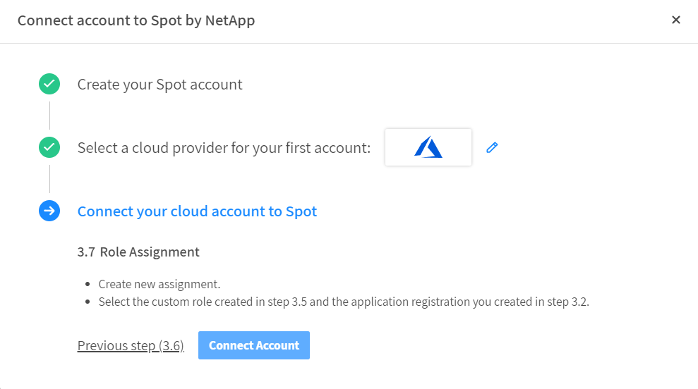

## 실습 목표

사용자를 대신하여 Spoy by Netapp 솔루션이 클라우드 자원을 관리할 수 있도록 설정해야 합니다. 
Spot Console을 통해 Spot 계정을 등록하고 Cloud service Provider accounts를 연결하기 위한 절차를 설명합니다.

## Spot organization 생성

Spot Console과 Cloud Provider Accounts와 연결하기 위해서는 Spot Console 계정이 필요합니다. 
다음 링크(<https://console.spotinst.com/>)로 이동하여 다음의 절차를 수행합니다. 
다음의 예와 같이 필요한 기본 정보를 입력 후 가입이 완료 됩니다. 

Company(회사) 항목 입력 시, 지정한 회사 이름이 조직(Organization)의 이름이 되기 때문에 최초
생성 시 유의하여 생성을 권장합니다. 다음 절차에서 복잡성을 모두 만족하는 패스워드를 입력
후, 봇 방지와 동의에 체크하여 가입을 진행합니다. 

## Account 연결

1. Connected a Linked Account를 클릭합니다.
2. Azure 별칭 또는 구독이름을 입력합니다. 

3. Cloud Provider를 **Azure**를 선택하고 **Next**를 선택합니다. 

4. **Subscription** 을 선택합니다. 

5. 브라우저의 새로운 Tab에서 Azure에 로그인합니다.
6. **Azure Active Directory** > **앱 등록** 에서 **+ 새 등록** 을 클릭합니다. 

7. 애플리케이션 등록정보를 입력하고 확인을 클릭합니다. 
> ### Tips
> 해당 App은 디렉토리에 공유됩니다.  
> 두분이상 동일한 테넌트를 사용하는 계정으로 사용하는 경우 동일한 이름으로 작성하지 않도록 이니셜을 포함합니다.  

8. 화면에 나타난 App ID 와 Directory ID를 복사합니다. 

9. Spot 콘솔에서 복사해둔 App ID 와 Directory ID를 입력합니다. 

10. 사이드 메뉴에 있는 **인증서 및 암호** 에서 **+ 새 클라이언트 암호**를 선택합니다. 

11. 설명란을 자유롭게 적고 만료시간을 24months로 선택합니다.  

12. 화면에 나타난 값을 복사합니다.  

13. Spot 콘솔에서 복사해둔 비밀값을 입력합니다.  

14. 준비해온 구독 ID를 입력합니다.
15. **Export Policy**를 클릭하면 파일이 다운로드됩니다.
16. **구독** > **"준비해온 구독"** > **엑세스 제어(IAM)** 에서 **추가** 버튼을 누르고 **사용자 지정 역할 추가**를 선택합니다. 

17. **사용자 지정 역할 만들기** 마법사에서 **기준 권한** > **json에서 시작** 을 선택하고 파일 업로드 버튼을 누릅니다.
18. 방금 전 다운로드한 파일을 업로드 합니다.
19. 사용자 지정 역할 이름 뒷자리 번호를 지우고 이니셜을 추가합니다. 

20. 리뷰 TAB으로 이동해서 역할 생성을 완료합니다.
21. **구독** > **"준비해온 구독"** > **엑세스 제어(IAM)** 에서 **추가** 버튼을 누르고 **역할 할당 추가**를 선택합니다. 

22. 이니셜로 검색 후 나타난 CustomRole을 선택하고 **다음**을 클릭합니다.합니다. 

23. **+ 구성원 추가** 를 클릭합니다.
24. 이니셜로 검색 후 생성한 App을 클릭합니다. 

25. 선택을 완료하고 **다음**을 클릭합니다.
26. **검토 + 할당**을 선택하여 Role 연결을 마칩니다.
27. Spot 콘솔에서 **Connect Account**를 클릭합니다. 

## 결과
Spot by Netapp 계정과 Azure를 연동했습니다. 

## 다음 과정
Azure VMSS를 Elastigroup으로 가져옵니다.
- 다음 과정:
- 이전 과정:

# 참조
- [Connect Azure Subscription](https://docs.spot.io/connect-your-cloud-provider/first-account/azure)
