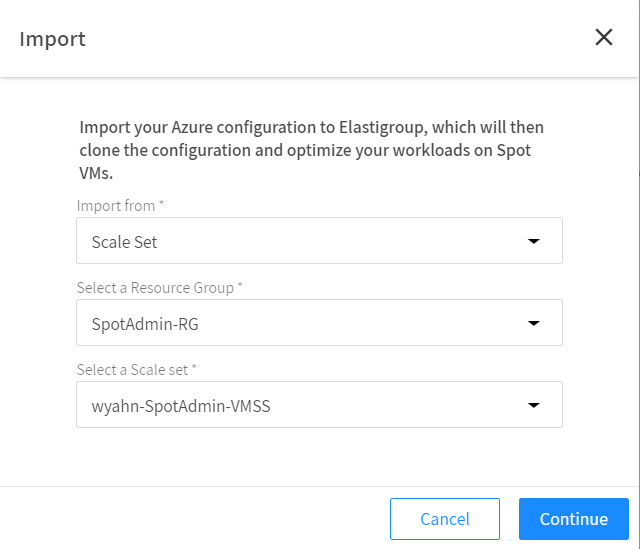
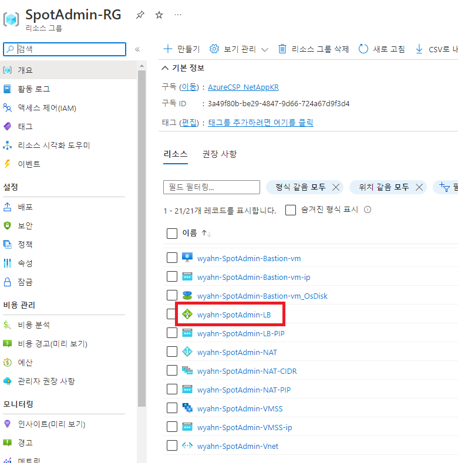

# 기존 Azure 리소스를 Elastigroup으로 가져오기

온디멘드 VM으로 동작하는 리소스들을 Elasticgroup에 가져올 수 있습니다.

## 실습 목표

Azure VMSS를 Elastigroup으로 가져오는 방법에 대해 알아봅니다.

## 전제조건

Spot 계정과 Azure 구독이 연결되어 있어야 합니다.
Azure 리소스(예: Scale Set, Application Gateway, Load Balancer, VM)가 적어도 하나이상 실행되고 있어야 합니다.

## Azure VMSS를 Elastigroup으로 가져오기

1. Elasticgrouop 콘솔에서 **Import**를 선택합니다. </br>


2. 가져올 Azure 자원 중 **scale set** 을 선택합니다. </br>


3. **continu**를 누르면 추가 항목이 나타납니다.
4. Quickstart 단원에서 생성한 자원을 선택합니다. 
- import from: scale set </br>
- select a Resource Group : SpotAdmin-RG
- Select a Scale Set : SpotAdmin-vmss </br>


3. Review 컴퓨팅 부분을 누르고 설정을 편집합니다.</br>


4. 다음과 같이 스팟 VM 사이즈를 추가선택합니다.</br>


> ### 주의
>
> 리소스 그룹 내 네트워크 보안 그룹 목록을 가져오지 못하는 경우 잠시 다른 리소스그룹을 선택하였다가 다시 기존 리소스 그룹을 > 선택하면 보안그룹목록이 보입니다.

5. Load Balancer Tab을 열고 **SpotAdmin-bg**를 추가합니다. </br>


6. 고급 설정에서 CUSTOM DATA를 입력합니다.

```bash
#!/bin/bash
sudo yum -y install unzip 
sudo yum -y install httpd 
yum -y install nfs-utils 
wget https://netappkr-wyahn-s3.s3.ap-northeast-2.amazonaws.com/public/sneat-1.0.0.zip
sudo unzip sneat-1.0.0.zip -d /var/www/html/
sudo systemctl start httpd
```


7. **Next** 버튼을 눌러 **Review**로 돌아와 **IMPORT** 버튼을 누릅니다.
8. Import가 완료되고 결과 화면이 보입니다.


9. Azur콘솔로 이동합니다.
10. VMSS 에서 인스턴스 수를 0으로 조절합니다.


11. 생성한 리소스 그룹이름 > **SpotAdmin-LB** 를 클릭하고 IP를 확인합니다.</br>

12. 브라우저에 아래주소를 입력합니다.

```url
http://<로드벨런서IP주소>/sneat-1.0.0/html/index.html
```

# 결과

- 브라우저에 서비스페이지가 잘 보입니다.
- 2대의 VM이 Spot 타입으로 실행됩니다.


# 다음과정

Elasigroup에서 무엇을 할 수 있는지 알아봅니다. </br>

- 다음 과정 : [Elastigroup Acion](./2-2_ElastigroupInstanceAction.md)
- 이전 과정 : [Elastigroup Acion](../exercise-1/1-1_Connect-Account.md)
