# Elastigroup Instance Actions

Elastigroup은 인프라 동작을 실행 중인 워크로드 유형과 일치시킵니다. 로드 밸런서에서 서버를 등록 및 등록 취소하거나, 다양한 상태 확인을 사용하여 상태를 모니터링하거나, 데이터 무결성에 대한 걱정 없이 초과 용량에서 상태 저장 워크로드를 실행할 수 있습니다.

## 실습 목표

Elastigroup에서 인스턴스를 수동으로 추가 제거 하는 방법을 실습합니다.

## 인스턴스 수동 추가 제거

Action 버튼을 사용하여 분리하려는 특정 인스턴스 또는 여러 인스턴스를 간단히 확인할 수 있습니다. 이렇게 하면 인스턴스/인스턴스가 제거되고 새 인스턴스가 시작됩니다.

### Instance 추가
인스턴스를 수동으로 Scale out하는 실습을 진행합니다.

1. 스팟 콘솔 우측 상단의 Manage Capacity를 클릭합니다. 

2. 목표값과 최대값을 변경합니다.

- Target : 3
- Minimum : 1
- Maximum : 3  
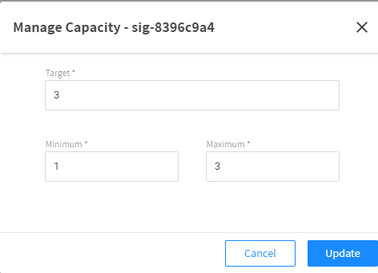

### 결과

수분 후 콘솔상에 인스턴스가 추가된것이 보입니다. 
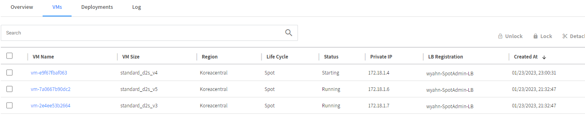

### Instance 분리
인스턴스를 수동으로 Scale in하는 실습을 진행합니다.

1. 먼저 배포된 인스턴스를 클릭하고 Action 버튼에서 Detach를 클릭합니다. 
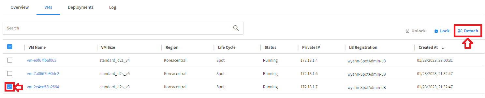

2. 유휴시간 및 그룹용량 감소를 체크하고 Detech를 클릭합니다.

- Draing Timeout : 120
- [X] Terminate Instances
- [X] Decrement Group's Capacity  
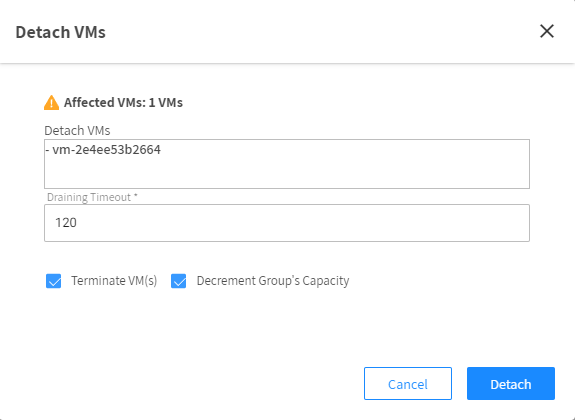

### 결과

1. 인스턴스가 분리된것이 확인됩니다.  
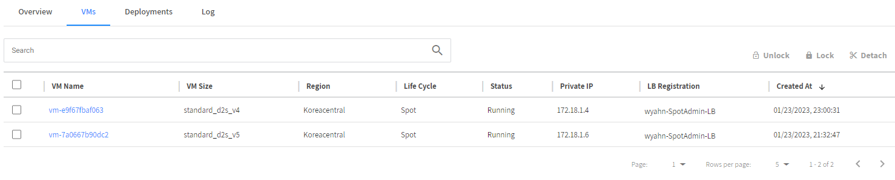

2. Azure console로 이동합니다.
3. **리소스 그룹** 에서 아래와 같이 필터하여 VM만 보여지도록 설정합니다.  
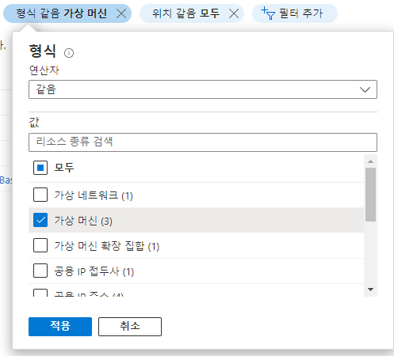

4. 2분 후에 인스턴스가 없어지는 것을 확인합니다.  
( 새로고침 필요 ) 
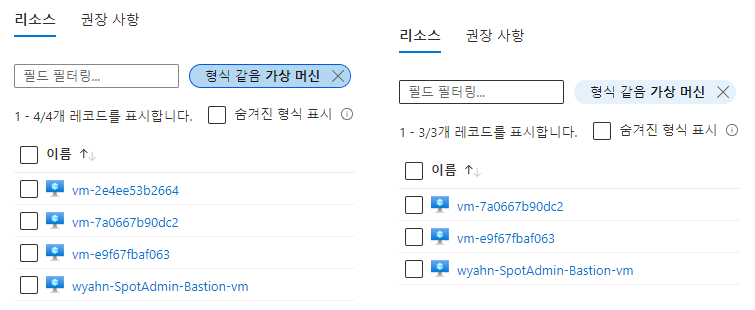

## Deployments 실습
이 기능은 VM Image update 또는 customdata(start script)변경 등 여러가지 이유로 그룹내 인스턴스를 다시 시작해야 되는 경우 유용하게 사용할 수 있습니다.

1. 스팟 콘솔 우측 상단의 Manage Capacity를 클릭합니다. 

2. 목표값과 최대값을 변경합니다.

- Target : 2
- Minimoun: 1
- Maximum : 3  
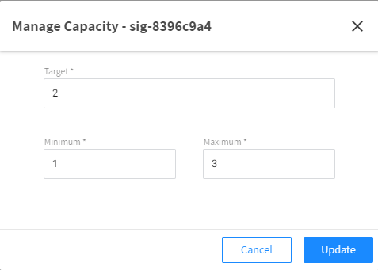

4. 수분 후 콘솔상에 인스턴스가 추가된것이 보입니다. 
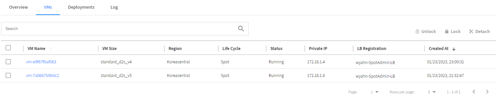

5. 스팟 콘솔 우측 상단의 Actions 버튼을 눌러 드롭다운합니다.
6. Deploy를 클릭합니다. 
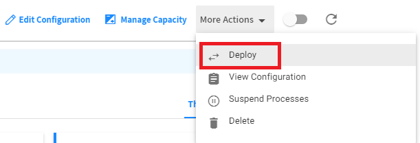

7. 얼마만큼의 인스턴스를 어떠한 간격으로 교체할건지 설정합니다.
- Batch Size (Percentage): 50%
- Grace Period (Seconds): 300 
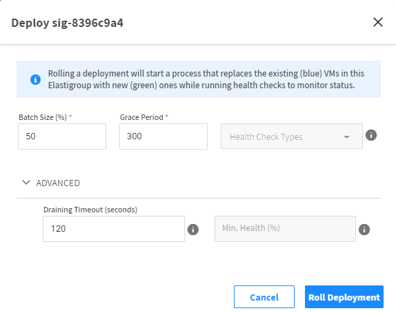

## 결과
1. Deployments Tab을 클릭합니다.
2.  지정한 비율만큼 Blue Green 교체가 일어나는것을 모니터링 할 수 있습니다. 
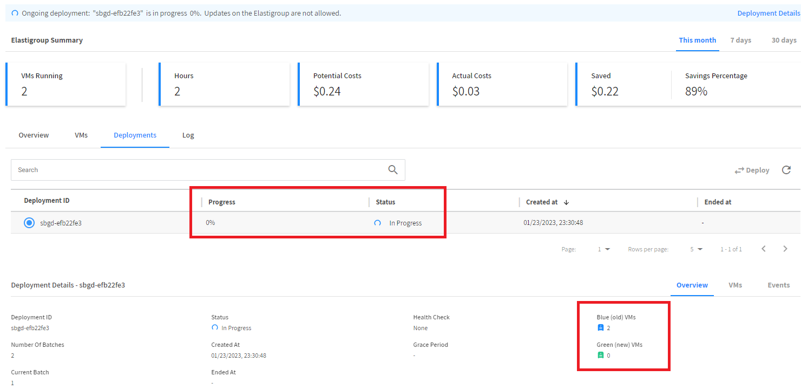

# 다음 과정

- 이전 과정 : [ElastiGroup 생성](./2-1_CreateElasticGroup.md)
- 다음 과정 : [Elastigroup Auto Scaling](./2-3_ElasticGroupAutoScaling.md)

# 참고

- [Azure Load Balancer health probes](https://learn.microsoft.com/en-us/azure/load-balancer/load-balancer-custom-probe-overview)
