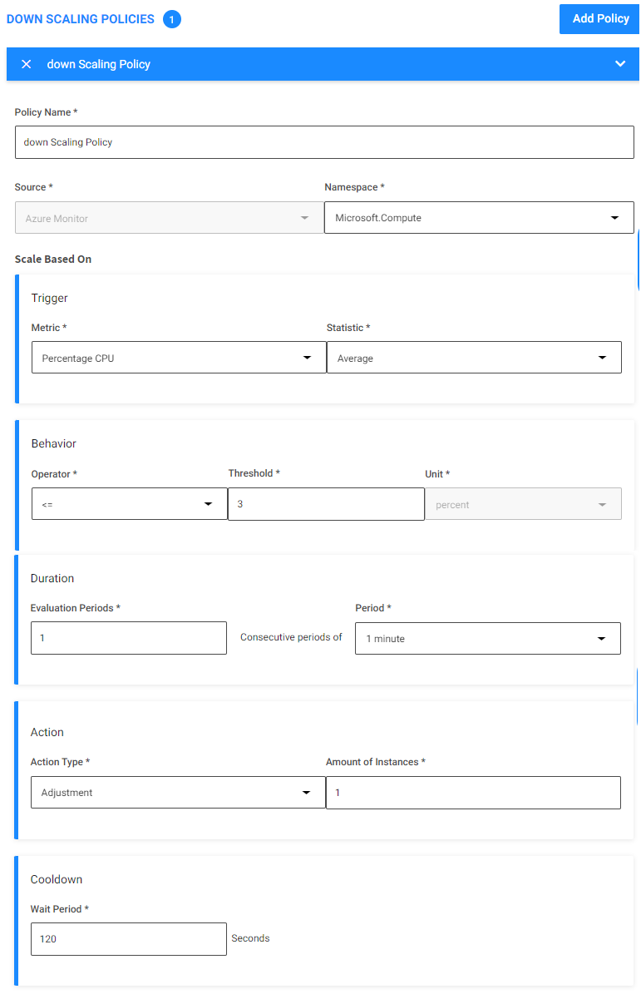

# ElastiGroup AutoScaling

Elastigroup의 예측 자동 확장은 확장 정책 정의 프로세스를 간소화하고 피크 시간을 식별하며 사전에 올바른 용량을 보장하기 위해 자동 확장합니다. </br>
기계 학습 알고리즘은 애플리케이션의 향후 로드를 예측하고 최대 트래픽을 수용하기 위해 클러스터를 사전에 확장합니다.

## 실습 목표

엘라스틱 그룹의 대상 조정 정책 및 자동 조정 기능을 실습합니다.</br>

## Scaling Policies

목표 조정 정책은 원하는 목표 값과 관련하여 지정된 지표를 추적하고 이 목표를 충족하도록 Elastigroup 규모를 자동으로 조정하는 자동 조정 정책입니다.

1. Elastigroup의 spotadmin-wordpress-TG 콘솔로 이동합니다.
2. 스팟 콘솔 우측 상단의 Actions 버튼을 눌러 드롭다운합니다.
3. Manage Capacity를 클릭합니다.</br>

4. Target Min Max값을 변경합니다.

- Target : 1
- Minimum : 1
- Maximum : 4</br>


5. 우측 상단 Action을 드롭다운하고 Edit Configration을 클릭합니다.</br>


3. Scaling Tab으로 이동 후 **Add Policy**를 클릭하여 Scaling 정책을 설정합니다.
### UP SCALING POLICIES
- Policy Name : up Scaling Policy
- Source: Azure Monitor
- Namespace : Microsoft.Compute
- Trigger
  - Metric : Percentage CPU
  - Statistic : Average
- Behavior
  - Operator : >=
  - Threshold : 10
- Duration
  - Evaluation Periods : 1
  - Period : 1 minute
- Action 
  - Action Type : Adjustment
  - Amount of instance : 1
- Cooldown
  - wait period : 120 sec </br>


### DOWN SCALING POLICIES
- Policy Name : down Scaling Policy
- Source: Azure Monitor
- Namespace : Microsoft.Compute
- Trigger
  - Metric : Percentage CPU
  - Statistic : Average
- Behavior
  - Operator : <=
  - Threshold : 3
- Duration
  - Evaluation Periods : 1
  - Period : 1 minute
- Action 
  - Action Type : Adjustment
  - Amount of instance : 1
- Cooldown
  - wait period : 120 sec </br>


4. Review Tab으로 이동, 구성 확인 후 **Update** 를 클릭합니다.
5. Roll My Group 선택하지 않고 **Close** 를 클릭합니다.</br>


5. Bastion Host에 접속합니다.
접속 방법은 [Bastion 접속하기](../../QuickStart/ConnectToBastion.md)를 참고합니다.

6. Azure Web console로 이동합니다.
7. 배포한 리소스 그룹 > 에서 "SpotAdmin-LB"를 클릭합니다.

8. **프런트 엔드 IP 구성** 에서 IP 주소를 복사합니다.</br>


9. Hey를 이용하여 부하를 발생시킵니다.

```
hey -z 1s -z 5m -c 9 http://<로드벨런서IP주소>/sneat-1.0.0/html/index.html
```

## 결과 확인
1. VM Tab으로 이동합니다.
2. 대쉬보드에서 Request 수치와 Scaling Metric 수치가 증가하는 것을 확인합니다.</br>  


3. 인스턴스가 자동으로 추가된것이 확인됩니다.</br>

4. 부하가 멈추면 수분 후 인스턴스가 자동 축소되는것이 확인됩니다.

> ### Tips
> 이 Test는 적어도 결과를 보는데 20분 이상의 시간이 필요합니다. </br>
> 결과를 기다리지 말고 다음 스탭을 진행 후 결과는 로그로 확인하는것을 추천드립니다.


## Instance 잠금

인스턴스를 잠금으로 서 작업도중 자동으로 스케일링 되는것을 방지할 수 있습니다.

1. 인스턴스를 체크 후 Action에서 Lock을 클릭합니다.</br>

2. 잠금 시간을 2분으로 설정합니다.</br>

3. 잠금 모양 아이콘이 표시됩니다.

## 결과 확인

인스턴스가 자동 조정작업에 대해 보호됩니다.

> ### Tips
> 이 설정은 Auto Scaling 이벤트에 대한 잠금 설정입니다. 수동 Detech 시도 시 허용됩니다. </br>
> 또한 Spot Interruption(강제 회수)이 발생하는 경우 이를 방지하지는 못합니다.

# 다음 과정

- 이전 과정 : [ElastiGroup Action](./2-2_ElastigroupInstanceAction.md)
- 다음 과정 : [Statful ElastiNode](./2-4_Create_Statful_Elastinode.md)
# 참고

- [간단한 커맨드 라인용 web 부하 테스트 프로그램 hey](https://www.lesstif.com/system-admin/web-hey-93127695.html)
- [man hey](https://manpages.ubuntu.com/manpages/focal/man1/hey.1.html)