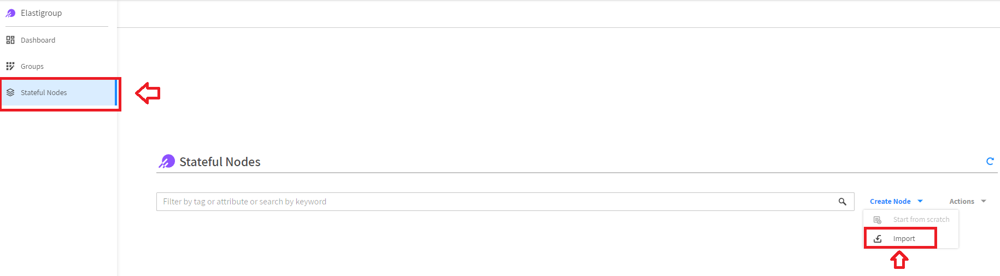
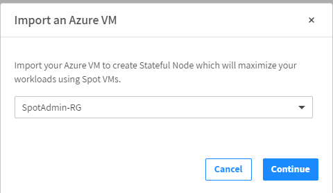
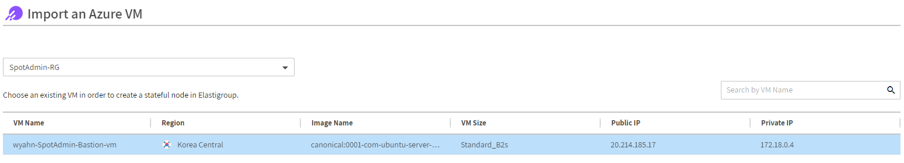
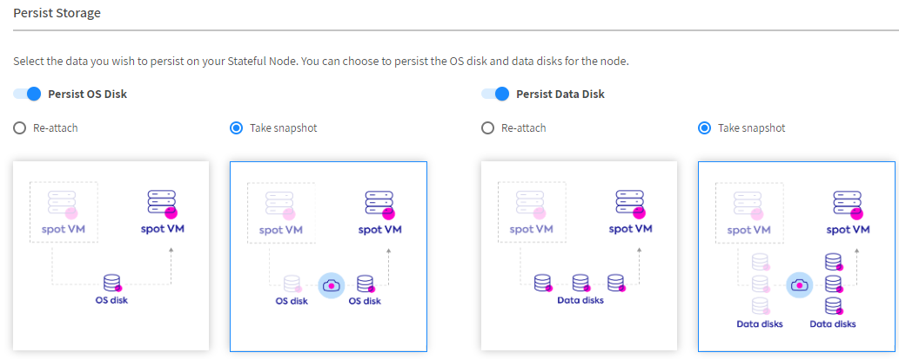
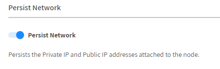
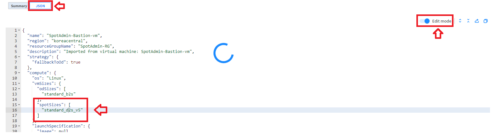

# Statful Elastinode

Spot 노드는 일시적이며 AWS에 의해 언제든지 중단될 수 있습니다.  
상태 비저장 애플리케이션에서는 문제가 되지 않지만 수평으로 쉽게 확장할 수 있도록 설계되었기 때문에 상태 저장 애플리케이션에서는 어려울 수 있습니다.  
상태 저장이 필요한 애플리케이션도 ElastiGroup에서 실행할 수 있습니다.  
루트 볼륨, 데이터 볼륨 및 네트워크 인터페이스에 대한 지속성을 제공하는 동시에 스팟 노드를 활용하여 비용을 절감합니다.

## 실습 목표

Spot by Netapp에서 Statful Elastinode를 구성하는 방법에 대해 알아봅니다.

## Stateful Elastinode 실습

1. Elastigroup console로 이동합니다.
2. 사이드 바에 **Stateful Nodes**를 클릭합니다.
3. 우측 상단 **Create Node**를 클릭하여 드롭다운합니다.
4. **Import**를 클릭합니다. 

5. **Import an Azure VM** 에서 생성한 리소스 그룹을 선택합니다. 

6. 리소스 그룹에 있는 단일 VM 목록이 보입니다.  

7. VM을 클릭하고 화면 하단에서 **Review & Import** 버튼을 클릭합니다. 

8. 기존 VM 정보를 가져옵니다.
9. Persist Storage 옵션을 **Take snaphost**으로 선택합니다. 

10. Persist Network 설정을 활성화 합니다.  

11. **Next**를 눌러 Review 화면으로 이동합니다.
12. json tab을 클릭하고 Edit mode를 활성화 합니다.
13. Spot size를 **standard_b2s** 에서 **standard_D2s_v5** 로 변경합니다. 

14. **Import & Create** 버튼을 클릭합니다.

## 다음 주제

- 이전 과정 : [EG Auto Scaling](./2-3_ElasticGroupAutoScaling.md.md)
- 다음 과정 : [Stateful Elastigroup Action](./2-5_StatefulEGAction.md)

# 참조

- [Create a Stateful Elastigroup](https://docs.spot.io/elastigroup/tutorials/elastigroup-tasks/create-a-stateful-elastigroup-from-scratch?id=create-a-stateful-elastigroup-from-scratch)
- [Azure VM 2 세대 지원](https://learn.microsoft.com/ko-kr/azure/virtual-machines/generation-2)
- [Azure Spot 가격](https://azure.microsoft.com/en-us/pricing/details/virtual-machines/linux/#pricing)