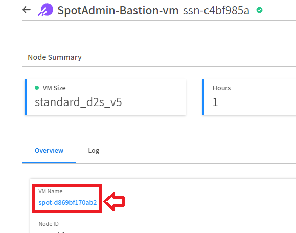
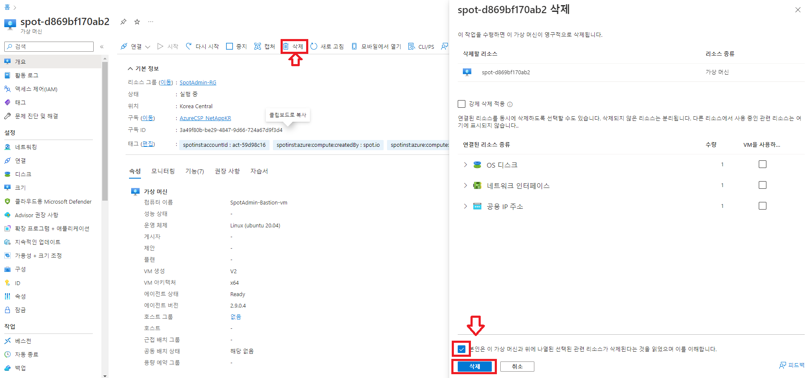
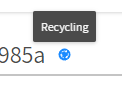

# Stateful ElastiGroup Action

실습을 통해 Statuful EG의 동작을 확인합니다.

1. Bastion Host 접속합니다.</br>
접속 방법은 [bastion host 접속](../../QuickStart/ConnectToBastion.md)을 참고합니다.
2. Test를 위한 간단한 웹서버를 구성합니다.
```
sudo apt-get install nginx -y
sudo systemctl start nginx
sudo systemctl enable nginx
```
3. Hello 파일을 생성합니다.

```bash
sudo touch /var/www/html/Hello.html
echo "Hello Spot by Netapp" | sudo tee Hello.html
```
4. 브라우저에서 서버 주소를 입력하여 Hello.html 파일을 확인합니다.
```
http://<Bastion host Public IP>/Hello.html
```
5. Spot console에서 **VM Name**을 클릭합니다.</br>


6. Azure VM console로 이동됩니다.
7. **삭제** 버튼을 클릭하고 리소스를 삭제합니다.</br>


8. Spot Console로 이동하여 인스턴스가 다시 생성되길 기다립니다.</br>


12. Bastion Host 서버에 접속합니다.
13. 브라우저에서 서버 주소를 입력하여 Hello.html 파일을 확인합니다.
```
http://<Bastion host Public IP>/Hello.html
```

# 결과

Private IP와 볼륨의 데이터가 유지된 상태로 새로운 서버가 생성됩니다.
