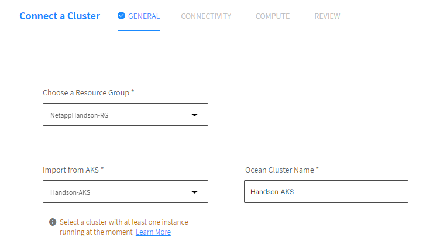
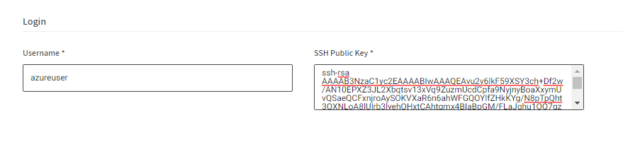

# Ocean 소개
Ocean은 포드, 컨테이너 및 애플리케이션의 요구 사항을 충족하도록 인프라 용량과 크기를 자동으로 조정하는 Kubernetes용 관리형 인프라 서비스입니다.

이 절차에서는 스팟 콘솔을 사용하여 기존 AKS 클러스터를 Ocean에 연결합니다.

## 전제 조건
- Spot에 연결된 Azure 구독
- 하나 이상의 노드를 실행하는 AKS의 Kubernetes 클러스터
- Kubernetes 명령줄 도구 kubectl은 워크스테이션에 설치되고 관련 AKS 클러스터와 함께 작동하도록 구성됩니다.

## 기존 AKS 클러스터 연결
1. Spot Console의 왼쪽 메뉴에서 Ocean/Cloud Clusters를 클릭하고 Create Cluster를 클릭합니다.


2. Cluster 생성 페이지가 나타나면 아래 항목을 선택합니다. 
- **Choose a resource Group** : SpotAdmin-RG
- **Import from AKS**: SpotAdmin-AKS
- **Ocean cluster Name**: SpotAdmin-AKS </br>
 

3. 다음을 클릭합니다.

4. "Generate Token" 을 클릭합니다. </br>


5. Token 이름을 입력하고 **생성**을 클릭합니다.
- Token Name : SpotAdmin-AKS </br>


> ### Tips
> 이미 생성된 토큰의 비밀키를 알고 있다면 중복으로 사용할 수 있습니다. </br>

6. **STEP 3**의 스크립트를 복사합니다.
7. [Bastion-VM에 접속](../../QuickStart/ConnectToBastion.md)합니다. </br>
8. Aks로 접속합니다. 자세한 내용은 [Kubectl로 AKS에 접속하기](../../QuickStart/Connected_AKS_used_kubectl.md)를 참조 해주세요.
9. Bastion Host 쉘에 복사한 스크립트를 붙여넣고 Enter를 눌러 실행합니다.
### 예시
```bash
#!/usr/bin/env bash
curl -fsSL http://spotinst-public.s3.amazonaws.com/integrations/kubernetes/cluster-controller/scripts/init.sh | \
SPOTINST_TOKEN=< Token > \
SPOTINST_ACCOUNT=<your spot account > \
SPOTINST_CLUSTER_IDENTIFIER=SpotAdmin-aks \
bash
```
```bash
2022-09-20T13:34:43.727Z downloading
2022-09-20T13:34:44.954Z rendering
2022-09-20T13:34:45.014Z applying
secret/spotinst-kubernetes-cluster-controller created
configmap/spotinst-kubernetes-cluster-controller-config created
serviceaccount/spotinst-kubernetes-cluster-controller created
clusterrole.rbac.authorization.k8s.io/spotinst-kubernetes-cluster-controller created
clusterrolebinding.rbac.authorization.k8s.io/spotinst-kubernetes-cluster-controller created
deployment.apps/spotinst-kubernetes-cluster-controller created
```

10. ```kubectl get pods -n kube-system``` 명령을 통해 배포한 Ocean Controller가 **READY 1/1** 상태가 되었는지 확인합니다.
```
wooyoung [ ~ ]$ kubectl get pods -n kube-system 
NAME                                                     READY   STATUS    RESTARTS   AGE
spotinst-kubernetes-cluster-controller-f58d9d4f8-z2qsz   1/1     Running   0          73s
kubectl get pods -n kube-system spotinst-kubernetes-cluster-controller-f58d9d4f8-z2qsz 
```

11. **STEP 4**에 스크립트를 복사합니다.
12. Bastion Host 쉘에서 스크립트를 실행합니다. 
### 예시
```bash
curl -fsSL https://spotinst-public.s3.amazonaws.com/integrations/kubernetes/aks/spot-aks-connector/init.sh | \
bash -s acd-4ed2c385
2022-09-20T13:42:07.200Z downloading
2022-09-20T13:42:08.305Z rendering
2022-09-20T13:42:08.312Z applying
job.batch/get-waagent-data created
```
13. ```kubectl get job -n kube-system``` 명령의 출력을 통해 **COMPLETIONS 1/1** 상태를 확인합니다.
```
wooyoung [ ~ ]$ kubectl get job -n kube-system
NAME               COMPLETIONS   DURATION   AGE
get-waagent-data   1/1           18s        18s
```

14. **다음**을 클릭합니다.
15. 로그인 항목에서 퍼블릭키를 입력합니다. </br>
나머지 값은 자동으로 입력됩니다. </br>
```
ssh-rsa AAAAB3NzaC1yc2EAAAABIwAAAQEAvu2v6lkF59XSY3ch+Df2w/AN10EPXZ3JL2Xbqtsv13xVq9ZuzmUcdCpfa9NyjnyBoaXxymUvQSaeQCFxnjroAySOKVXaR6n6ahWFGQOYlfZHkKYg/N8pTpQht3QXNLoA8lUlrb3lyehQHxtCAhtgmx4BIaBpGM/FLaJqhu1OQ7gz0GBbG1qZOmEyrzcklkvriyPYzEESg3N9w+eM09rWvu3dK+EezAsgeFBlcsfHY5eNRmgp2iPfvz8tNZ3wgsrU/UiZHueqsMmGYS+Njjr461cx2q3EhjjPbYz8+tj3t/taZ/Jf419r9ZhT1JHm8/vUh22B5Xm31LdbMBPGvuUKPQ==
```
</br>

16. VNG 항목에서 라벨을 추가합니다.</br>
- key: node.kubernetes.io/exclude-from-external-load-balancers
- value: true</br>


17. 다음을 선택합니다.
18. 최종확인 후 생성합니다.

## 결과
AKS가 Ocean과 연결됩니다.</br>


## 참조
- [Connect an Existing AKS Cluster](https://docs.spot.io/ocean/getting-started/aks)
- [cloud-provider-azure/AKS/issues](https://github.com/kubernetes-sigs/cloud-provider-azure/issues/401)
