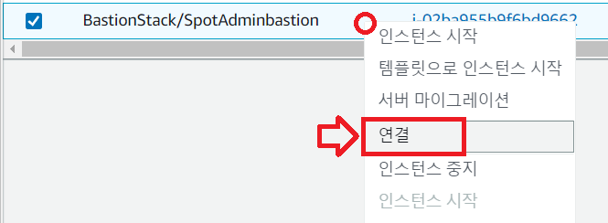

# Hand on Bastion

핸존 환경을 위한 Bastion 서버 생성 및 접속 가이드입니다.

## bastion Host 서버 접속

Handson Bastion 서버에 다음 중 하나의 방법을 이용해 접속합니다.</br>
**사용하고 계시는 SSH Tool을 활용하는것을 권장합니다.**

### 1. Sesstion manager 활용

1. ec2 console에서 Bastion host를 마우스 오른쪽버튼으로 클릭하고 Connect 를 선택합니다. </br>


2. Session Manager 탭을 선택하고 connect를 선택합니다. </br>
 </br>
3. 프롬프트를 Root로 변경합니다. </br>

```bash
sudo su -
```

### 2. SSH Tool 활용

1. KeyPair Download

- [handsonkey.pem](../keypair/handsonkey.pem)
- [handsonkey.pub](../keypair/handsonkey.pub)

2. 사용하고 계신 ssh tool을 이용해 서버에 접속합니다.

```bash
ssh  -i handsonkey.pem ec2-user@<"bastion server ip">
```

> ### Tips
> ### ssh key 오류로 접속이 안되는 경우
>
>  1. [aws IAM console로 이동합니다.](https://us-east-1.console.aws.amazon.com/iamv2/home#/users)
>  2. HandsOnAdmin user를 찾아 클릭합니다.
>  3. Access Key를 발급합니다.
>  4. [AWS CLI를 설치합니다.](https://docs.aws.amazon.com/ko_kr/cli/latest/userguide/getting-started-install.html)
>
> - KeyPair Download
>   - [handsonkey.pem](../keypair/handsonkey.pem)
>   - [handsonkey.pub](../keypair/handsonkey.pub)
>
>  5. AWS cli 명령을 이용해 Public-key를 서버에 넣습니다.
>
>    ```bash
>    aws ec2-instance-connect send-ssh-public-key \
>    --region ap-northeast-2 \
>    --instance-id <bastion-instance-id> \
>    --availability-zone <bastion AZ name> \
>    --instance-os-user <ec2-user or root>
>    --ssh-public-key file://handsonkey.pub << 파일위치를 확인하고 값을 알맞게 수정합니다.
>    ```
>
>  6. 사용하고 계신 ssh tool을 이용해 서버에 접속합니다.

---
---
---

## AWS Image Builder  

이미지 빌더를 통해 Hand on 에 필요한 패키지 서비스등을 설치 합니다.
Hands on 구성에 대한 참고용 입니다.

> ### 경고

> 해당 단원은 Hands on 환경을 직접 제작하는 경우에만 참고합니다. 이미지 생성과정은 핸존 수행자분들은 보지 않으셔도 됩니다.

1. Netappkr 게정에 로그인 후 AWS Image Builder 콘솔로 이동합니다.
2. 이미지 파이프라인 항목에서 hands-on-builder를 클릭하여 상세 설정을 확인합니다.

### 사용된 이미지 레서피 목록

- install kubectl
- install trident
- install iscsi deamon
- install hey
- install eksctl
- install python3
- install bash-completion
