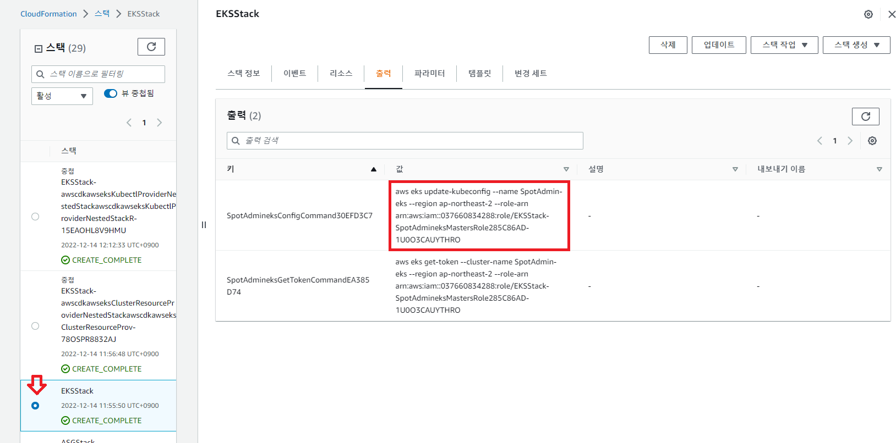
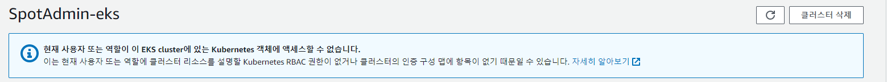

# EKS연결을 위한 kubeconfig 작성
AWS CLI 명령을 이용해 접속에 필요한 정보를 불러올 수 있습니다.
## 전제 조건
- AWS CLI가 설치되어 있어야 합니다.
- EKS의 정보를 불러올 수 있는 권한을 사전에 관리자로부터 할당받아야 합니다.
- EKSCTL이 설치되어 있어야 합니다.

# Getting Start
1. AWS Cloudformation console로 이동합니다.
2. Quckstart 가이드에서 생성한 스택을 클릭합니다. ( 스택명은 과정별로 다를 수 있습니다.)
3. 출력 Tab에서 값을 복사합니다.


### 출력 예시
```
aws eks update-kubeconfig --name SpotAdmin-eks --region ap-northeast-2 --role-arn arn:aws:iam::037660834288:role/EKSStack-SpotAdmineksMastersRole285C86AD-1U0O3CAUYTHRO
```


4. [Bastion Host에 접속](./ConnectToBastion.md)합니다.
5. 복사한 출력을 붙혀넣습니다.
```bash
[root@ip-172-30-0-109 ~]# aws eks update-kubeconfig --name SpotAdmin-eks --region ap-northeast-2 --role-arn arn:aws:iam::037660834288:role/EKSStack-SpotAdmineksMastersRole285C86AD-1U0O3CAUYTHRO
Added new context arn:aws:eks:ap-northeast-2:037660834288:cluster/SpotAdmin-eks to /root/.kube/config
```

6. kubectl 명령 시 출력결과를 확인합니다.
```
kubectl get svc
```
```bash
[root@ip-172-30-0-109 ~]# kubectl get svc
NAME         TYPE        CLUSTER-IP   EXTERNAL-IP   PORT(S)   AGE
kubernetes   ClusterIP   10.100.0.1   <none>        443/TCP   26h
```

# EKS에 AWS IAM user를 등록
EKS console 접속 시 엑세스 관련 경고가 표시될 수 있습니다.

EKS 클러스터는 IAM 사용자 및 역할을 사용하여 클러스터에 대한 액세스를 제어합니다.

```bash
# kubectl get configmap -n kube-system
NAME                                  DATA   AGE
aws-auth                              3      26h
aws-load-balancer-controller-leader   0      26h
coredns                               1      26h
cp-vpc-resource-controller            0      26h
eks-certificates-controller           0      26h
extension-apiserver-authentication    6      26h
kube-proxy                            1      26h
kube-proxy-config                     1      26h
kube-root-ca.crt                      1      26h
```
## EKSCTL을 통해 AWS IAM user를 등록
eksctl에서 configmap에 대한 읽기와 수정하는 명령을 제공합니다.
제어규칙은 aws-auth이라는 configmap에서 설정합니다. 
1. 매칭된 ID값 보기
```
eksctl get iamidentitymapping --cluster <clusterName> --region=<region>
```
2. ID 매핑을 만듭니다.
```
eksctl create iamidentitymapping --cluster  <clusterName> --region=<region> --arn arn:aws:iam::123456:role/testing --group system:masters --username admin
```
# 참조
- [EKSCTL iam-identity-mappings](https://eksctl.io/usage/iam-identity-mappings/)