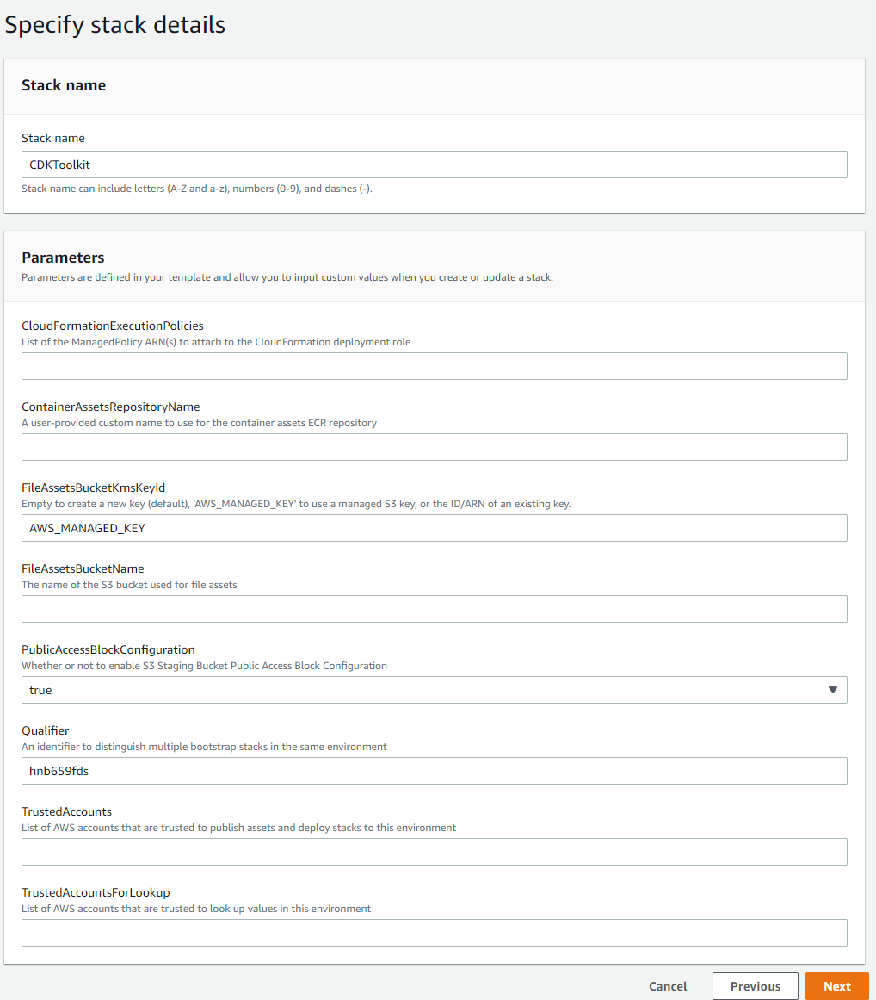

# 빠른배포
Hands on 환경을 빠르게 생성합니다.

## CDKToolkit 배포
1. AWS console > Cloudformation 콘솔을 엽니다.
2. stack 생성 버튼을 선택합니다.
- StackName: CDKToolkit
- Template URL: https://netappkr-wyahn-s3.s3.ap-northeast-2.amazonaws.com/public/CDKToolkit.yml

### Parameters
- Name : CDKToolkit
- FileAssetsBucketKmsKeyId : AWS_MANAGED_KEY
- PublicAccessBlockConfiguration : true
- Qualifier : hnb659fds  

3. 전부 기본값으로 진행 후 다음을 눌러 스택생성 페이지까지 이동합니다.
4. 체크박스를 모두 활성화 후 스택을 생성합니다.
  - [X] AWS CloudFormation이 사용자 지정 이름으로 IAM 리소스를 생성할 수 있음을 인정합니다. 

5. CDKToolkit 스택에서 생성된 s3에 파일을 업로드합니다.
- 그림과 같이 cdkasset.zip 파일의 압축을 풀고 하위 파일들을 모두 업로드합니다. 
  압축파일 : [cdkasset](./cdk_asset.zip)

- 압축파일 해제 후 s3에 파일을 업로드합니다.  
  s3 burketname : cdk-hnb659fds-assets-<"your aws account id">-ap-northeast-2  
  

## Merge Stack 배포
1. Merge Stack을 생성합니다.
- StackName: MergeStack  
- Template URL: https://netappkr-wyahn-s3.s3.ap-northeast-2.amazonaws.com/public/Spot_Admin/cdk/MergeStack.template.json
### Parameters
- 모두 기본값
2. 체크박스를 모두 활성화 후 스택을 생성합니다.
  - [X] AWS CloudFormation이 사용자 지정 이름으로 IAM 리소스를 생성할 수 있음을 인정합니다.
  - [X] AWS CloudFormation에 다음 기능이 필요할 수 있음을 인정합니다. CAPABILITY_AUTO_EXPAND
> 생성완료까지 걸리는 예상 시간  
> ✨  Total time: 1492.66s

# 결과
그림과 같이 2개의 메인스택과 2개의 서브스택이 배포되고 Hands-on 환경이 생성됩니다. 

# 다음과정
- 다음과정: [exe-1_Spot by netapp 과 AWS Account를 연결합니다.](../exercise/exercise-1/1-1_ConnectAccount.md)

# 참고문서
- [CDKv2 doc](https://docs.aws.amazon.com/cdk/v2/guide/parameters.html)
- [CDkv2 python](https://docs.aws.amazon.com/cdk/api/v2/python/aws_cdk.aws_eks/CfnAddon.html)

