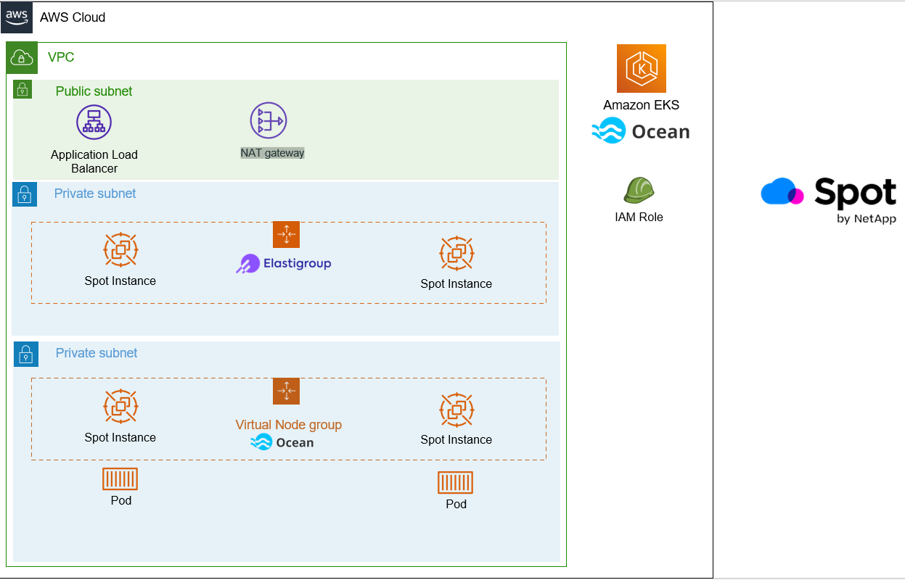

# Spot by Netapp Admin
Spot by Netapp admin 과정 교육을 위한 실습가이드를 제공합니다.

## 실습 전 필요사항
- AWS Account  
AWS CDK로 생성한 Cloudformation 템플릿을 이용하여 실습환경을 배포합니다. 
안타깝게도 본 과정에서는 실습에 필요한 클라우드 비용을 지불해드리지 않습니다. 

- Administartor 권한  
본과정에서는 EC2, IAM, EKS, Billing, S3 자원에 대한 CRUD 권한이 필요합니다. 

## 실습환경 배포
실습 전 Hands on 환경을 미리 배포해주세요.  
[빠른시작 Spot by Netapp Amdin Hands on](./QuickStart/CreateLabQuickstartGuide.md)

## 구성도
