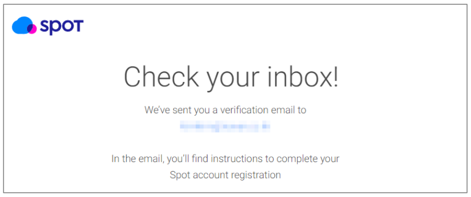
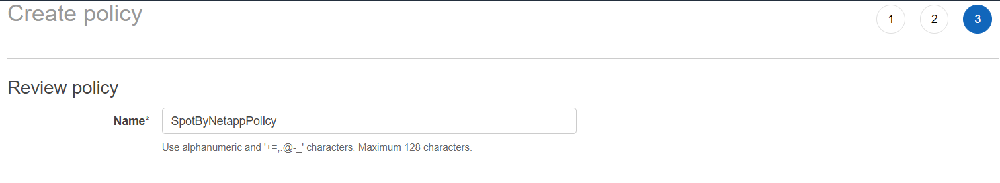
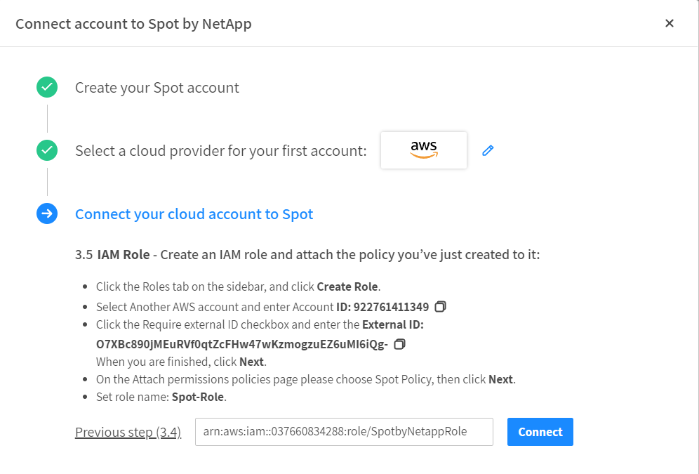

# 개요
본 문서는 사용자를 대신하여 인스턴스 리소스를 관리할 수  있도록 Spot Console에 Cloud Provider accounts를 연결하기 위한 절차들을 설명합니다.

# 1. Spot 조직 생성
Spot Console과 Cloud Provider Accounts와 연결하기 위해서는 Spot Console 계정이 필요합니다.</br>
다음 링크(https://console.spotinst.com/)로 이동하여 다음의 절차를 수행합니다.</br>
다음의 예와 같이 필요한 기본 정보를 입력 후 가입이 완료 됩니다.</br>


Company(회사) 항목 입력 시, 지정한 회사 이름이 조직(Organization)의 이름이 되기 때문에 최초
생성 시 유의하여 생성을 권장합니다. 다음 절차에서 복잡성을 모두 만족하는 패스워드를 입력
후, 봇 방지와 동의에 체크하여 가입을 진행합니다.</br>


# 2. account 연결
Cloudformation 템플릿 또는 사용자가 직접 role을 생성하여 Spot by netapp 서비스를 연동합니다.
권장하는 설정은 자동으로 하는 방법이지만 이 가이드에서는 Cloudformation을 통한 자동방법은 안내하지 않습니다.
연결에 문제가 있거나 권한수정등이 필요한 경우 수동설정으로 진행합니다.
### 계정추가 또는 활성화된 대쉬보드에서 Manually를 선택합니다.

### AWSS GovCloud이거나 China 계정여부를 확인합니다.

### AWS console에 로그인합니다.

### IAM 서비스로 이동 후 Spot by Netapp에 부여할 권한을 생성합니다.
1. 왼쪽 사이드메뉴에서 Policies를 클릭합니다.

2. 정책 생성을 클릭합니다.

3. Spot 콘솔로 되돌아온 후 View Policy를 클릭합니다.

4. 표시된 Policy를 복사합니다.

```json
{
  "Version": "2012-10-17",
  "Statement": [
    {
      "Sid": "GeneralSpotInstancesAccess",
      "Action": [
        "ec2:RequestSpotInstances",
        "ec2:CancelSpotInstanceRequests",
        "ec2:CreateSpotDatafeedSubscription",
        "ec2:Describe*",
        "ec2:AssociateAddress",
        "ec2:AttachVolume",
        "ec2:ConfirmProductInstance",
        "ec2:CopyImage",
        "ec2:CopySnapshot",
        "ec2:CreateImage",
        "ec2:CreateSnapshot",
        "ec2:CreateTags",
        "ec2:CreateVolume",
        "ec2:DeleteTags",
        "ec2:DisassociateAddress",
        "ec2:ModifyImageAttribute",
        "ec2:ModifyInstanceAttribute",
        "ec2:MonitorInstances",
        "ec2:RebootInstances",
        "ec2:RegisterImage",
        "ec2:RunInstances",
        "ec2:StartInstances",
        "ec2:StopInstances",
        "ec2:TerminateInstances",
        "ec2:UnassignPrivateIpAddresses",
        "ec2:DeregisterImage",
        "ec2:DeleteSnapshot",
        "ec2:DeleteVolume",
        "ec2:ModifyReservedInstances",
        "ec2:CreateReservedInstancesListing",
        "ec2:CancelReservedInstancesListing",
        "ec2:ModifyNetworkInterfaceAttribute",
        "ec2:DeleteNetworkInterface"
      ],
      "Effect": "Allow",
      "Resource": [
        "*"
      ]
    },
    {
      "Sid": "AccessELB",
      "Action": [
        "elasticloadbalancing:Describe*",
        "elasticloadbalancing:Deregister*",
        "elasticloadbalancing:Register*",
        "elasticloadbalancing:RemoveTags",
        "elasticloadbalancing:RegisterTargets",
        "elasticloadbalancing:EnableAvailabilityZonesForLoadBalancer",
        "elasticloadbalancing:DisableAvailabilityZonesForLoadBalancer",
        "elasticloadbalancing:DescribeTags",
        "elasticloadbalancing:CreateTargetGroup",
        "elasticloadbalancing:DeleteTargetGroup",
        "elasticloadbalancing:ModifyRule",
        "elasticloadbalancing:AddTags",
        "elasticloadbalancing:ModifyTargetGroupAttributes",
        "elasticloadbalancing:ModifyTargetGroup",
        "elasticloadbalancing:ModifyListener"
      ],
      "Effect": "Allow",
      "Resource": [
        "*"
      ]
    },
    {
      "Sid": "AccessCloudWatch",
      "Action": [
        "cloudwatch:DescribeAlarmHistory",
        "cloudwatch:DescribeAlarms",
        "cloudwatch:DescribeAlarmsForMetric",
        "cloudwatch:GetMetricStatistics",
        "cloudwatch:GetMetricData",
        "cloudwatch:ListMetrics",
        "cloudwatch:PutMetricData",
        "cloudwatch:PutMetricAlarm"
      ],
      "Effect": "Allow",
      "Resource": [
        "*"
      ]
    },
    {
      "Sid": "AccessSNS",
      "Action": [
        "sns:Publish",
        "sns:ListTopics",
        "sns:CreateTopic",
        "sns:GetTopicAttributes",
        "sns:ListSubscriptionsByTopic",
        "sns:Subscribe"
      ],
      "Effect": "Allow",
      "Resource": [
        "*"
      ]
    },
    {
      "Sid": "AccessIAM",
      "Action": [
        "iam:AddRoleToInstanceProfile",
        "iam:ListInstanceProfiles",
        "iam:ListInstanceProfilesForRole",
        "iam:PassRole",
        "iam:ListRoles",
        "iam:ListAccountAliases",
        "iam:GetPolicyVersion",
        "iam:ListPolicies",
        "iam:GetPolicy",
        "iam:ListAttachedRolePolicies",
        "organizations:ListAccounts",
        "iam:CreateServiceLinkedRole",
        "iam:PutRolePolicy",
        "iam:GetInstanceProfile",
        "iam:GetRolePolicy",
        "iam:ListRolePolicies",
        "iam:SimulatePrincipalPolicy"
      ],
      "Effect": "Allow",
      "Resource": [
        "*"
      ]
    },
    {
      "Sid": "GeneralAccessElaticBeanstalk",
      "Action": [
        "elasticbeanstalk:Describe*",
        "elasticbeanstalk:RequestEnvironmentInfo",
        "elasticbeanstalk:RetrieveEnvironmentInfo",
        "elasticbeanstalk:ValidateConfigurationSettings",
        "elasticbeanstalk:UpdateEnvironment",
        "elasticbeanstalk:ListPlatformVersions",
        "cloudformation:GetTemplate",
        "cloudformation:DescribeStackResources",
        "cloudformation:DescribeStackResource",
        "cloudformation:DescribeStacks",
        "cloudformation:ListStackResources",
        "cloudformation:UpdateStack",
        "cloudformation:DescribeStackEvents",
        "logs:PutRetentionPolicy",
        "logs:createLogGroup",
        "elasticbeanstalk:ListTagsForResource"
      ],
      "Effect": "Allow",
      "Resource": [
        "*"
      ]
    },
    {
      "Sid": "AccessAutoScalingGroups",
      "Action": [
        "autoscaling:*"
      ],
      "Effect": "Allow",
      "Resource": [
        "*"
      ]
    },
    {
      "Sid": "AccessEks",
      "Action": [
        "eks:ListClusters",
        "eks:DescribeNodegroup",
        "eks:ListNodegroups"
      ],
      "Effect": "Allow",
      "Resource": [
        "*"
      ]
    },
    {
      "Sid": "AccessEMR",
      "Action": [
        "elasticmapreduce:*",
        "s3:GetObject"
      ],
      "Effect": "Allow",
      "Resource": [
        "*"
      ]
    },
    {
      "Sid": "AccessECS",
      "Action": [
        "ecs:List*",
        "ecs:Describe*",
        "ecs:DeregisterContainerInstance",
        "ecs:UpdateContainerInstancesState",
        "ecs:RegisterTaskDefinition",
        "ecs:CreateService",
        "application-autoscaling:PutScalingPolicy",
        "application-autoscaling:RegisterScalableTarget",
        "application-autoscaling:Describe*",
        "ecs:putAttributes"
      ],
      "Effect": "Allow",
      "Resource": [
        "*"
      ]
    },
    {
      "Sid": "AccessBatch",
      "Action": [
        "batch:List*",
        "batch:Describe*"
      ],
      "Effect": "Allow",
      "Resource": [
        "*"
      ]
    },
    {
      "Sid": "AccessOpsWorks",
      "Action": [
        "opsworks:DeregisterInstance",
        "opsworks:DescribeInstances",
        "opsworks:DescribeStacks",
        "opsworks:DescribeLayers"
      ],
      "Effect": "Allow",
      "Resource": [
        "*"
      ]
    },
    {
      "Sid": "AccessCodeDeploy",
      "Action": [
        "codedeploy:*"
      ],
      "Effect": "Allow",
      "Resource": [
        "*"
      ]
    },
    {
      "Sid": "AccessGeneralS3",
      "Action": [
        "s3:GetObject",
        "s3:List*",
        "s3:GetBucketLocation"
      ],
      "Effect": "Allow",
      "Resource": [
        "*"
      ]
    },
    {
      "Sid": "AccessRoute53",
      "Action": [
        "route53:ListHostedZones",
        "route53:ListResourceRecordSets",
        "route53:ChangeResourceRecordSets"
      ],
      "Effect": "Allow",
      "Resource": [
        "*"
      ]
    },
    {
      "Sid": "AccesS3forElasticBeanstalk",
      "Effect": "Allow",
      "Action": [
        "s3:*"
      ],
      "Resource": [
        "arn:aws:s3:::elasticbeanstalk*"
      ]
    },
    {
      "Sid": "DockerBasedBeanstalkEnvironments",
      "Action": [
        "ecs:Poll",
        "ecs:DiscoverPollEndpoint",
        "ecs:StartTelemetrySession",
        "ecs:StartTask",
        "ecs:StopTask",
        "ecs:DescribeContainerInstances",
        "ecs:RegisterContainerInstance",
        "ecs:DeregisterContainerInstance",
        "ecs:SubmitContainerStateChange",
        "ecs:SubmitTaskStateChange"
      ],
      "Effect": "Allow",
      "Resource": [
        "*"
      ]
    },
    {
      "Sid": "ElasticFileSystem",
      "Action": [
        "elasticfilesystem:DescribeFileSystems"
      ],
      "Effect": "Allow",
      "Resource": [
        "*"
      ]
    },
    {
      "Sid": "Pricing",
      "Action": [
        "pricing:GetProducts"
      ],
      "Effect": "Allow",
      "Resource": [
        "*"
      ]
    },
    {
      "Sid": "SavingsPlan",
      "Action": [
        "savingsplans:Describe*",
        "savingsplans:List*"
      ],
      "Effect": "Allow",
      "Resource": [
        "*"
      ]
    },
    {
      "Sid": "Lambda",
      "Action": [
        "lambda:ListFunctions"
      ],
      "Effect": "Allow",
      "Resource": [
        "*"
      ]
    }
  ]
}
```
5. aws iam console에서 json 탭을 선택 후 복사한 내용을 붙여넣고 다음을 클릭합니다.

6. ( 선택사항 ) TAG를 추가합니다.
- Key: Create
- value : Manually

7. Review Policy 페이지이서 정책이름을 생성하고 생성합니다.
- Name : SpotByNetappPolicy


### 5.AWS 콘솔에서 IAM Role을 생성하고 이전에 생성한 정책을 부여합니다. 
1. AWS IAM 콘솔을 열고 사이드메뉴에서 Roles를 선택합니다.
2. Create Role 을 클릭합니다.

3. 신뢰관계 페이지에서 AWS Account를 선택하고 계정번호를 입력합니다.
- AWS Account ID : 922761411349 
4. External ID 옵션을 활성화 하고 Spot Console에 표시된 값을 복사하여 AWS 콘솔에 붙혀 넣습니다. ( 진행도중 스팟 콘솔 새로고침이나 새로생성 시 External ID값이 변경될 수 있습니다.)

5. 정책 추가 페이지에서 이전 단계에서 생성한 Policy를 할당합니다.

6. 다음 페이지에서 Role 이름을 입력합니다.
- Name : SpotbyNetappRole

7. aws 콘솔에서 IAM 롤을 복사합니다.

8. Spot Console에서 복사한 Role ARN을 입력하고 연결버튼을 클릭합니다.



# 참조
- [Spot DOC AWS 계정 수동연결](https://docs.spot.io/connect-your-cloud-provider/first-account/aws-manually)
