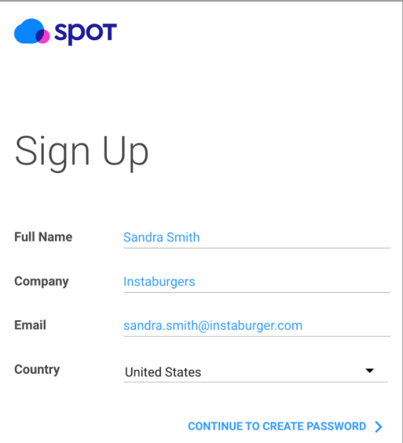

# 실습 설명

사용자를 대신하여 Spoy by Netapp 솔루션이 클라우드 자원을 관리할 수 있도록 설정해야 합니다. 
Spot Console을 통해 Spot 계정을 등록하고 Cloud service Provider accounts를 연결하기 위한 절차를 설명합니다.

# Spot organization 생성

Spot Console과 Cloud Provider Accounts와 연결하기 위해서는 Spot Console 계정이 필요합니다. 
다음 링크(<https://console.spotinst.com/>)로 이동하여 다음의 절차를 수행합니다. 
다음의 예와 같이 필요한 기본 정보를 입력 후 가입이 완료 됩니다. 

Company(회사) 항목 입력 시, 지정한 회사 이름이 조직(Organization)의 이름이 되기 때문에 최초
생성 시 유의하여 생성을 권장합니다. 다음 절차에서 복잡성을 모두 만족하는 패스워드를 입력
후, 봇 방지와 동의에 체크하여 가입을 진행합니다. 

# Account 연결

Cloudformation 템플릿 또는 사용자가 직접 role을 생성하여 Spot by netapp 서비스를 연동합니다. 
권장하는 연동 방법은 자동으로 하는 방법이지만  
이 가이드에서는 Cloudformation을 통한 자동방법은 안내하지 않습니다. 
연결에 문제가 있거나 권한 수정등이 필요한 경우 수동설정으로 진행합니다.

1. Connected a Linked Account를 클릭합니다.
2. AWS 계정 별칭 또는 AWS Account number를 입력합니다. 

3. CSP 선택 화면에서 AWS를 선택합니다. 

4. 활성화된 대쉬보드에서 Manually를 선택합니다. 

5. AWS GovCloud이거나 AWS China 계정여부를 묻는 질문에 No를 선택합니다. 

6. AWS console에 로그인 후 스팟 콘솔로 돌아와 Next를 클릭합니다. 

7. 가이드되어 있는 절차에 따라 AWS Policy를 생성해야 합니다. 

8. 왼쪽 사이드메뉴에서 Policies를 클릭합니다. 

9. 정책 생성을 클릭합니다. 

10. Visual Editor Page를 열고 Json Tab을 클릭합니다. 

11. Spot 콘솔로 되돌아온 후 View Policy를 클릭합니다. 

12. 표시된 Policy를 복사합니다. 

13. aws iam console에서 json 탭을 선택 후 복사한 내용을 붙여넣고 다음을 클릭합니다. 

14. ( 선택사항 ) TAG를 추가합니다.

- Key: Create
- value : Manually

15. Review Policy 페이지이서 정책이름을 생성하고 생성합니다. 
**이떄 Policy 이름은 AWS 계정 내에서 고유하도록 설정합니다.**

- Name : SpotByNetappPolicy_<개인별칭또는이름>

16. AWS 콘솔에서 IAM Role을 생성하고 이전에 생성한 정책을 할당해야 합니다.

17. AWS IAM 콘솔을 열고 사이드메뉴에서 Roles를 선택합니다.

18. Create Role 을 클릭합니다.  

19. 신뢰관계 페이지에서 AWS Account를 선택하고 계정번호를 입력합니다.

- AWS Account ID : 922761411349

20. External ID 옵션을 활성화 하고 Spot Console에 표시된 값을 복사하여 AWS 콘솔에 붙혀 넣습니다.

> ### 경고

> 진행도중 스팟 콘솔을 새로고치거나 새로생성 시 External ID값이 변경될 수 있습니다.  

21. 정책 추가 페이지에서 이전 단계에서 생성한 Policy를 할당합니다.

22. 다음 페이지에서 Role 이름을 입력합니다. 
**이떄 반드시 Role 이름은 AWS 계정 내에서 고유해야 합니다.**

- Name : SpotbyNetappRole_<개인별칭또는이름>

23. aws 콘솔에서 IAM 롤을 복사합니다.

24. Spot Console에서 복사한 Role ARN을 입력하고 연결버튼을 클릭합니다.

25. 연결에 성공할 시 아래 메세지가 표시됩니다.

# 참조

- [Spot DOC AWS 계정 수동연결](https://docs.spot.io/connect-your-cloud-provider/first-account/aws-manually)
