# Eco
Eco는 클라우드 약정 구매 및 배포를 위한 자동화 및 최적화 솔루션입니다.  
Eco는 유연성, 시장 규모, 과거 및 예상 사용량을 고려하여 예약 인스턴스와 저축 계획의 이상적인 조합을 식별하여 비용 절감을 극대화하는 동시에 미래의 요구 사항에 대해 최대한의 유연성을 제공합니다.

## 시작하기 전에..

기본리전은 버지니아로 설정되어 있습니다. 스택 수행 시 IAM Role 과 Policy 가 생성됩니다.  
이 실습에서는 원하시는 리전으로 이동 후 수행하지만 버지니아 리전에서 작업하는것을 권장합니다. 
> ### AWS Region
> All actions in this procedure should be made in the US-East-1 (Northern Virginia) AWS region. (This includes generating the CUR file into a bucket in us-east-1.) If there is a problem doing this, please contact Support.

## AWS 계정 Eco 서비스 연결
1. Cloud Analyzer 콘솔로 이동 시 아래 화면이 보입니다.  

2. 권한 추가를 클릭하고 설명된 단계에 따라 설정을 진행합니다.
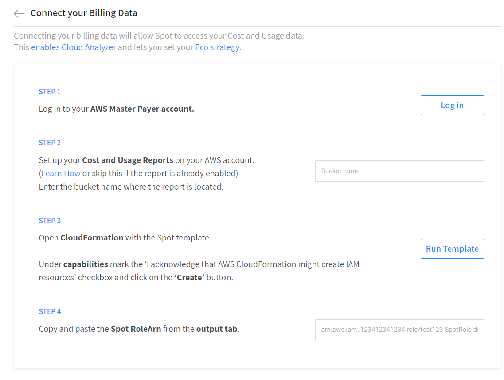

3. AWS Billing 페이지에 엑세스 할 수 있는 계정으로 로그인합니다.

> ### 주의!
> MSP에 등록되어 있는 계정인 경우 Root 계정으로도 Billing 정보를 열람할 수 없습니다.  
> MSP측에 빌링정보에 엑세스 할 수 있는 권한을 요청하거나 MSP측에서 제공해주는 빌링정보를 따로가져와야합니다.  
> 자세한 내용은 [Customer Working with AWS MSP](https://docs.spot.io/eco/getting-started/connect-account-customer-working-with-msp) 문서를 참고해주세요.

> ### Tips!
> [AWS 결제 데이터에 대한 IAM 액세스 활성화](https://docs.aws.amazon.com/ko_kr/IAM/latest/UserGuide/tutorial_billing.html)를 통해 Root 계정이 아닌계정에서도 구성이 가능합니다.

4. AWS 콘솔 사용자 계정을 클릭하여 메뉴를 드롭다운 후 계정을 클릭하여 AWS Biling 페이지로 이동합니다.
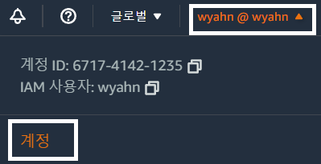

5. 왼쪽 사이드메뉴에서 Cost & Usage Report를 클릭합니다.  
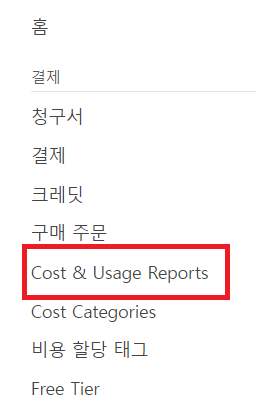

6. "보고서 생성"을 클릭합니다.
7. 필요한 항목을 채워넣습니다.
- 보고서이름 : Spot-by-Netapp-Billing-report
- 추가 보고서 : [X] 리소스 ID 포함
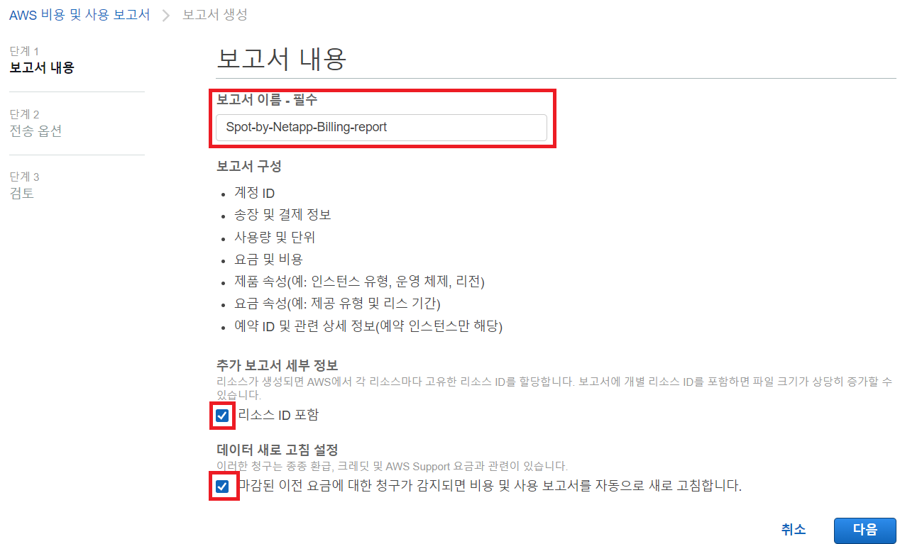
8. 전송옵션 단계에서 s3 버킷구성을 클릭합니다.
9. 버킷 생성 마법사에서 필요한 항목을 채워넣습니다.
- S3 버킷이름 : spot-biling-report-<your account ID>
- 리전 : 서울 
    > ### TIPs
    > 버지니아리전의 s3가 보관가격이 조금 더 쌉니다. 다른 이슈가없다면 버지니아에 생성하는것을 권장합니다. 

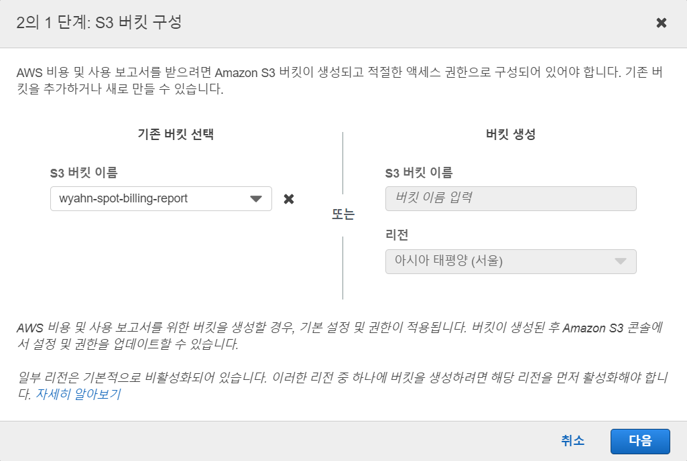

10. 버킷 폴리시를 업데이트합니다.
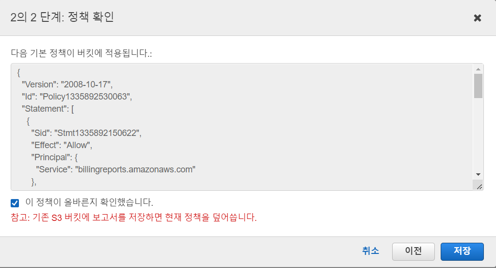

11. 아래와 같이 전송 옵션을 구성합니다.
- 보고서 경로 접두사 - 필수 : SpotByNetapp
- 시간 세부 수준 : 매 시간
- 보고서 버전 관리 : 기존 보고서 덮어쓰기
- 보고서 데이터 통합 활성화 대상 : [X] Amazon Athena
- 압축 유형 : Parquest ( 아테나 선택 시 고정됨 )
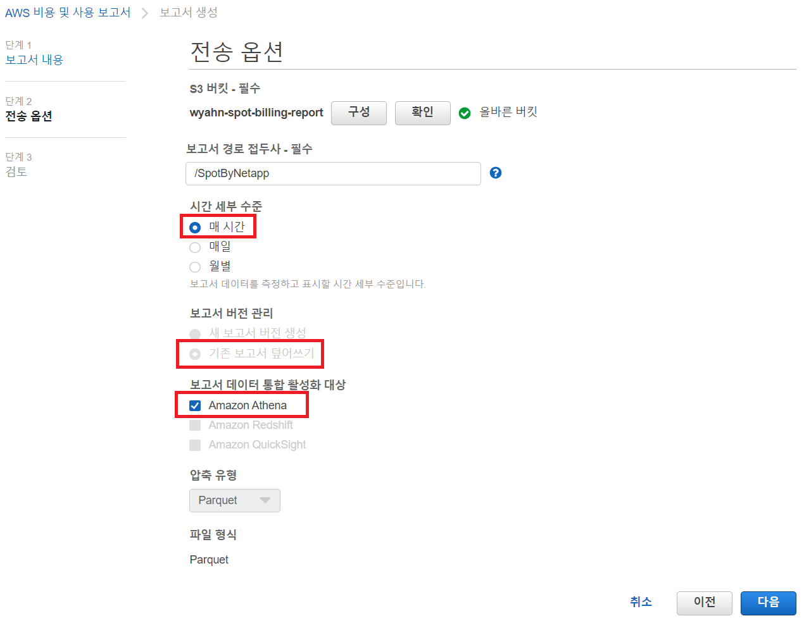

12. 검토 화면에서 생성된 내용을 검토 후 리포트를 생성합니다.
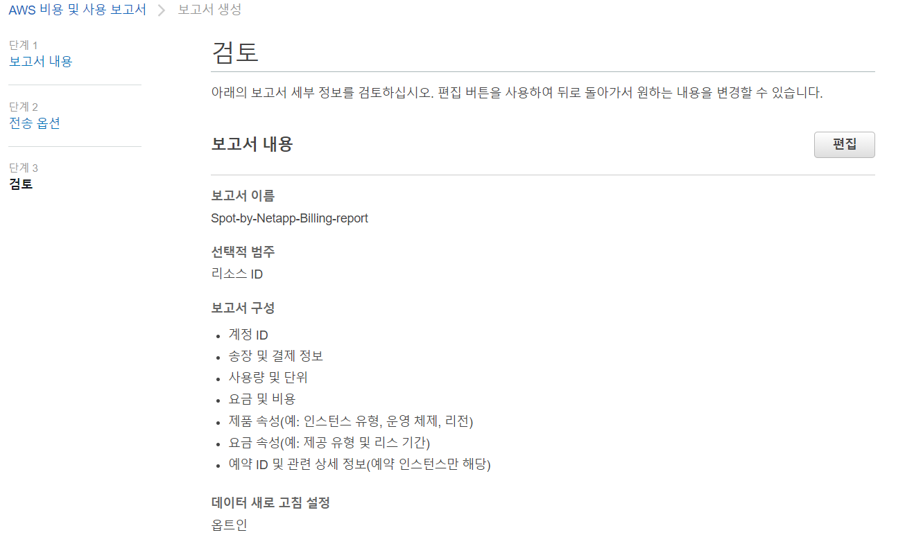
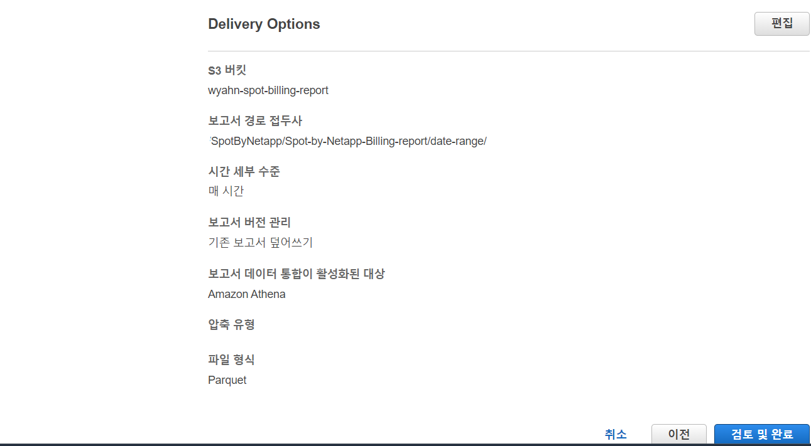

13. AWS 비용 보고서가 설정됩니다.
해당 s3에 데이터 파일이 생성되는데 하루정도 시간이 필요합니다.
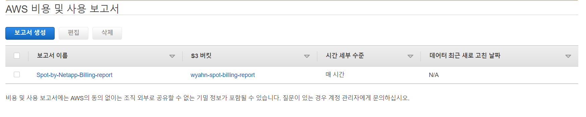

14. 스팟콘솔로 돌아와 STEP2에 버킷 이름을 입력합니다.
15. STEP3의 Cloudformation 링크를 클릭합니다.
16. CUR 데이터가 지정된 s3에 생성되면 연결이 가능합니다. 
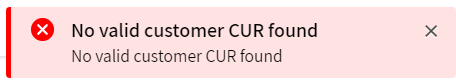

17. 연동이 완료되면 CloudAnlayzer에 최대 72시간 후에 집계된 데이터가 표시됩니다.

# 참조
- [ECO 연결](https://docs.spot.io/eco/getting-started/connect-your-aws-account)
- [Customer Working with AWS MSP](https://docs.spot.io/eco/getting-started/connect-account-customer-working-with-msp)
