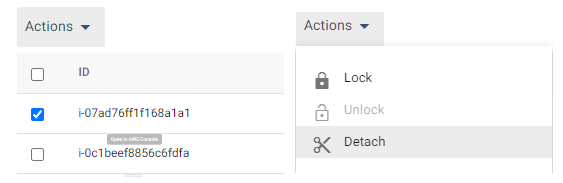

# Instance Actions

## 인스턴스 수동 추가 제거
Action 버튼을 사용하여 분리하려는 특정 인스턴스 또는 여러 인스턴스를 간단히 확인할 수 있습니다. 이렇게 하면 인스턴스/인스턴스가 제거되고 새 인스턴스가 시작됩니다.

### Instance 추가
1. 스팟 콘솔 우측 상단의 Actions 버튼을 눌러 드롭다운합니다. 

2. 목표값과 최대값을 변경합니다. 
- Target : 2
- Maximum : 2  

### 결과
수분 후 콘솔상에 인스턴스가 추가된것이 보입니다. 

### Instance 분리
1. 먼저 배포된 인스턴스를 클릭하고 Action 버튼에서 Detach를 클릭합니다. 

2. 유휴시간 및 그룹용량 감소를 체크하고 Detech를 클릭합니다.
- Draing Timeout : 120
- [X] Decrement Group's Capacity  

### 결과
인스턴스가 분리된것이 확인됩니다.  

AWS console로 이동 후 대상 tab에서 인스턴스 상태가 draining 인것을 확인하고 2분 후에 인스턴스가 없어지는것을 확인합니다. ( 새로고침 필요 ) 

> ### !Tips
> 이것은 AWS 대상그룹의 Draining Timeout과 무관합니다. 운영자분들은 수동으로 Detech 시도 시 운영중인 대상그룹의 Draining Timeout 과 같거나 크게 설정하는것이 좋습니다.
> AWS TargetGroup 관련 유휴시간에 대한 자세한 내용은 [AWS 로드벨런서 연결 유휴시간](https://docs.aws.amazon.com/ko_kr/elasticloadbalancing/latest/application/application-load-balancers.html#connection-idle-timeout)을 참고하세요

## Instance 잠금
1. 인스턴스를 체크 후 Action에서 Lock을 클릭합니다. 

2. 잠금 시간을 설정합니다. 

### 결과
인스턴스가 자동 조정작업에 대해 보호됩니다.

> ### Tips
> 이 설정은 Auto Scaling 이벤트에 대한 잠금 설정입니다. 수동 Detech 시도 시 허용됩니다.
또한 Spot Interruption(강제 회수)이 발생하는 경우 이를 방지하지는 못합니다.

# 다음 과정
- 이전 과정 : [ElastiGroup 생성](./2-1_CreateElasticGroup.md)
- 다음 과정 : [Elastigroup Auto Scaling](./2-2_ElasticGroupAutoScaling.md)

# 참고
- [AWS 로드벨런서 연결 유휴시간](https://docs.aws.amazon.com/ko_kr/elasticloadbalancing/latest/application/application-load-balancers.html#connection-idle-timeout)