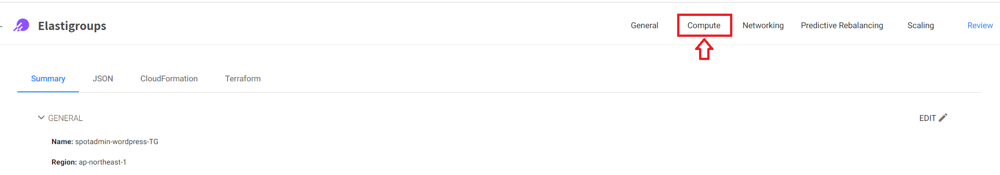
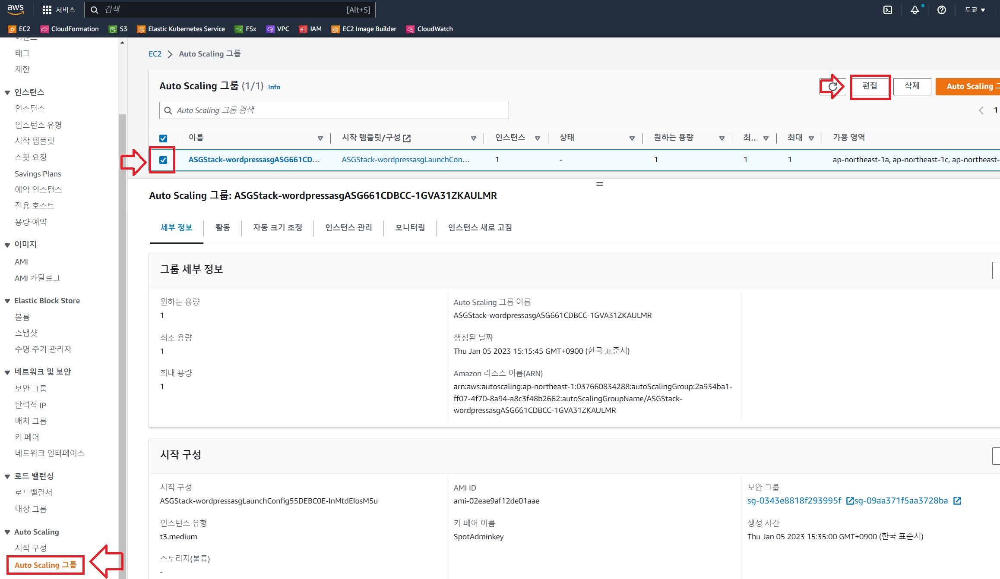
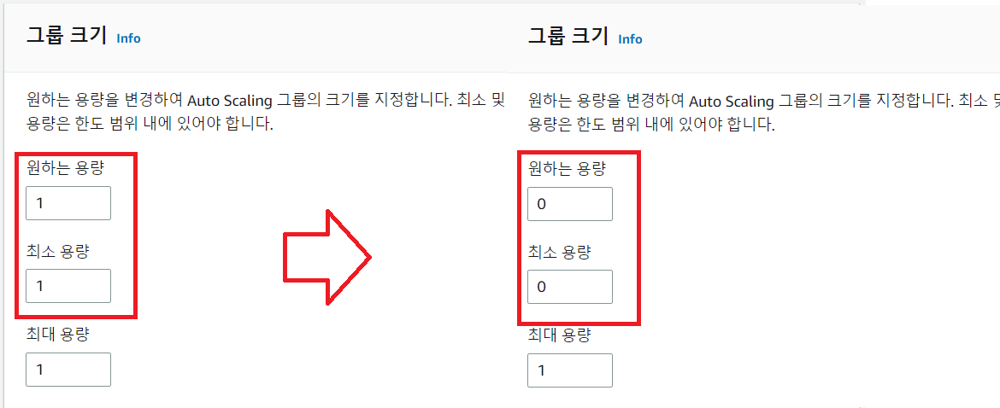

# ElastiGroup

Elastigroup은 AWS, Azure 또는 GCP에서 실행되는 확장형 애플리케이션을 위한 클라우드 인프라를 단순화 및 자동화하여 운영 팀이 인프라 관리의 부담을 덜어줍니다. </br>
Elastigroup은 리소스 사용량을 지속적으로 분석하고 가장 저렴한 컴퓨팅 옵션을 사용하여 리소스 수요를 충족하고 가용성을 보장하기 위해 컴퓨팅 리소스를 최적화하는 자동 확장할 수 있습니다.

## 실습 목표

이미 AWS에 구성된 Auto Scaling Group과 Elastic Load Balancer 설정을 엘라스틱 그룹으로 가져오는 방법에 대해 실습합니다.

## 실습 전

- Auto Scaling Group이 구성된 AWS 계정이 필요합니다. </br>
[실습 환경구성](../../QuickStart/CreateLabQuickstartGuide.md)에서 실습전 필요한 환경을 배포합니다.
- AWS 계정에 연결된 Spot 계정 </br>
[AWS 계정을 Spot에 연결합니다.](../exercise-1/ConnectAccount.md)

## ElastiGroup으로 가져오기

1. "Import"를 드롭다운하고 "AWS Load Balancer"를 클릭합니다.</br>


2. AWS Load Balancer 팝업 창에 가져올 AWS 인프라 정보를 입력합니다.

- Region: "스택을 배포한 Region 선택"
- Load Balancer Type: Application / Network
- Balancers: spotadmin-wordpress-TG</br>


> ### Tip
> 이 명령은 로드벨런서 대상그룹의 설정만 가져옵니다. 로드벨런서 정보는 가져오지 않습니다.

4. "Select"를 클릭합니다. </br>

5. 구성검토 화면에서 "Compute" Tab을 선택합니다.


6. 화면을 드래그하여 Spot Types 메뉴로 이동 후 타입을 지정합니다. (체크박스 활성화)


7. Compute Tab으로 이동 후 타입을 지정합니다.


8. **Review Tab**을 클릭합니다.</br>
요약 아래의 Review 탭에서 Elastigroup의 최종 구성을 검토할 수 있습니다. </br>
또한 Spot은 Terraform에서 사용할 수 있는 Elastigroup 템플릿도 자동으로 생성해줍니다. </br>


9. **Create**를 클릭하고 Elastigroup 생성을 완료합니다.

## 서비스 상태 확인
워크로드가 성공정으로 옮겨졌는지 서비스에 문제가 없는지 확인합니다.

1. AWS EC2 Web console로 이동합니다.


2. 좌측 사이드메뉴에서 로드벨런서를 클릭하고 **SpotAdminALB**를 클릭합니다.

3. 하단에 활성화된 ALB 정보중 **DNS 이름**을 복사합니다.


4. nslookup 명령을 통해 도메인 IP를 알아냅니다. </br>
nslookup < 도메인 >

### 예시 출력

    ```
    PS C:\Users\wyahn> nslookup SpotAdminALB-344794616.ap-northeast-2.elb.amazonaws.com
    서버:    kns.kornet.net
    Address:  168.126.63.1

    권한 없는 응답:
    이름:    SpotAdminALB-344794616.ap-northeast-2.elb.amazonaws.com
    Addresses:  43.201.128.116
            13.209.199.200

    PS C:\Users\wyahn>
    ```

5. 사용하고 있는 편집기를 관리자권한으로 실행 후 hosts 파일을 수정합니다. </br>

### 각 OS별 hosts 파일경로

- 윈도우 : C:\Windows\System32\drivers\etc\hosts </br>
- 리눅스 : /etc/hosts

### 예시

< IP > wp.netappkr.com </br>


> ### Tips
> 1. 보안프로그램에서 경고 또는 hosts 파일변조 차단이 걸릴 수 있습니다. </br>
> 이 경우 Curl 명령을 이용해 결과를 text로 확인 합니다. 
> 2. OS별 설치된 curl 버전별로 명령어 옵션이 조금 다를 수 있습니다. </br>
> **BastionHost에 접속하여 확인하는 것을 권장**합니다.
> ### 예시 출력
>```bash
> [ec2-user@ip-172-30-0-116 ~]$ nslookup SpotAdminALB-1120979018.ap-northeast-1.elb.amazonaws.com
> Server:		172.30.0.2
> Address:	172.30.0.2#53
> 
> Non-authoritative answer:
> Name:	SpotAdminALB-1120979018.ap-northeast-1.elb.amazonaws.com
> Address: 3.113.207.75
> Name:	SpotAdminALB-1120979018.ap-northeast-1.elb.amazonaws.com
> Address: 54.92.67.53
> Name:	SpotAdminALB-1120979018.ap-northeast-1.elb.amazonaws.com
> Address: 54.64.195.66
> 
>[ec2-user@ip-172-30-0-116 ~]$ cat /etc/hosts
> 127.0.0.1   localhost localhost.localdomain localhost4 localhost4.localdomain4
> ::1         localhost6 localhost6.localdomain6
> 
> 54.92.67.53 wp.netappkr.com
> 54.64.195.66 wp.netappkr.com
> 3.113.207.75 wp.netappkr.com
>
> [ec2-user@ip-172-30-0-116 ~]$ curl -IL -H "Host:wp.netappkr.com" 
> HTTP/1.1 301 Moved Permanently
> Date: Thu, 05 Jan 2023 07:17:22 GMT
> Content-Type: text/html
> Content-Length: 169
> Connection: keep-alive
> Set-Cookie: AWSALB=h851GaW/+W/HG3d2ACmd+ZXDfmtz7e/aeWQDFJ+lOy+hZUBNAcDmke29iqU/iJcEwVWRCbGduRgmZqIZCF9puIbUTyLSqg8nLHZKQi2SlvNMMO+hxo1Y3/bcSmUd; Expires=Thu, 12 Jan 2023 07:17:22 GMT; Path=/
> Set-Cookie: AWSALBCORS=h851GaW/+W/HG3d2ACmd+ZXDfmtz7e/aeWQDFJ+lOy+hZUBNAcDmke29iqU/iJcEwVWRCbGduRgmZqIZCF9puIbUTyLSqg8nLHZKQi2SlvNMMO+hxo1Y3/bcSmUd; Expires=Thu, 12 Jan 2023 07:17:22 GMT; Path=/; SameSite=None
> Server: nginx/1.22.0
> Location: http://wp.netappkr.com/wordpress/
> 
> HTTP/1.1 200 OK
> Date: Thu, 05 Jan 2023 07:31:28 GMT
> Content-Type: text/html; charset=UTF-8
> Connection: keep-alive
> Set-Cookie: AWSALB=Mf0z+YoJCWg+S7LWPyxTIT9y4lGD+OxLWvPZDw0upDoj4RgHFakJtcEHi5SqOZ647zi9VeuO0sPdacYAaAqF4vhhkW8ZMKyA6j4smBAFHZVWXxsbu0puduXqwJHP; Expires=Thu, 12 Jan 2023 07:31:27 GMT; Path=/
> Set-Cookie: AWSALBCORS=Mf0z+YoJCWg+S7LWPyxTIT9y4lGD+OxLWvPZDw0upDoj4RgHFakJtcEHi5SqOZ647zi9VeuO0sPdacYAaAqF4vhhkW8ZMKyA6j4smBAFHZVWXxsbu0puduXqwJHP; Expires=Thu, 12 Jan 2023 07:31:27 GMT; Path=/; SameSite=None
> Server: nginx/1.22.0
> X-Powered-By: PHP/7.2.34
> Link: <http://wp.netappkr.com/wordpress/index.php/wp-json/>; rel="https://api.w.org/"
> 
> ```

6. 브라우저를 열고 <http://wp.netapp.com/wordpress> 로 접속합니다.</br>
웹서비스가 잘 떠있는것이 확인됩니다.


7. Spot Console로 이동 후 Loadbalancers Tab에서 인스턴스 2대가 표시되는것을 확인합니다.
( 기존 instance 1 + Spot Instance 1)</br>


8. AWS Auto Scaleing Group Web console로 이동합니다.
9. Auto Scaling 그룹 검색에 wordpress를 검색합니다. </br>
10. 오토스케일링 그룹을 선택하고 편집을 클릭합니다.

11. Auto Scaling Group의 크기를 변경합니다.
- 원하는 용량 : 0
- 최소 용량 : 0

12. 업데이트를 클릭합니다.</br>
수분 후 기존 서버가 삭제됩니다.

## 결과
AWS Auto Scaling Group 자원을 Elastigroup으로 가져왔습니다.

- 브라우저를 새로고침하거나 Curl 명령을 통해 질의 시 서비스 상태에 변화가 없습니다.

# 다음 과정

Console Action에 대해 알아봅니다.

- [Elastigroup Instance Action](./2-1-1_ElastigroupInstanceAction.md)
