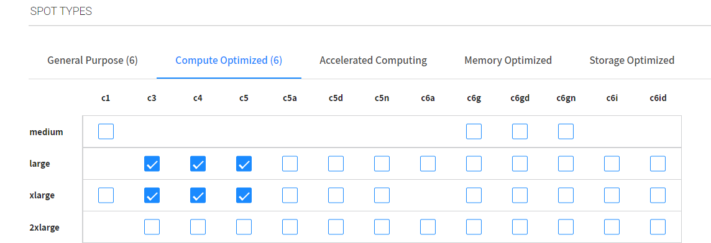

# 엘라스틱 그룹 가져오기
오토스케일링 그룹과 Elastic Load Balancer 설정을 엘라스틱 그룹으로 가져옵니다.

# 실습 전
- Auto Scaling Group이 구성된 AWS 계정이 필요합니다. </br>
[실습 환경구성](../../QuickStart/CreateLabQuickstartGuide.md)에서 실습전 필요한 환경을 배포합니다.
- AWS 계정에 연결된 Spot 계정 
[AWS 계정을 Spot에 연결합니다.](../exercise-1/ConnectAccount.md)

# Getting start
1. Spot Console의 왼쪽 메뉴에서 Elastigroup/Groups를 클릭하고 Elastigroup 생성을 클릭합니다.
2. Use Cases Page 에서 Elastic Load Balancer를 클릭합니다.
    > ### TIp
    > 기존에 이미 EG가 생성되어 있는경우 import 메뉴를 드롭다운하여 생성합니다.
    > 
3. AWS Load Balancer 팝업에서 기존 AWS Load Balancer에서 Elastigroup 생성을 선택하고 다음 정보를 완료합니다.
- Region: Seoul
- Load Balancer Type: Application
- Balancers: wordpress-TG</br>

    > ### !Tips
    > 이 명령은 로드벨런서 대상그룹의 설정만 가져옵니다. 로드벨런서 정보는 가져오지 않습니다.
4. "Select"를 클릭합니다. </br>
5. 구성검토 화면에서 "Compute" Tab을 선택합니다.
6. 화면을 드래그하여 Spot Types 메뉴로 이동 후 타입을 지정합니다. (체크박스 활성화)

7. Memory Tab으로 이동 후 타입을 지정합니다.


# 적용 전 구성 검토
요약 아래의 Review 탭에서 Elastigroup의 최종 구성을 검토할 수 있습니다. 또한 Spot은 Terraform에서 사용할 Elastigroup 템플릿을 자동으로 생성합니다.


# 서비스 상태 확인
1. AWS EC2 Webconsole로 이동합니다. 

2. 좌측 사이드메뉴에서 로드벨런서를 클릭하고 "SpotAdminALB"를 클릭합니다.
3. 하단에 활성화된 ALB 정보중 DNS 이름을 복사합니다.

4. nslookup 명령을 통해 도메인 IP를 알아냅니다. </br>
nslookup < 도메인 > 
### 예시 출력
    ```
    PS C:\Users\wyahn> nslookup SpotAdminALB-344794616.ap-northeast-2.elb.amazonaws.com
    서버:    kns.kornet.net
    Address:  168.126.63.1

    권한 없는 응답:
    이름:    SpotAdminALB-344794616.ap-northeast-2.elb.amazonaws.com
    Addresses:  43.201.128.116
            13.209.199.200

    PS C:\Users\wyahn>
    ```

5. 사용하고 있는 편집기를 관리자권한으로 실행 후 hosts 파일을 수정합니다. </br>
### 각 OS별 hosts 파일경로
- 윈도우 : C:\Windows\System32\drivers\etc\hosts </br>
- 리눅스 : /etc/hosts 

### 예시
< IP > wp.netappkr.com </br>


> ### Tips
> 보안프로그램에서 경고 또는 hosts 파일변조 차단이 걸릴 수 있습니다. 이 경우 Curl 명령을 이용해 결과를 text로 확인 합니다.
> - bash
> ```bash
> curl -IL -H "Host:wp.netappkr.com"; http://< IP >/wordpress
> ```
> - powershell
> ```powershell
> Invoke-RestMethod -Uri "http://<IP>/wordpress" -Headers @{"Host"="wp.netappkr.com"}
> ```
6. 브라우저를 열고 http://wp.netapp.com/wordpress 로 접속합니다. 

# 결과
웹서비스가 잘 떠있는것이 확인됩니다.


Spot Console로 이동 후 Loadbalancers Tab에서 인스턴스 2대가 표시되는것을 확인합니다.
( 기존 instance 1 + Spot Instance 1)


# 다음 과정
Console Action에 대해 알아봅니다.
- [Elastigroup Instance Action](./2-1-1_ElastigroupInstanceAction.md)
