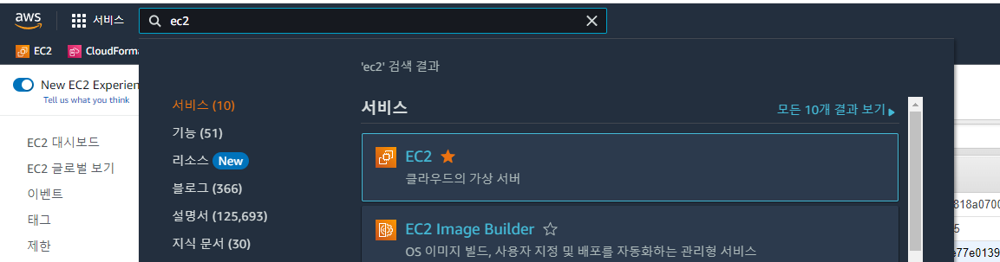

# ElastiGroup AutoScaling 
엘라스틱 그룹의 대상 조정 정책 및 예측 자동 조정 기능을 실습합니다.

## Target Scaling Policies and Predictive Autoscaling
목표 조정 정책은 원하는 목표 값과 관련하여 지정된 지표를 추적하고 이 목표를 충족하도록 Elastigroup 규모를 자동으로 조정하는 자동 조정 정책입니다.

## Getting Start
1. Elastigroup의 spotadmin-wordpress-TG 콘솔로 이동합니다.
2. 우측 상단 Action을 드롭다운하고 Edit Configration을 클릭합니다.

3. Scaling Tab으로 이동 후 Target Scaling Policies를 설정합니다.
- Policy Name : ALB Req per TG
- Policy Type : Target Scaling
- Metric Name : ALB Request Count Per Target
- Target Value : 10
- Cooldwon : 10 Sec
- Target Group : spotadmin-wordpress-TG


4. Review Tab으로 이동 후 구성 확인 후 Update 합니다.
- [ ] Roll My Group (체크하지 않고 Close)


5. Bastion Host에 접속합니다.
접속 방법은 [Bastion 접속하기](../../QuickStart/ConnectToBastion.md)를 참고합니다.

6. AWS EC2 Webconsole로 이동합니다. 

7. 좌측 사이드메뉴에서 로드벨런서를 클릭하고 "SpotAdminALB"를 클릭합니다.
8. 하단에 활성화된 ALB 정보중 DNS 이름을 복사합니다.

9. nslookup 명령을 통해 도메인 IP를 알아냅니다. </br>
```
nslookup < 복사한 도메인 >
```
#### 예시 출력
```
Server:		172.30.0.2
Address:	172.30.0.2#53

Non-authoritative answer:
Name:	SpotAdminALB-344794616.ap-northeast-2.elb.amazonaws.com
Address: 43.201.128.116
Name:	SpotAdminALB-344794616.ap-northeast-2.elb.amazonaws.com
Address: 13.209.199.200
```
10. hosts 파일을 수정합니다.
```
sudo vim /etc/hosts
```
```
127.0.0.1   localhost localhost.localdomain localhost4 localhost4.localdomain4
::1         localhost6 localhost6.localdomain6
43.201.128.116 wp.netappkr.com
13.209.199.200 wp.netappkr.com
```
11. Hey를 이용하여 부하를 발생시킵니다.
```
hey -n 45000 -q 10 -c 5 http://wp.netappkr.com/wordpress/
```

> ### Tips
> 이 Test는 적어도 결과를 보는데 20분 이상의 시간이 필요합니다. 결과를 기다리지 말고 다음 스탭을 진행 후 결과는 로그로 확인하는것을 추천드립니다.

## 결과
부하가 늘어남에따라 인스턴스가 자동으로 추가된것이 확인됩니다.

부하가 멈추면 수분 후 인스턴스가 자동 축소되는것이 확인됩니다.

# 다음과정
- 이전 과정 : [ElastiGroup Action](./2-1-1_ElastigroupInstanceAction.md)
- 다음 과정 : [Elastigroup Intelligent Traffic Flow](./2-3_IntelligentTrafficFlow.md)
# 참고
- [predictive-autoscaling](https://docs.spot.io/elastigroup/features/scaling/predictive-autoscaling)
