# ElastiGroup Intelligent Traffic Flow

ElastiGroup의 ITF를 실습합니다.

## Intelligent Traffic Flow

ITF(Intelligent Traffic Flow)는 Elastigroup에서 시작한 인스턴스로 들어오는 트래픽 분포를 최적화하는 기능입니다.  
ITF는 각 대상 그룹이 보유한 vCPU 수를 기반으로 대상 그룹에 대한 트래픽 분포를 실시간으로 관리합니다.  
( ALB 가중치 분산 기능을 활용합니다. )

> ### 경고!
> - ITF의 경우 Sticky session 설정을 지원하지 않습니다.  
> 만약 제공된 리소스가 아닌 다른 자원을 선택해보시는 경우 마이그레이션 프로세스 진행 전 AWS Target Group 설정에서 비활성화 해야합니다.
> Sticky Session에 대한 자세한 내용은 [ALB Sticky Session](https://docs.aws.amazon.com/ko_kr/elasticloadbalancing/latest/application/sticky-sessions.html)을 참조합니다.
> - ITF 활성화 시 Scaling 실습에서 사용한 Target Scaling Policy와 같이 사용하지 못합니다. (simple scaling policy는 가능) 

1. Elastigroup의 spotadmin-wordpress-TG 콘솔로 이동합니다.
2. 우측 상단 Action을 드롭다운하고 Edit Configration을 클릭합니다. 

3. Network Tab으로 이동 후 ITF를 설정합니다.

- Select how to manage your incoming traffic: Intelligent Traffic 
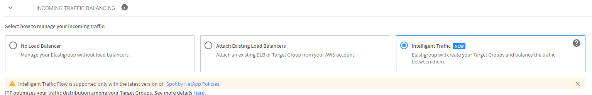
- Application Load Balancer : SpotAdminALB 
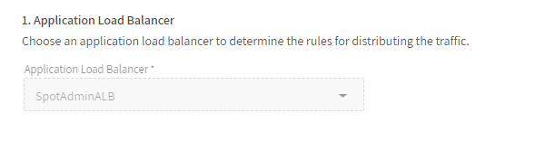
- Listener Rule : [X] Requests otherwise not routed 
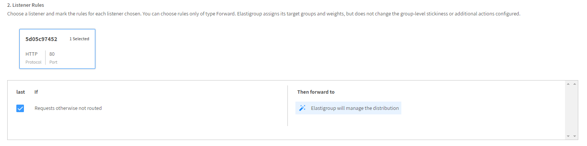

4. 나머지 옵션은 모두 기본값을 따릅니다
5. Predictive Rebalancing Tab을 클릭합니다.
6. **1. SET THE CAPACITY OF YOUR WORKLOAD** 메뉴에서 용량을 수정합니다.  

- Target : 3
- Minimum : 1
- Maximum : 4  
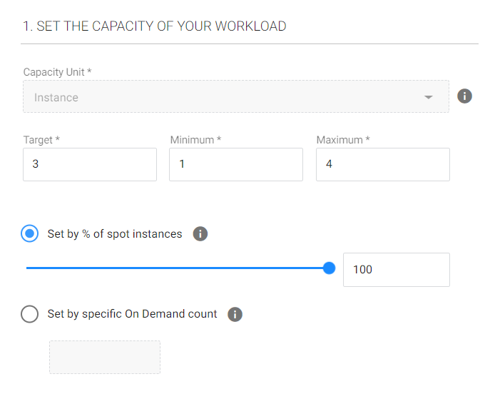

7. Cluster Orientation 에서 알고리즘을 변경합니다.

- cheapset  
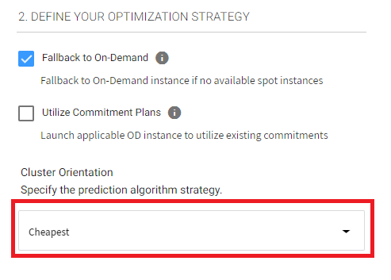

7. Scaling Tab에서 적용된 Policy가 있다면 **X**를 눌러 삭제합니다.
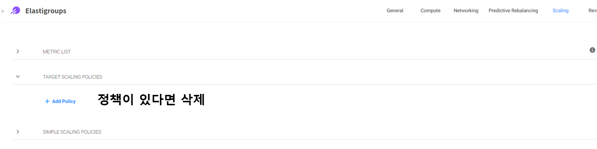
8. ReView Tab에서 설정을 검토 후 Update 합니다.
9. Group 내 모든 인스턴스를 Rollup 합니다.
- [X]Roll My Group
- Batch Size: 100 
- Grace Period: 60  
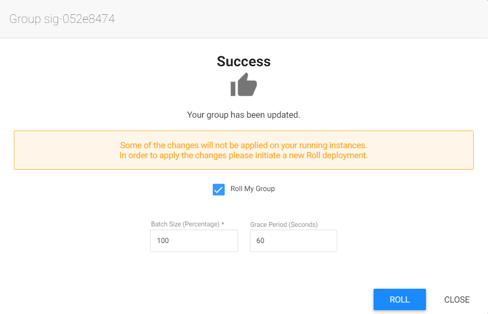

## 결과 확인

- 수분 후 선택했던 wordpress TG 에서 Sig-**** TG로 마이그레이션이 완료됩니다.
- Group내에 3대의 인스턴스가 보입니다.
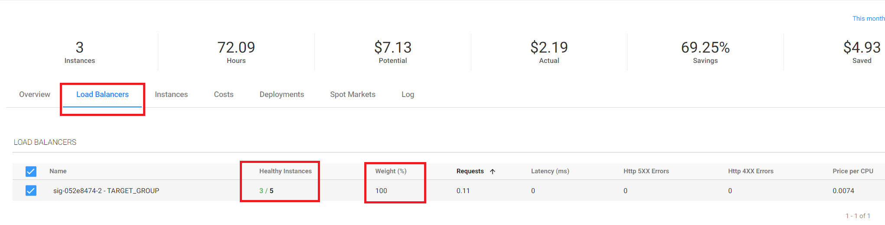

## Intelligent Traffic Flow Action

ITF는 Elastigroup 의 워크로드가 변화함에 따라 자동으로 AWS TargetGroup을 생성하고 ALB의 가중치를 변경합니다.

1. 우측 상단 Action을 드롭다운하고 Edit Configration을 클릭합니다. 

2. Predictive Rebalancing Tab을 클릭합니다.
3. Cluster Orientation 에서 알고리즘을 변경합니다. 
- Balanced ( recommended ) 
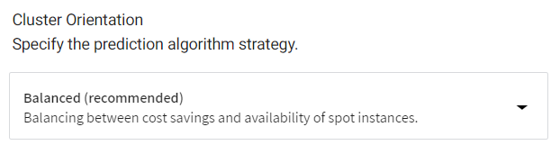

4. 배포된 인스턴스 중 하나를 클릭하고 Action 버튼에서 Detach를 클릭합니다. 
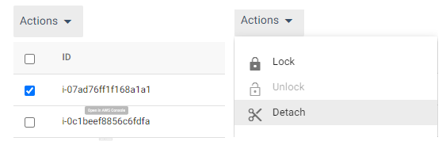

5. 유휴시간 및 그룹용량 감소를 체크하고 Detech를 클릭합니다.

- Draing Timeout : 0
- [X] Terminate Instances
- [-] Decrement Group's Capacity  
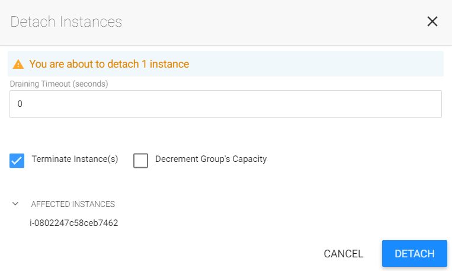

6. **INSTANCE AVAILABILITY** 메뉴에서 선호 설정을 입력합니다.
- Preferred Availability Zones : 모두 선택
- Preferred Spot Types : c5.xlarge
- Draining Timeout (seconds): 120  
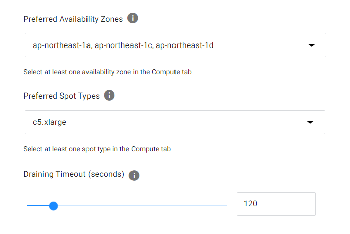

7. 서로다른 vcpu를 가진 인스턴스가 배포되는것을 확인합니다. 
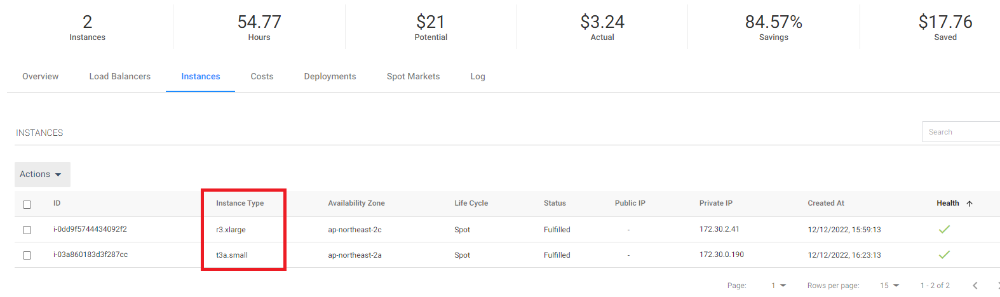

8. 수분 후 Elasigroup에서 자동으로 변경이 일어나는 지 확인합니다.

## 결과

Elastigrouop의 변화하는 workload에 따라 부하분산 가중치가 변경되는것을 확인했습니다.  
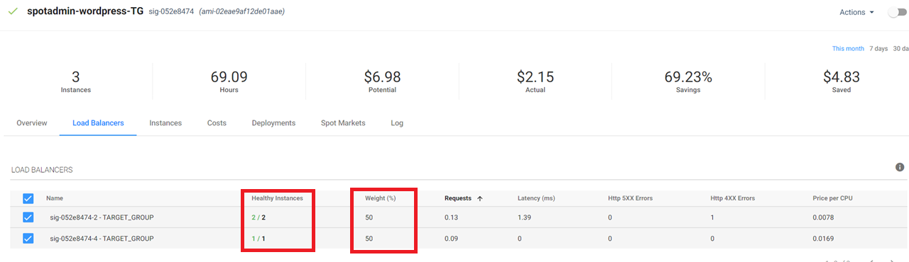

ALB 가중치 분산 설정이 어떻게 적용되었는지 확인합니다. 
1. AWS EC2 Webconsole로 이동합니다. 

2. 좌측 사이드메뉴에서 로드벨런서를 클릭하고 "SpotAdminALB"를 클릭합니다. 
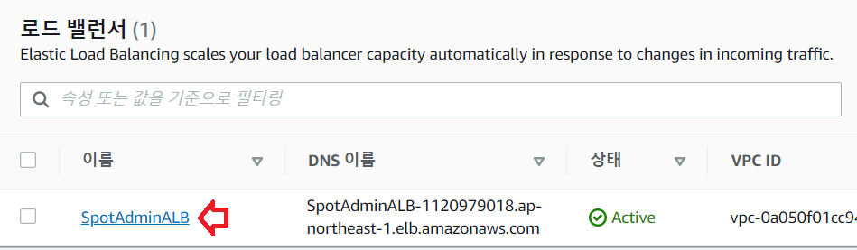

3. 하단의 활성화된 메뉴에서 리스너 Tab을 클릭합니다. 
4. 새로고침 아이콘을 누르면서 진행과정을 지켜볼 수 있습니다.
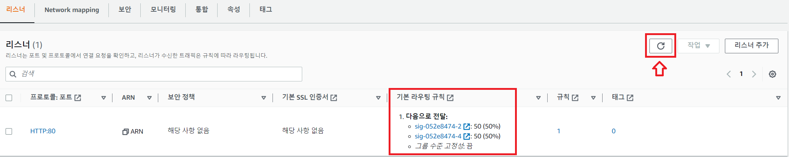

# 다음 과정

- 이전 과정 : [ElastiGroup Auto Scaling](./2-2_ElasticGroupAutoScaling.md)
- 다음 과정 : [Statful Elastigroup 생성](./2-4_CreateStatfulElastiGroup.md)

# 참조
- [ALB Sticky Session](https://docs.aws.amazon.com/ko_kr/elasticloadbalancing/latest/application/sticky-sessions.html)
- [Intelligent Migration Flow Migration Process](https://docs.spot.io/elastigroup/features/intelligent-traffic-flow/migration-process)