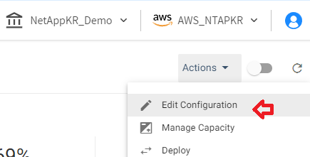

# ElastiGroup Intelligent Traffic Flow 
엘라스틱 그룹의 ITF를 실습합니다.

# Intelligent Traffic Flow
ITF(Intelligent Traffic Flow)는 Elastigroup에서 시작한 인스턴스로 들어오는 트래픽 분포를 최적화하는 기능입니다. ITF는 각 대상 그룹이 보유한 vCPU 수를 기반으로 대상 그룹에 대한 트래픽 분포를 실시간으로 관리합니다.
( ALB 가중치 분산 기능을 활용합니다. )

## Getting Start
1. Elastigroup의 spotadmin-wordpress-TG 콘솔로 이동합니다.
2. 우측 상단 Action을 드롭다운하고 Edit Configration을 클릭합니다.

3. Network Tab으로 이동 후 ITF를 설정합니다.
- Select how to manage your incoming traffic: Intelligent Traffic

- Application Load Balancer : SpotAdminALB

- Listener Rule : [X] Requests otherwise not routed

4. 나머지 옵션은 모두 기본값을 따릅니다
5. Predictive Rebalancing Tab을 클릭합니다.
6. Cluster Orientation 에서 알고리즘을 변경합니다.
- cheapset  

5. 설정을 검토 후 적용합니다.
6. 스팟 콘솔 우측 상단의 Actions 버튼을 눌러 드롭다운합니다.

7. 목표값과 최대값을 변경합니다. 
- Target : 2
- Maximum : 3  

8. 서로다른 vcpu를 가진 인스턴스가 배포되는것을 확인합니다.

9. AWS EC2 Webconsole로 이동합니다. 

10. 좌측 사이드메뉴에서 로드벨런서를 클릭하고 "SpotAdminALB"를 클릭합니다.
11. 하단의 활성화된 메뉴에서 리스너 Tab을 클릭합니다.

12. 규칙 보기/편집을 선택합니다.

# 결과
ALB 가중치 분산 설정이 어떻게 적용되었는지 확인합니다.

# 다음과정
- 이전 과정 : [ElastiGroup Auto Scaling](./2-2_ElasticGroupAutoScaling.md)
- 다음 과정 : [Statful Elastigroup 생성](./2-4_CreateStatfulElastiGroup.md)