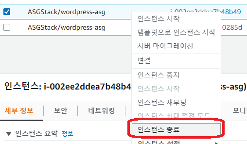
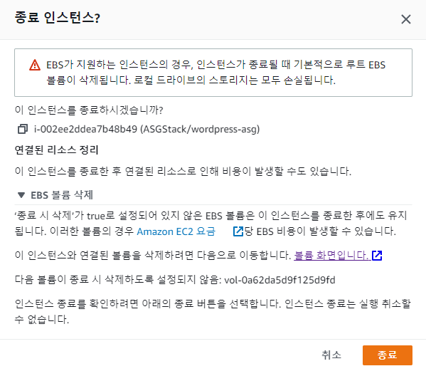
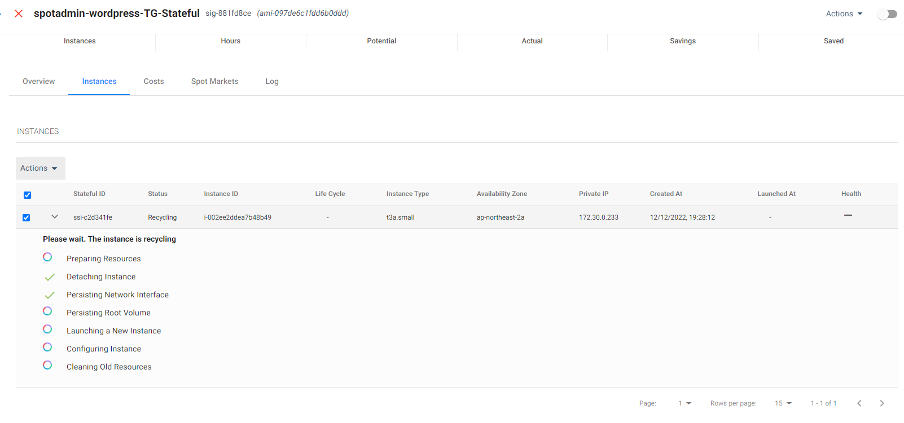

# Stateful ElastiGroup Action

실습을 통해 Statuful EG의 동작을 확인합니다.

1. Bastion Host 접속합니다.
접속 방법은 [bastion host 접속](../../QuickStart/ConnectToBastion.md)을 참고합니다.
2. 키파일을 다운로드 합니다.

```
wget https://netappkr-wyahn-s3.s3.ap-northeast-2.amazonaws.com/public/Key/handsonkey.pem
```

3. 키파일의 권한을 변경합니다.

```
chmod 400 handsonkey.pem
```

4. wordpress 서버에 접속합니다.

```
ssh -i handsonkey.pem ec2-user@172.30.0.233
```

5. Hello 파일을 생성합니다.

```
sudo touch Hello.html
```

```
echo "Hello Spot by Netapp" > Hello.html
```

6. Hello 파일의 권한을 변경합니다.

```
sudo chown nginx:nginx /usr/share/nginx/html/Hello.html
```

웹서버 경로에 파일을 집어 넣습니다.

```
sudo mv Hello.html /usr/share/nginx/html/Hello.html
```

7. AWS EC2 console로 이동합니다.
8. Pravate IP가 일치하는 Stateful 인스턴스를 찾아 마우스 우클릭 버튼을 누릅니다.
9. 활성화된 메뉴에서 인스턴스 종료(삭제)를 클릭합니다.</br>

10. 인스턴스 ID를 확인 후 종료(삭제)를 클릭합니다.</br>


11. Spot Console로 이동하여 인스턴스가 다시 생성되길 기다립니다.</br>


12. Bastion Host 서버에 접속합니다.
13. curl 명령을 통해 Hello 파일이 잘 보이는지 확인합니다.

- curl <http://<stateful> 서버 IP>/Hello.html

```
[ec2-user@ip-172-30-0-215 ~]$ curl http://172.30.233/Hello.html
Hello Spot by Netapp
```

# 결과

Private IP와 EBS의 데이터가 유지된 상태로 새로운 서버가 생성됩니다.
