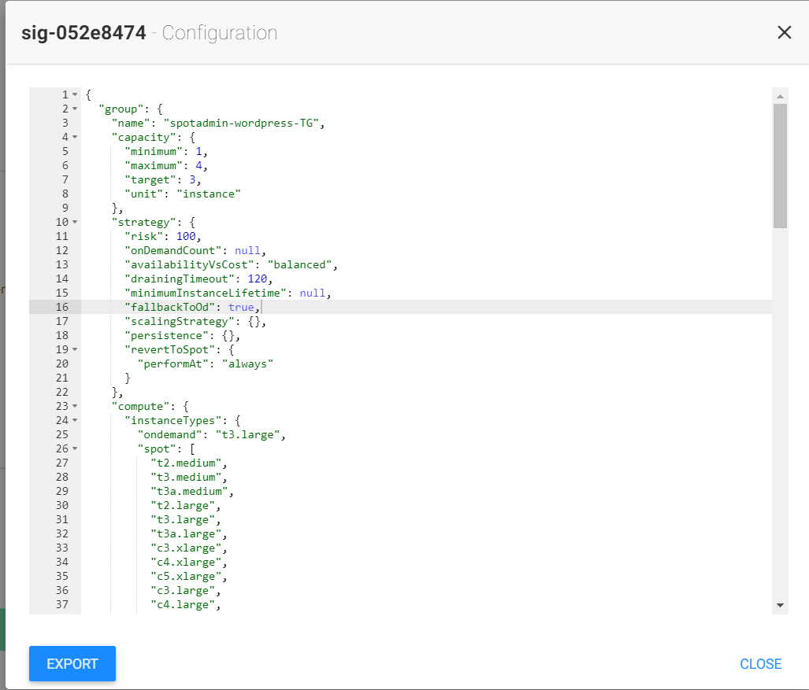

# Statful ElastiGroup

Spot 노드는 일시적이며 AWS에 의해 언제든지 중단될 수 있습니다.  
상태 비저장 애플리케이션에서는 문제가 되지 않지만 수평으로 쉽게 확장할 수 있도록 설계되었기 때문에 상태 저장 애플리케이션에서는 어려울 수 있습니다.  
상태 저장이 필요한 애플리케이션도 ElastiGroup에서 실행할 수 있습니다.  
루트 볼륨, 데이터 볼륨 및 네트워크 인터페이스에 대한 지속성을 제공하는 동시에 스팟 노드를 활용하여 비용을 절감합니다.

## 실습 목표

Spot by Netapp에서 Statful ElastiGroup을 구성하는 방법에 대해 알아봅니다.

## Statful ElastiGroup 실습

1. Elastigroup console로 이동합니다.
2. Spotadmin-wordpress-TG를 클릭합니다.
3. 우측 상단 Action을 드롭다운합니다.
4. View configuration 을 선택합니다. 

5. Json으로 이루어진 설정이 나타나면 클립보드에 복사합니다. 

6. Export 버튼을 눌러 파일을 다운로드 받습니다.  

7. Elastigroup console로 돌아옵니다. 

8. 우측 상단 **Import** 버튼을 누르고 **JSON file** 을 선택합니다.
9. 다운로드 받은 파일을 업로드합니다.  

10. Elastigroup 설정에서 General Tab을 클릭하고 이름을 수정합니다.

- Pick a name : spotadmin-wordpress-TG-Stateful 

11. Compute Tab으로 이동 후 페이지를 드레그하여 **STATEFUL** 항목을 찾습니다.
12. Stateful 옵션을 활성화 합니다.

- [X] Persist Root Volume
- [X] Persist Data Volumes
  - [X] Snapshot Backups
- [X] Maintain Private IP

13. Network Tab으로 이동 후 "No Load Balancer"를 클릭합니다. 

14. Predictive Rebalancing Tab으로 이동 후 다음과 같이 수정합니다. 

7. Scaling Tab에서 적용된 Policy가 있다면 **X**를 눌러 삭제합니다.

16. Review Tab에서 최종 구성을 확인 후 Create를 선택합니다.

17. 잠시 후 새로운 Elastigroup이 생성됩니다. 

## 다음 주제

- 이전 과정 : [ElastiGroup Intelligent Traffic Flow](./2-3_IntelligentTrafficFlow.md)
- 다음 과정 : [Statful Elastigroup Action](./2-4-1_StatefulEGAction.md)

# 참조

- [Create a Stateful Elastigroup](https://docs.spot.io/elastigroup/tutorials/elastigroup-tasks/create-a-stateful-elastigroup-from-scratch?id=create-a-stateful-elastigroup-from-scratch)