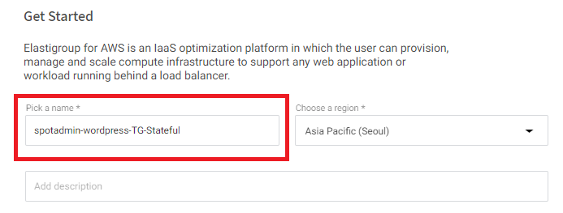

# StatfulElastiGroup
Spot by Netapp을 이용해 Statful 서비스를 구성해 봅니다.

## Getting Start
1. Elastigroup console로 이동합니다.
2. Spotadmin-wordpress-TG를 클릭합니다.
3. 우측 상단 Action을 드롭다운합니다.
4. View configuration 을 선택합니다.<br>

5. Json으로 이루어진 설정이 나타나면 클립보드에 복사합니다.
6. 사용자 로컬 환경에 json 파일을 생성하고 해당 내용을 붙혀넣습니다.
예시 설정
```json
{
  "group": {
    "name": "spotadmin-wordpress-TG-Stateful",
    "capacity": {
      "minimum": 1,
      "maximum": 3,
      "target": 2,
      "unit": "instance"
    },
    "strategy": {
      "risk": 100,
      "onDemandCount": null,
      "availabilityVsCost": "cheapest",
      "drainingTimeout": 120,
      "fallbackToOd": true,
      "scalingStrategy": {
        "terminationPolicy": "default"
      },
      "persistence": {},
      "revertToSpot": {
        "performAt": "always"
      }
    },
    "compute": {
      "instanceTypes": {
        "ondemand": "r5.xlarge",
        "spot": [
          "r3.xlarge",
          "r4.xlarge",
          "r5.xlarge",
          "r5a.xlarge",
          "t2.medium",
          "t3.medium",
          "t3a.medium",
          "t2.small",
          "t3.small",
          "t3a.small",
          "r3.large",
          "r4.large",
          "r5.large",
          "r5a.large"
        ]
      },
      "availabilityZones": [
        {
          "name": "ap-northeast-2a",
          "subnetIds": [
            "subnet-011c17a255dfe187f"
          ]
        },
        {
          "name": "ap-northeast-2c",
          "subnetIds": [
            "subnet-02c59ae848d60cef4"
          ]
        },
        {
          "name": "ap-northeast-2b",
          "subnetIds": [
            "subnet-0510b34405ae6dcb8"
          ]
        }
      ],
      "product": "Linux/UNIX",
      "launchSpecification": {
        "loadBalancerNames": null,
        "loadBalancersConfig": {
          "loadBalancers": null
        },
        "itf": {
          "fixedTargetGroups": false,
          "weightStrategy": "vcpu",
          "migrationHealthinessThreshold": 50,
          "loadBalancers": [
            {
              "loadBalancerArn": "arn:aws:elasticloadbalancing:ap-northeast-2:037660834288:loadbalancer/app/SpotAdminALB/526f683edfc63587",
              "listenerRules": [
                {
                  "ruleArn": "arn:aws:elasticloadbalancing:ap-northeast-2:037660834288:listener-rule/app/SpotAdminALB/526f683edfc63587/3cacd25d05c97452/70705f8634cd8983"
                }
              ]
            }
          ],
          "targetGroupConfig": {
            "vpcId": "vpc-0c3e31e77e0139b2d",
            "healthCheckIntervalSeconds": 30,
            "healthCheckPath": "/",
            "healthCheckPort": "traffic-port",
            "healthCheckProtocol": "HTTP",
            "healthCheckTimeoutSeconds": 5,
            "healthyThresholdCount": 5,
            "unhealthyThresholdCount": 2,
            "matcher": {
              "httpCode": "200"
            },
            "port": 80,
            "protocol": "HTTP",
            "protocolVersion": "HTTP1"
          }
        },
        "healthCheckType": null,
        "securityGroupIds": [
          "sg-051765c770a10a15a",
          "sg-0122d483d57969375"
        ],
        "monitoring": true,
        "ebsOptimized": false,
        "imageId": "ami-097de6c1fdd6b0ddd",
        "iamRole": {
          "name": null,
          "arn": "arn:aws:iam::037660834288:instance-profile/ASGStack-wordpressasgInstanceProfile9075E223-h04GR01gIxiP"
        },
        "keyPair": "SpotAdminkey",
        "userData": "IyEvYmluL2Jhc2gKeXVtIC15IHVwZGF0ZQ==",
        "shutdownScript": null,
        "networkInterfaces": [
          {
            "deviceIndex": 0,
            "associatePublicIpAddress": false,
            "deleteOnTermination": true,
            "associateIpv6Address": false
          }
        ],
        "tags": [
          {
            "tagKey": "Name",
            "tagValue": "ASGStack/wordpress-asg"
          }
        ],
        "tenancy": "default"
      }
    },
    "scaling": {
      "multipleMetrics": null,
      "target": [
        {
          "policyName": "ALB Req per TG",
          "namespace": "AWS/ApplicationELB",
          "metricName": "RequestCountPerTarget",
          "dimensions": [
            {
              "name": "TargetGroup",
              "value": "targetgroup/spotadmin-wordpress-TG/7c08dc21ee667674"
            }
          ],
          "statistic": "sum",
          "unit": "none",
          "target": 10,
          "cooldown": 180
        }
      ]
    },
    "scheduling": {},
    "thirdPartiesIntegration": {},
    "multai": null
  }
}
```
6. Elastigroup console로 돌아옵니다.

7. 우측 상단 Import 버튼을 누르고 Json 을 선택합니다.
8. 작성한 파일을 업로드합니다. </br>

9. Elastigroup 설정에서 General Tab을 클릭하고 이름을 수정합니다.
- Pick a name : spotadmin-wordpress-TG-Stateful

10. Compute Tab으로 이동 후 페이지를 드레그하여 Stateful 항목을 찾습니다.
11. Stateful 옵션을 활성화 합니다.
- [X] Persist Root Volume
- [X] Persist Data Volumes
  - [X] Snapshot Backups
- [X] Maintain Private IP


12. Network Tab으로 이동 후 "No Load Balancer"를 클릭합니다.

12. Predictive Rebalancing Tab으로 이동 후 다음과 같이 수정합니다.


13. Scaling Tab으로 이동 후 Target Scaling Policy를 삭제합니다.


14. Review Tab에서 최종 구성을 확인 후 Create를 선택합니다.

15. 잠시 후 새로운 Elastigroup이 생성됩니다.


## 다음 주제
- 이전 과정 : [ElastiGroup Intelligent Traffic Flow](./2-3_IntelligentTrafficFlow.md)
- 다음 과정 : [Statful Elastigroup Action](./2-4-1_StatefulEGAction.md)