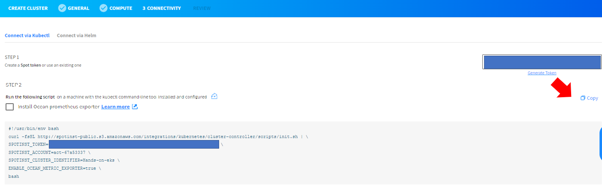

# Ocean

Ocean은 포드, 컨테이너 및 애플리케이션의 요구 사항을 충족하도록 인프라 용량과 크기를 자동으로 조정하는 Kubernetes용 관리형 인프라 서비스입니다.

이번 과정에서는 스팟 콘솔 을 사용하여 기존 EKS 클러스터를 Ocean에 연결합니다.

## 전제 조건

- AWS 계정을 Spot에 연결합니다 .
- EKS 클러스터에 적어도 한개 이상의 노드가 필요합니다.

## 기존 EKS 클러스터를 Ocean에 연결

1. Spot Console의 왼쪽 메뉴에서 Ocean/Cloud Clusters를 클릭하고 Create Cluster를 클릭합니다.</br>


2. Create Ocean Cluster 페이지가 나타나면 "join an Existing"에서 "Migrate Worker Node configuration From EKS worker nodes"을 선택 합니다.</br>

<!---->

## 1단계: General

1. 일반 페이지에서 클러스터 이름 및 클러스터 식별자를 입력하고 클러스터가 실행 중인 지역을 클릭합니다.
2. 클러스터 정보를 입력합니다.

- Cluster Name : SpotAdmin-eks
- Cluster Identifier : SpotAdmin-eks

> ### Tips
> 가져오는 클러스터의 경우 원래 클러스터와 동일한 이름을 지정하는 것이 좋습니다. 이렇게 하면 어떤 EKS에 어떤 Ocean을 연결하였는지 구분이 쉬워집니다.

3. "Import Cluster" 메뉴에서 아래와 같이 설정합니다. </br>

- Region : "Hands on 용 Stack을 배포한 Region 선택"
- Import from : EKS node Group
- EKS Cluster Name : SpotAdmin-eks
- Node group : SpotAdmineksnodegroup </br>


4. 다음을 클릭합니다.

## 2단계: Computing

Ocean은 EKS 노드 그룹에서 컴퓨팅 구성을 가져와 컴퓨팅 페이지에 보여줍니다. **필요한 경우**에만 EKS 구성을 확인하고 변경합니다.

1. Cluster Network 값이 자동으로 입력됩니다. 필요한 경우에만 기존 EKS Network 환경과 동일한지 확인합니다.</br>


2. Instance Type에서 Customize Instance Types을 클릭합니다.</br>


3. 클러스터에 허용되는 컴퓨팅 자원과 타입들을 확인 합니다.

> ### 경고
> 실습에서는 해당 값을 수정하지 않습니다.

4. Instance Specifications 메뉴에서 EKS에서 가져온 worker node의 Spec과 설정을 확인하고 Keypair를 지정합니다.

- AMI : 변경하지 않습니다.
- Security Groups : 변경하지 않습니다.
- Instance Profile : 변경하지 않습니다.
- Key Pair : "SpotAdminKey"
- User Data (Startup Script) : 변경하지 않습니다.</br>
  

5. 다음을 클릭합니다.

## 3단계: 연결

Ocean Controller를 설치하고 Ocean SaaS와 클러스터 간의 연결을 설정합니다.

1. **STEP 1**의 "Generate Token"을 클릭하여 스팟 Token을 생성합니다.</br>


2. Token 이름을 작성 후 GENERATE를 클릭합니다.

- Token Name : SpotAdmin-eks


3. Token이 생성되면 **DONE** 을 눌러 **STEP2** 스크립트에 적용합니다.

> ### Tips
> Token을 분실한 경우 다시 확인 할 수 없습니다. 분실한 경우 신규 발급 후 기존값과 교체해야 합니다.

4. [BastionHost에 ssh로 접속](../../QuickStart/ConnectToBastion.md)합니다.
5. [EKS 접속을 위해 kubeconfig 작성](../../QuickStart/ConnectedEKSforkubectl.md)합니다.
6. kubectl 명령줄 도구를 사용하여 Ocean Controller를 설치합니다. </br>
**STEP 2**의 Copy 버튼을 누르고 Bastionhost에 복사된 스크립트를 붙여 넣어 실행합니다. </br>
 </br>
    ```bash
    [root@ ~ ]# curl -fsSL http://spotinst-public.s3.amazonaws.com/integrations/kubernetes/cluster-controller/scripts/init.sh | \
    SPOTINST_TOKEN="< your token >" \
    SPOTINST_ACCOUNT="< your account >" \
    SPOTINST_CLUSTER_IDENTIFIER=hands-on-eks \
    ENABLE_OCEAN_METRIC_EXPORTER=false \
    bash

    2022-10-04T13:04:26.856Z downloading
    2022-10-04T13:04:27.617Z rendering
    2022-10-04T13:04:27.633Z applying
    secret/spotinst-kubernetes-cluster-controller created
    configmap/spotinst-kubernetes-cluster-controller-config created
    serviceaccount/spotinst-kubernetes-cluster-controller created
    clusterrole.rbac.authorization.k8s.io/spotinst-kubernetes-cluster-controller created
    clusterrolebinding.rbac.authorization.k8s.io/spotinst-kubernetes-cluster-controller created
    deployment.apps/spotinst-kubernetes-cluster-controller created
    ```

  > ### (선택 사항) Ocean Prometheus Exporter
  > Ocean은 프로메테우스에서 수집할 수 있는 Ocean Metric과 exporter 제공합니다. </br>
  > Prometheus 와 Grafana를 활용하고 계시는 경우 선택할 수 있는 옵션입니다.</br>
  > **이 실습에서는 선택하지 않습니다.**


5. 배포한 Ocean controler의 상태가 **Running**이며 **READY** 인지 확인합니다.

```
kubectl get pods -n kube-system
```

```
[root@ip-172-30-0-109 ~]# k get pods -n kube-system
NAME                                                      READY   STATUS    RESTARTS   AGE
spotinst-kubernetes-cluster-controller-7488c7f7f4-gfd7h   1/1     Running   0          58s
```

6. spot console로 돌아와 **STEP 3**의 "Test Connectivity"를 클릭하여 컨트롤러 기능을 확인합니다.</br>


7. 테스트가 완료될 때까지 약 2~5분 정도 기다립니다.</br>


8. 다음을 클릭합니다.

## 4단계: 검토

1. 구성한 모든 Ocean 설정을 검토합니다.

2. **Create**을 클릭하여 Ocean을 생성합니다.

## 결과

Ocean 생성되며 대시보드화면이 보입니다.

# 다음 과정

Ocean으로 workload migration을 진행합니다.</br>

- 다음 과정: [workload migration](./3-2_WorkloadMigration.md)
- 이전 과정: [EKS에 Test app 배포](./3-0_Deploy_App_for_Test.md)

# 참조

- [Migrate the Workload to Ocean](https://docs.spot.io/ocean/getting-started/eks/join-an-existing-cluster)
- [Prometheus exporter](https://prometheus.io/docs/instrumenting/exporters/)
- [Scrape Ocean Metrics using Prometheus](https://docs.spot.io/ocean/tools-and-integrations/prometheus/scrape)