# 워크로드 마이그레이션
기존 EKS가 관리하던 노드를 Ocean에서 관리하는 Node로 서비스를 마이그레이션합니다.

### 전제 조건
1. Ocean 클러스터에 연결된 EKS 클러스터
2. Ocean Controller 버전 1.0.44 이상
3. Kubernetes Autoscaler 비활성화 또는 삭제
> ```경고 : Kubernetes Autoscaler가 활성 상태인 경우 새 노드를 rollup 중 이중 배포가 일어날 수 있습니다.```

## EKS Metric server 설치
1. 다음 명령을 사용하여 지표 서버를 배포합니다.
```bash
kubectl apply -f https://github.com/kubernetes-sigs/metrics-server/releases/latest/download/components.yaml
```
2. 다음 명령을 사용하여 metrics-server 배포에서 원하는 수의 pods를 실행하고 있는지 확인합니다.
```
kubectl get deployment metrics-server -n kube-system
```
3. 출력 예는 다음과 같습니다.
```
NAME             READY   UP-TO-DATE   AVAILABLE   AGE
metrics-server   1/1     1            1           6m
```
## VNG 생성
1. Virfual Node Grouops Tab으로 이동합니다.
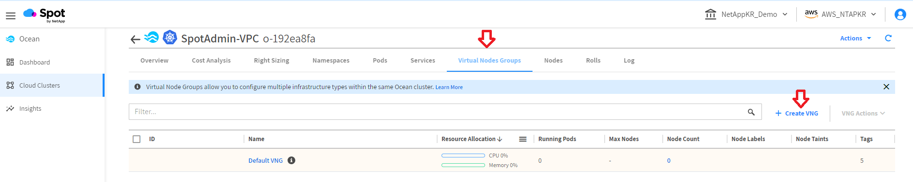
2. import configurations form an Auto Scaling Grouop을 선택하고 미리 생성된 AutoScalingGroup을 선택합니다.
- Auto Scaling Group : eks-custom-ng </br>
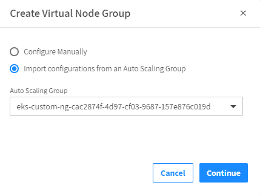 </br>
ASG의 정보를 바탕으로 VNG 작성에 필요한 정보를 가져오게됩니다.
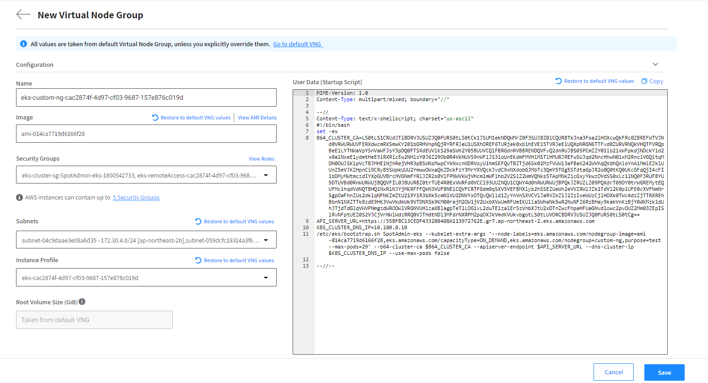

3. Node Selection 메뉴를 찾아 Label 값을 입력합니다.</br>
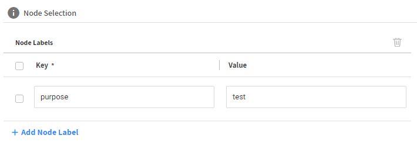
- Key: purpose
- Value: test
4. **customize intance type**을 클릭합니다.

5. t3.large, t2.large, m4.large, m5.large를 선택합니다.
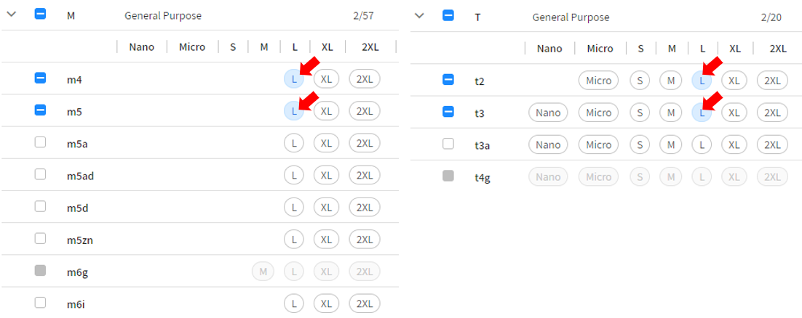

6. **Advanced**항목에서 Spot % 설정을 체크하고 비율을 100%로 설정합니다.
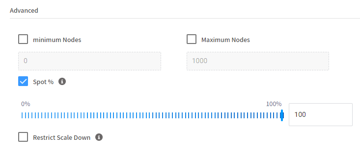
7. **Block Device Mapping** 항목에서 "Insert BDM foramt template"를 클릭하고 볼륨타입을 **"gp3"**로 수정합니다. (선택사항이지만 권장합니다.)
    ```json
    [
        {
            "deviceName": "/dev/xvda",
            "ebs": {
            "deleteOnTermination": true,
            "encrypted": true,
            "volumeSize": "30",
            "volumeType": "gp3" << "gp2를 gp3로 수정"
            }
        }
    ]
    ```
5. Tags를 추가합니다. (선택사항이지만 권장합니다.)
    - Name : Hands-on-eks-vng-node </br>
    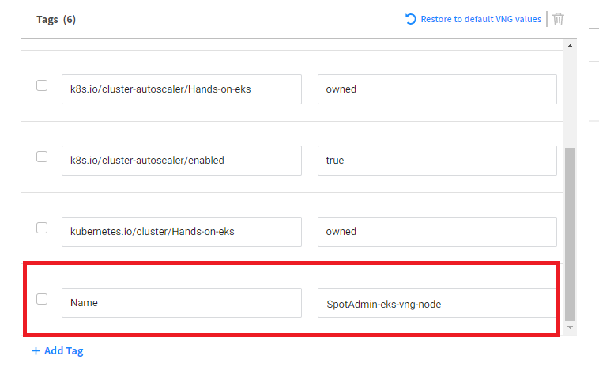


## 워크로드 마이그레이션 시작하기
Ocean 클러스터 생성을 성공적으로 완료한 후 오른쪽 상단 모서리에 있는 Workload Migration을 클릭합니다.
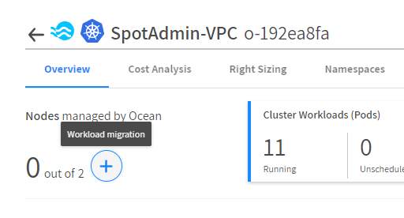

## Migration 대상 인스턴스 선택
Ocean은 연결된 Kubernetes 클러스터에 속하는 워크로드(노드 및 포드)를 자동으로 감지합니다.

다음 화면에서 Ocean은 발견한 모든 노드를 표시합니다.</br>
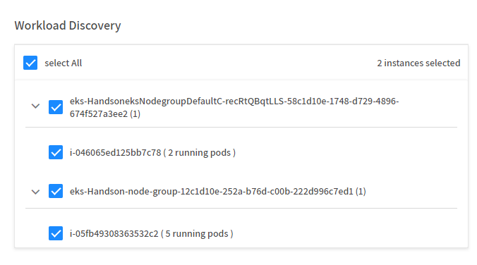

## 기본 설정 지정
관련 확인란을 선택하여 원하는 워크로드 마이그레이션 프로세스를 선택합니다.
1. Workload Discovery
- [X] Select All
2. Workload Migration Perferences
- [X] Terminate instances
- [X] Evict stand-alone pods
- [X] Force PDB covered Pod Eviction
- Batch Size : 50%
> ### 항목 설명
> - 인스턴스 종료: Ocean은 해당 인스턴스에 있는 포드가 마이그레이션되고 이전 인스턴스가 완전히 비워지면 이전 인스턴스를 종료합니다.
> - 독립 실행형 포드 제거: Ocean은 Kubernetes 배포에 속하지 않는 포드를 종료합니다. 즉, 자동으로 수행하는 개체가 없기 때문에 포드를 수동으로(마이그레이션 후) 시작해야 합니다.
> - Force PDB Covered Pod Eviction: 이 확인란을 선택하면 Ocean은 PDB가 충족되지 않더라도 인스턴스에서 Pod를 강제로 제거합니다

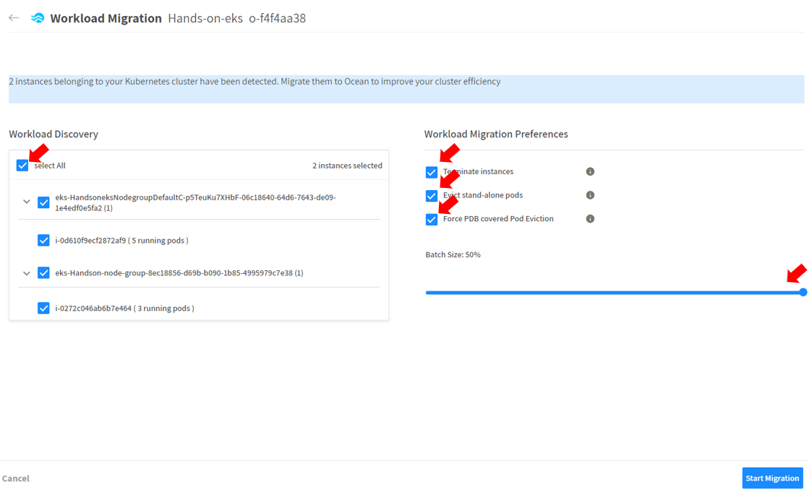

## Migration 시작
1. Start Migration을 클릭합니다. </br>
마이그레이션 작업 전 팝업이 나타납니다.</br>

2. Start Migration을 클릭하여 공식적으로 마이그레이션 프로세스를 시작합니다.</br>
> ### Tips
> 마이그레이션을 도중 중지 할 수 있습니다. </br>
> 하지만 이미 Spot으로 마이그레이션된 워크로드는 Spot에서 관리하는 새 인스턴스 아래에 유지됩니다. </br>
> 즉, 프로세스를 중지하면 이전 구성으로 원복하는 절차를 수행하지 않습니다.

# Workload Migration 대시보드
Migration 프로세스를 시작하게 되면 migration 절차를 모니터링 할 수 있는 대쉬보드가 활성화 됩니다.
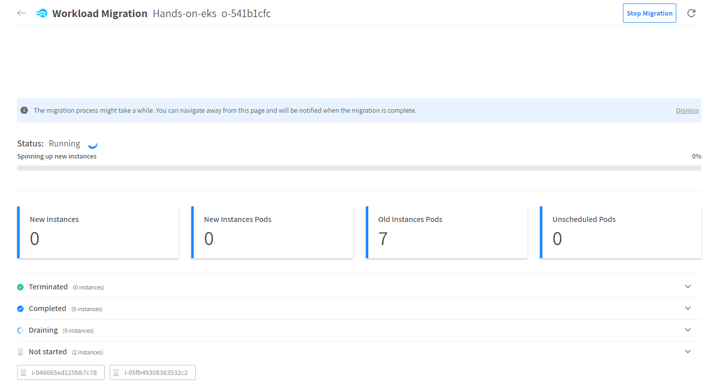

# 결과
Ocean으로 Migration이 완료됩니다.

# 다음과정
Ocean으로 Migration이 완료됬습니다. Ocean의 자동 스케일링 동작에 대해 알아봅니다.</br>
- 다음주제: [Scaling](./3-3_ScalingEvent.md)
- 이전주제: [EKS Ocean 연동](./3-1_ConnectAnEKSCluster.md)

# 참조
- [Kubernetes 지표 서버 설치](https://docs.aws.amazon.com/ko_kr/eks/latest/userguide/metrics-server.html)
- [Right Sizing 작동 방식(Ocean for Kubernetes)](https://docs.spot.io/ocean/features/right-sizing?id=right-sizing)