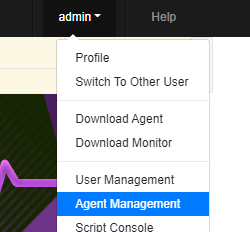
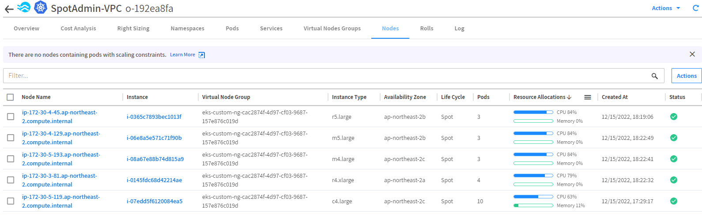

# 확장과 축소(Kubernetes)
Kubernetes 클러스터에 대한 Ocean의 Pod 기반 확장은 세 가지 주요 목표를 제공합니다.

- 리소스 부족으로 인해 현재 노드에서 실행에 실패한 포드를 예약합니다.
- 빈번한 확장 포드가 인스턴스가 시작될 때까지 기다릴 필요가 없도록 합니다(자세한 내용은 헤드룸 섹션 참조).
- 클러스터 리소스가 최적으로 활용되는지 확인합니다.


# 스케일링
Pendding event 감지 시 요구사항 많큼 노드가 증가하는지 확인합니다.
1. [Bastion Host에 접속](../../QuickStart/ConnectToBastion.md)합니다.
2. 다음 절차대로 ngrinder 앱을 배포합니다. 
> ### 경고
> 해당 파일은 s3에서 다운로드하도록 되어 있습니다. 파일이 수정 또는 삭제 시 다운로드가 되지 않거나 다른 내용이 있을 수 있습니다. 그럴경우 파일을 수동으로 생성하여 적용합니다.

```bash
kubectl create ns ngrinder
```
```bash
kubectl apply -f /opt/DeployTestapp/ngrinder/ngrinder-controller.yaml
```
```yaml
kind: Deployment
metadata:
  name: ngrinder-controller
  namespace: ngrinder
spec:
  replicas: 1
  selector:
    matchLabels:
      app: ngrinder
      tier: middle
  template:
    metadata:
      labels:
        app: ngrinder
        tier: middle
    spec:
      containers:
      - name: ngrinder-controller
        image: ngrinder/controller:latest
        resources:
          requests:
            cpu: 800m
        ports:
        - containerPort: 80
        - containerPort: 16001
        - containerPort: 12000
        - containerPort: 12001
        - containerPort: 12002
        - containerPort: 12003
        - containerPort: 12004
        - containerPort: 12005
        - containerPort: 12006
        - containerPort: 12007
        - containerPort: 12008
        - containerPort: 12009

        volumeMounts:
        - mountPath: /opt/ngrinder-controller
          name: ngrinder-data-volume
      volumes:
      - name: ngrinder-data-volume
```
```bash
k apply -f /opt/DeployTestapp/ngrinder/ngrinder-AwsNLB-svc.yaml
```
```yaml
kind: Service
metadata:
  name: ngrinder
  namespace: ngrinder
  labels:
    app: ngrinder
    tier: middle
  annotations:
    service.beta.kubernetes.io/aws-load-balancer-type: external
    service.beta.kubernetes.io/aws-load-balancer-nlb-target-type: ip
    service.beta.kubernetes.io/aws-load-balancer-scheme: internet-facing
    service.beta.kubernetes.io/aws-load-balancer-name: k8s-ngrinder-nlb
spec:
  ports:
  # the port that this service should serve on
  - name: port80
    port: 80
    targetPort: 80
    protocol: TCP
  - name: port16001
    port: 16001
    targetPort: 16001
    protocol: TCP
  - name: port12000
    port: 12000
    targetPort: 12000
    protocol: TCP
  - name: port12001
    port: 12001
    targetPort: 12001
    protocol: TCP
  - name: port12002
    port: 12002
    targetPort: 12002
    protocol: TCP
  - name: port12003
    port: 12003
    targetPort: 12003
    protocol: TCP
  - name: port12004
    port: 12004
    targetPort: 12004
    protocol: TCP
  - name: port12005
    port: 12005
    targetPort: 12005
    protocol: TCP
  - name: port12006
    port: 12006
    targetPort: 12006
    protocol: TCP
  - name: port12007
    port: 12007
    targetPort: 12007
    protocol: TCP
  - name: port12008
    port: 12008
    targetPort: 12008
    protocol: TCP
  - name: port12009
    port: 12009
    targetPort: 12009
    protocol: TCP
  selector:
    app: ngrinder
    tier: middle
  type: LoadBalancerapiVersion: apps/v1
```
```bash
kubectl apply -f /opt/DeployTestapp/ngrinder/ngrinder-agent.yaml
```
```yaml
apiVersion: apps/v1
kind: Deployment
metadata:
  name: ngrinder-agent
  namespace: ngrinder
spec:
  replicas: 1
  selector:
    matchLabels:
      app: ngrinder
      tier: middle
  template:
    metadata:
      labels:
        app: ngrinder
        tier: middle
    spec:
      containers:
      - name: ngrinder-agent
        image: ngrinder/agent:latest
        #imagePullPolicy: Always
        resources:
          requests:
            cpu: 1500m
        args:
        - "ngrinder.ngrinder.svc.cluster.local:80"
      affinity:
        nodeAffinity:
          requiredDuringSchedulingIgnoredDuringExecution:
            nodeSelectorTerms:
            - matchExpressions:
              - operator: In
                key: owner
                values:
                - handsonadminapiVersion: v1
```
```bash
kubectl get svc -n ngrinder 
```
```bash
[root@ip-172-30-0-23 ngrinder]# kubectl get svc -n ngrinder
NAME       TYPE           CLUSTER-IP     EXTERNAL-IP                                                                          PORT(S)                                                                                                                                                                                        AGE
ngrinder   LoadBalancer   10.100.139.125   k8s-ngrinder-ngrinder-f6331fdbc5-d5291cec4f3282d2.elb.ap-northeast-2.amazonaws.com   80:30729/TCP,16001:30869/TCP,12000:30484/TCP,12001:31649/TCP,12002:31813/TCP,12003:32007/TCP,12004:30469/TCP,12005:30809/TCP,12006:31784/TCP,12007:31850/TCP,12008:32335/TCP,12009:31423/TCP   87m
```
3. 웹브라우저를 열고 EXTERNAL-IP 출력된 도메인으로 접속 시 ngrinder 서비스가 보입니다.
### 예시
```
http://k8s-ngrinder-nlb-230f20aba713a42c.elb.ap-northeast-2.amazonaws.com
``` 
4. 로그인합니다..</br>
- ID : admin
- PW : admin</br>

      
5. 오른쪽 상단 admin 을 드롭다운 하여 "에이전트 관리" 를 선택합니다. </br>
 </br>
수분 후 agent 한개가 구동되는것이 확인됩니다.

6. BastionHost 에서 ngrinder agent 앱을 Scale up 합니다. 
```bash
kubectl scale --replicas=5 deployment ngrinder-agent -n ngrinder
```
7. Ocean web console에서 Node가 증가 하였는지 확인합니다.

8. ngrinder "에이전트 관리" 화면에서 agent 수가 증가하였는지 확인합니다.

9. kubectl 명령을 통해 node 수를 확인합니다.
```bash
kubectl get node -o custom-columns=NodeName:metadata.name,labels:metadata.labels.owner,STATUS:status.conditions[3].type,AGE:status.conditions[3].lastTransitionTime
```
```bash
[root@ip-172-30-0-23 ~]# kubectl get node -o custom-columns=NodeName:metadata.name,labels:metadata.labels.owner,STATUS:status.conditions[3].type,AGE:status.conditions[3].lastTransitionTime
NodeName                                          labels         STATUS   AGE
ip-172-30-2-112.ap-northeast-2.compute.internal   handsonadmin   Ready    2022-09-06T12:54:39Z
ip-172-30-2-150.ap-northeast-2.compute.internal   handsonadmin   Ready    2022-09-06T06:17:36Z
ip-172-30-2-5.ap-northeast-2.compute.internal     handsonadmin   Ready    2022-09-06T12:10:50Z
ip-172-30-3-110.ap-northeast-2.compute.internal   handsonadmin   Ready    2022-09-06T12:54:35Z
ip-172-30-3-188.ap-northeast-2.compute.internal   handsonadmin   Ready    2022-09-06T12:54:36Z
ip-172-30-3-32.ap-northeast-2.compute.internal    handsonadmin   Ready    2022-09-06T12:54:28Z
```
9. ngrinder agent App의 스팩을 "cpu:1500m"에서 "cpu:300m"으로 수정합니다.
```bash
kubectl edit deployment -n ngrinder ngrinder-agent
```
```yaml
apiVersion: apps/v1
kind: Deployment
metadata:
  name: ngrinder-agent
  namespace: ngrinder
spec:
  replicas: 5
  selector:
    matchLabels:
      app: ngrinder
      tier: middle
  template:
    metadata:
      labels:
        app: ngrinder
        tier: middle
    spec:
      containers:
      - name: ngrinder-agent
        image: ngrinder/agent:latest
        #imagePullPolicy: Always
        resources:
          requests:
            cpu: 300m #1500m -> 300m 으로 수정
        args:
        - "ngrinder.ngrinder.svc.cluster.local:80"
      affinity:
        nodeAffinity:
          requiredDuringSchedulingIgnoredDuringExecution:
            nodeSelectorTerms:
            - matchExpressions:
              - operator: In
                key: purpose
                values:
                - test
```
6. 수정된 내용을 적용합니다. ( vi 명)
```
:wq
```
노드의 cpu memory 자원 사용율이 줄어든것이 확인됩니다.


7. 수분 뒤 노드가 스케일인 되는것이 확인됩니다.

> ### Tips
> 빈패킹 프로세스 과정은 조건에 따라 수분이상 걸립니다.</br>
> 기다리지 마시고 다음과정을 진행하면서 확인하시기 바랍니다.
> 

# 결과
- Ocean은 Cluster의 Request를 감지하고 자동으로 Scaling 동작을 수행하는것을 확인했습니다.
- binpacking 프로세스를 활용하여 비용 효율적인 컴퓨팅 활용하는 과정을 확인했습니다.
    
    
# 다음과정
헤드룸에 대해 알아봅니다.</br>
- 다음주제: [Headroom](./3-4_Headroom.md)
- 이전주제: [Workload Migration](./3-2_WorkloadMigration.md)

# 참조
- [Scaling (Kubernetes)](https://docs.spot.io/ocean/features/scaling-kubernetes)
- [aws-load-balancer-controller/v2.4/guide](https://kubernetes-sigs.github.io/aws-load-balancer-controller/v2.4/guide/service/annotations/)