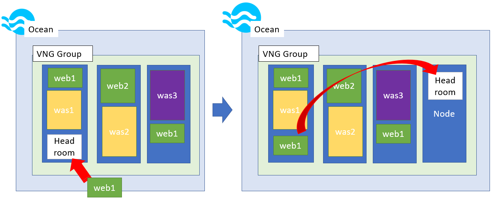
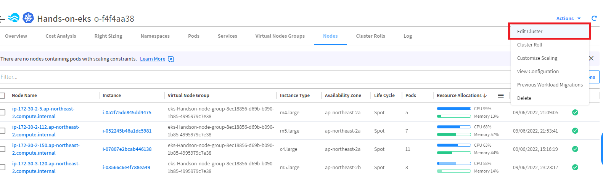
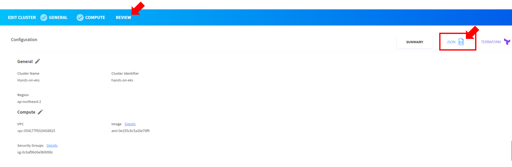
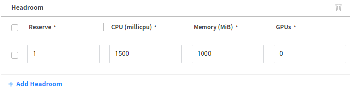
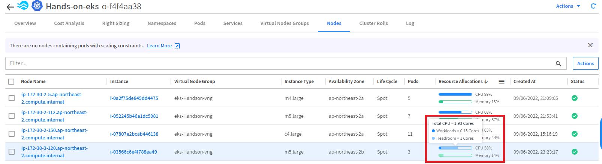
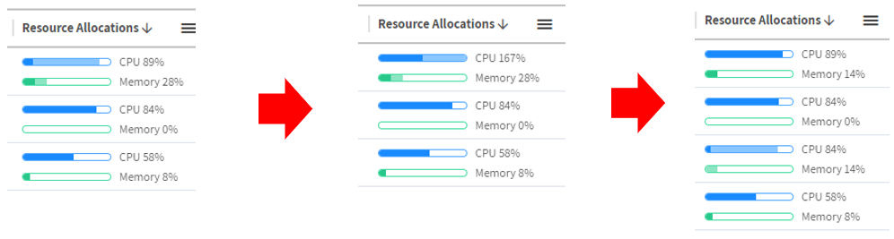

# Headroom

확장 최적화를 위한 Ocean의 주요 기능 중 하나는 **클러스터가 빠른 애플리케이션 확장을 위해 항상 준비되어 있도록 하는 예비 용량**의 버퍼인 headroom 입니다.</br>

특정 양의 리소스(예: vCPU, 메모리 및 GPU)에서 헤드룸을 구성하거나 클러스터의 총 요청 리소스에 대한 백분율로 헤드룸을 지정하면 클러스터는 새 인스턴스가 프로비저닝될 때까지 기다리지 않고 워크로드를 확장할 수 있습니다. </br>

Ocean은 최상의 비용 대비 성능 균형을 제공하기 위해 헤드룸을 동적으로 최적으로 관리합니다. 또는 헤드룸을 수동으로 구성하여 모든 사용 사례를 지원할 수 있습니다.

## Headroom Action

Ocean은 클러스터에 예약되지 않은 워크로드(포드 또는 작업)가 있는지 지속적으로 확인합니다. </br>
예약되지 않은 워크로드가 발견되면 Ocean은 이를 기존 인프라에 배치하는 것을 시뮬레이션합니다. </br>
Ocean은 컴퓨팅 리소스를 확보 했기 때문에(즉, 여유 공간이 생성됨) 컨테이너 오케스트레이터는 워크로드를 즉시 예약할 수 있습니다. </br>
워크로드 확장에 헤드룸이 사용되면 Ocean은 다음 서비스 확장에 대비하여 헤드룸 양의 균형을 맞추기 위해 더 많은 인프라를 프로비저닝 합니다. </br>
Headroom 설정은 자동으로 크기를 적용하거나 고정적으로 설정하도록 구성할 수 있습니다. </br>


## 실습 목표
Ocean에서 Headroom을 설정 해보고 작동 방식과 활용방법에 대해 실습합니다.

## Headroom 실습

1. 클러스터 수정을 선택합니다.</br>


2. REVIEW 항목으로 이동 후 Json 보기를 선택합니다.</br>


3. "Edit mode"를 활성화 한 뒤 "enableAutomaticAndManualHeadroom": true 항목을 아래와 같이 추가합니다.

  ```json
  {
    "cluster": {
      "name": "Hands-on-eks",
      "controllerClusterId": "Hands-on-eks",
      "autoScaler": {
        "resourceLimits": {
          "maxMemoryGib": 100000,
          "maxVCpu": 20000
        },
        "enableAutomaticAndManualHeadroom": true
      },
  ```

4. Ngrinder-agent.yaml 파일을 원복합니다.

```bash
vim /opt/DeployTestapp/ngrinder/ngrinder-agent.yaml
```

```yaml
apiVersion: apps/v1
kind: Deployment
metadata:
  name: ngrinder-agent
  namespace: ngrinder
spec:
  replicas: 1
  selector:
    matchLabels:
      app: ngrinder
      tier: middle
  template:
    metadata:
      labels:
        app: ngrinder
        tier: middle
    spec:
      containers:
      - name: ngrinder-agent
        image: ngrinder/agent:latest
        #imagePullPolicy: Always
        resources:
          requests:
            cpu: 1500m
        args:
        - "ngrinder.ngrinder.svc.cluster.local:80"
      affinity:
        nodeAffinity:
          requiredDuringSchedulingIgnoredDuringExecution:
            nodeSelectorTerms:
            - matchExpressions:
              - operator: In
                key: purpose
                values:
                - test
```

```bash
kubectl apply -f /opt/DeployTestapp/ngrinder/ngrinder-agent.yaml
```

5. 가상노드그룹에 헤드룸을 설정합니다.
6. Cluster(Hands-on-eks) > Vitual Node Group > VNG Name (eks-Handson-vng)를 클릭하여 VNG를 편집합니다.
7. 스크롤을 내려 Headroom 항목을 찾고 값을 입력합니다.

- Reserve: 1
- CPU : 1500
- Memory : 1000
- GPUs : 0</br>
 

8. Ngrinder Agent app을 스케일 아웃하고 Ocean 콘솔에서 컴퓨팅 리소스를 확인합니다.

```bash
kubectl scale --replicas=2 deployment ngrinder-agent -n ngrinder
```

## 결과

- 노드에 해드룸항목이 표시되는것이 보입니다.</br>

- 추가 확장되는 워크로드가 Node의 준비를 기다리지 않고 헤드룸 공간에 할당된 후 노드가 스케일 아웃이 일어나는것이 확인됩니다.</br>
헤드룸은 Pod의 빠른 확장을 원하는 경우 사용이 적합합니다.</br>


# 다음 과정

저 비용 노드로 되돌리기 기능에 대해 알아 봅니다.</br>

- 다음 과정: [Revert to Lower Cost Node](./3-5_ReverttoLowerCostNode.md)
- 이전 과정: [Scaling](./3-3_ScalingEvent.md)

# 참조

- [Headroom](https://docs.spot.io/ocean/features/headroom)
