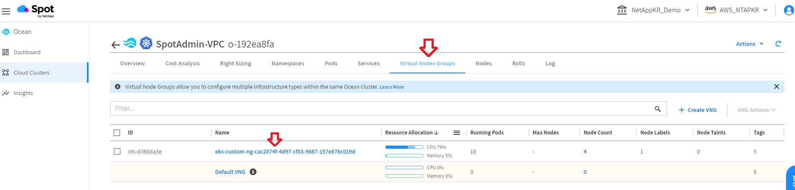
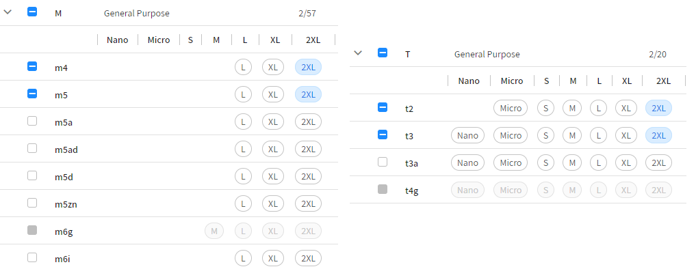
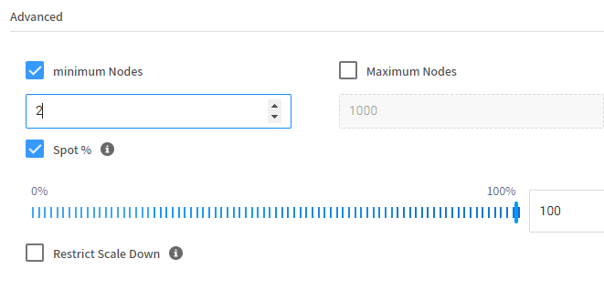
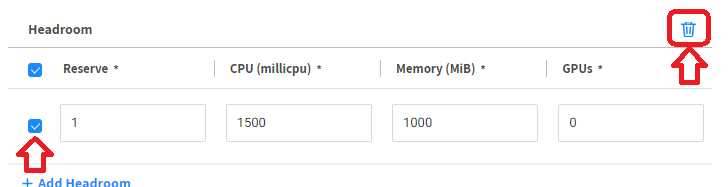
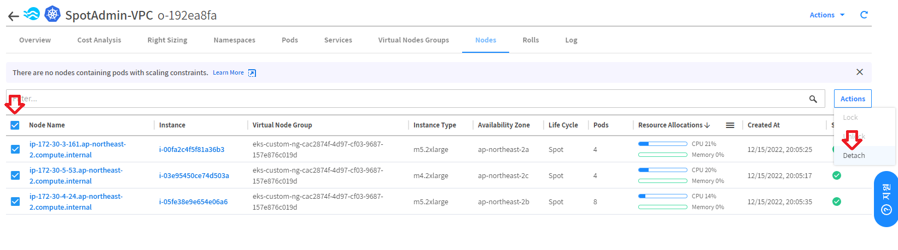
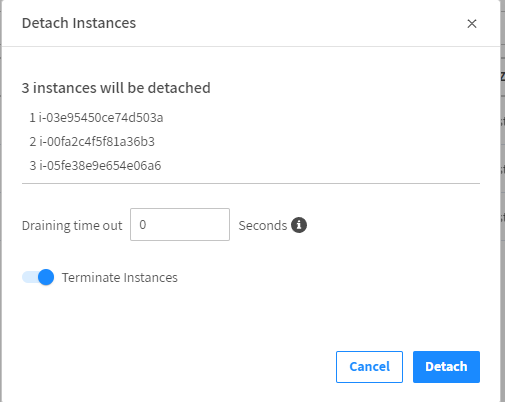

# Revert to Lower-Cost Node
확장 , 축소 및 다양한 최적화 프로세스(예: Revert to Reserved Capacity, Savings Plans, and Revert to Spot)외에도 Ocean은 추가적인 지속적인 최적화 프로세스를 사용합니다 . </br>
Revert to Lower-Cost Node는 **클러스터 노드중 축소 대상이 아닌 자원중 컴퓨팅 리소스가 충분히 활용되지 않는 노드에 적용되는 프로세스**입니다.

더 자세한 내용은 [revert-to-lower-cost-node](https://docs.spot.io/ocean/features/revert-to-lower-cost-node?id=revert-to-lower-cost-node) 에서 확인 할 수 있습니다.

# 실습
설정된 VNG에 2개의 2xlarge 타입만 실행되며 cpu 및 메모리 사용량이 50%가 넘지 않도록 설정합니다.
1. Ocean console로 이동 후 VNG Tab에서 VNG 이름을 클릭합니다.

2. instance Types 메뉴에서 아래의 타입만 선택합니다.
- m5.2xlarge
- m4.2xlarge
- t3.2xlarge
- t2.2xlarge

3. Advanced 메뉴에서 최소 노드 수를 2로 설정합니다.

4. VNG에 Headroom 설정이 되어 있다면 비활성화 합니다.

5. Node Tab으로 이동 후 모든 선택하고 Action 메뉴에서 Detech를 클릭합니다.

6. Draining Time out 값을 설정하고 Detech를 클릭하여 노드를 분리합니다.
- Draining Time out : 0</br>
</br>
노드 교체가 완료되었다면 두개의 노드만 실행되며 CPU 및 메모리 사용율이 50% 미만상태가 됩니다.

7. VNG Tab에서 VNG 이름을 클릭합니다.

7. VNG의 인스턴스 타입을 아래와 같이 변경합니다.
    - m4.large
    - m4.xlarge
    - m4.2xlarge
    - m5.large
    - m5.xlarge
    - m5.2xlarge
    - t3.large
    - t2.large
6. Ocean에서 적은 비용되돌리기가 발생할 떄 까지 기다립니다.
> 이 프로세스는 최소 10분이상의 대기시간을 필요로 합니다. 여기서 대기하지 마시고 다음 단계를 진행하고 계시기 바랍니다.

# 결과 
- Ocean이 더 저렴한 노드로 인스턴스를 변경했습니다.

- 이력 확인
    ```log
    07/09/2022, 12:44:12 PM	WARN	Can't scale down nodes from Virtual Node Groups: [eks-Handson-vng (ols-fdb135c4)]. These Virtual Node Groups have reached the minimum capacity
    07/09/2022, 12:43:13 PM	INFO	Instances: [i-08d65cb6b5d6f953f (ip-172-30-3-237.ap-northeast-2.compute.internal)] have been detached. Reason: Replacement of type 'Revert to lower cost node' has finished
    07/09/2022, 12:43:12 PM	INFO	Instances i-08d65cb6b5d6f953f was successfully deregistered from TARGET_GROUP Load Balancer: k8s-default-handsone-1b8b2edff5
    07/09/2022, 12:41:58 PM	INFO	Instance [i-0726dcb35dc8da7dd] successfully registered to load balancer: k8s-default-handsone-1b8b2edff5
    07/09/2022, 12:41:18 PM	INFO	Instances: [i-0726dcb35dc8da7dd] have been launched. Reason: Replacement of type 'Revert to lower cost node'
    07/09/2022, 12:40:05 PM	INFO	Revert to lower cost node: Replacing instance(s) i-08d65cb6b5d6f953f (ip-172-30-3-237.ap-northeast-2.compute.internal). Reason: Unable to perform scale down, trying to replace with cheaper instance.
    ```
# 다음과정
AWS FSx ontap의 볼륨 생성하는 과정을 알아봅니다.</br>
- 다음주제: [CreateVolume](../FSXforOntap/CreateVolume.md)
- 추가주제: [Cost Anlaysis](../OceanforEKS/CostAnalysis.md)
- 이전주제: [Headroom](../OceanforEKS/Headroom.md)

# 참조
- [revert-to-lower-cost-node](https://docs.spot.io/ocean/features/revert-to-lower-cost-node?id=revert-to-lower-cost-node)