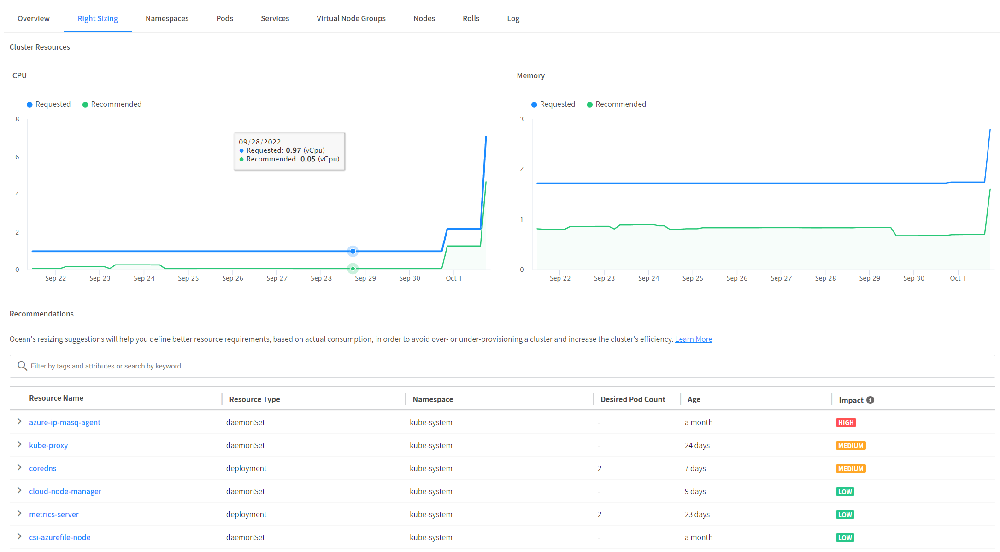
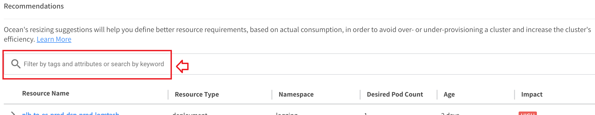
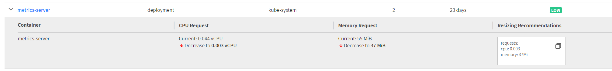

# Right Sizing
이 튜토리얼에서는 Ocean 크기 조정 제안과 이를 사용하는 방법에 대해 배웁니다. 
이 기능은 클러스터의 과도 또는 과소 프로비저닝을 방지하고 클러스터의 효율성을 높이기 위해 실제 소비를 기반으로 더 나은 리소스 요구 사항을 정의하는 데 도움이 됩니다.

## 전제 조건
이 자습서의 절차를 수행하기 전에 다음이 필요합니다.

- 스팟 계정
- AWS 계정
- Kubernetes 클러스터에 설치된 Metric Server
- Kubernetes 작업자 노드를 관리 하는 Ocean 클러스터
- 크기 조정 제안 및 그래프는 메트릭 수집 시작기준 최소 4일 후 데이터를 표시합니다.

## Metric server 설치
1. 다음 명령을 사용하여 지표 서버를 배포합니다.
    ```bash
    kubectl apply -f https://github.com/kubernetes-sigs/metrics-server/releases/latest/download/components.yaml
    ```
2. 다음 명령을 사용하여 metrics-server 배포에서 원하는 수의 pods를 실행하고 있는지 확인합니다.
    ```
    kubectl get deployment metrics-server -n kube-system
    ```
3. 출력 예는 다음과 같습니다.
    ```
    NAME             READY   UP-TO-DATE   AVAILABLE   AGE
    metrics-server   1/1     1            1           6m
    ```
## Right Sizing 살펴보기
</br>
Ocean은 클러스터 CPU 및 메모리 사용량을 지속적으로 모니터링하고 워크로드가 요청한 것보다 훨씬 더 많거나 적은 리소스를 소비하는 경우 권장 사항을 제공합니다.</br>
적절한 사이징 권장 사항은 컨테이너별로 제공되며 높은 수준에서 쉽게 표시할 수 있도록 전체 워크로드에 대해 요약됩니다. 컨테이너별 권장 사항을 통해 리소스 요청 변경이 필요한 애플리케이션을 정확하게 이해하고 이러한 변경 사항을 신속하게 구현할 수 있습니다.

1. Recommendations 항목에서 "metrics"를 검색합니다.</br>


2. metrics=server 를 드롭다운하고 권장 변경 값을 확인합니다.</br>


# 다음 과정
- 이전 과정 : [Ocean 비용 분석](./3-6_CostAnalysis.md)

# 참조
- [Use Right Sizing](https://docs.spot.io/ocean/tutorials/use-right-sizing)