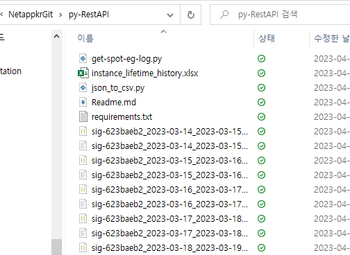

# python으로 Spot api 질의
로그 받아오거나 특정 데이터를 반복적으로 받아로려고 할 때 너무 피로도가 큽니다.</br>
로그 분서 관련 python 스크립트를 만들어 배포합니다.</br>
스파케티 코드라 부끄럽지만 업무하시는데 도움이 됬으면 좋겠습니다.

# 이용방법
1. 필요한 파이선 패키지 설치

```bash
$ pip install -r requirements.txt
```

2. 아래와 같이 명령
```bash
python get-spot-eg-log.py -gid <group id> -aid <account id> -token <Bear token> -fromDay <%Y-%m-%d> -toDay %Y-%m-%d -level ALL
```

```bash
python get-spot-eg-log.py --hlep
usage: get-spot-eg-log.py [-h] [-gid GROUP_ID] [-aid ACCOUNT_ID] [-token TOKEN] [-fromDay FROMDAY] [-toDay TODAY] [-level LEVEL]
get-spot-eg-log.py: error: unrecognized arguments: --hlep
```
### 명령어 예시
```
PS Netapp\NetappKR Github\NetappkrGit\py-RestAPI> python get-spot-eg-log.py -gid sig-623baeb2 -aid act-c2b5eb8b -token 000000000000000000000000000000000000000 -fromDay 2023-03-14 -toDay 2023-03-15 -level INFO
response code:200
```

## 결과
<egid>_<fromDay>_<toDay>.json 파일이 생성됩니다. </br>


## 추가 스크립트
## Json 파일 CSV로 변환

1. 단순 변환
Pandas 로 단순변환
디렉토리내에 떨어진 EG log를 CSV형식으로 변환합니다.

### 사용방법
```
python json_to_csv.py
```

2. 인스턴스 LifeTime 추출
디렉토리내에 모든 json파일들을 읽어서 결과를 xlsx 파일로 변환합니다.

### 사용방법
```
python spot_inst_lifetime.py
```

# 참고
- [elastigroup Aws Get Logs](https://docs.spot.io/api/#tag/Elastigroup-AWS/operation/elastigroupAwsGetLogs )
