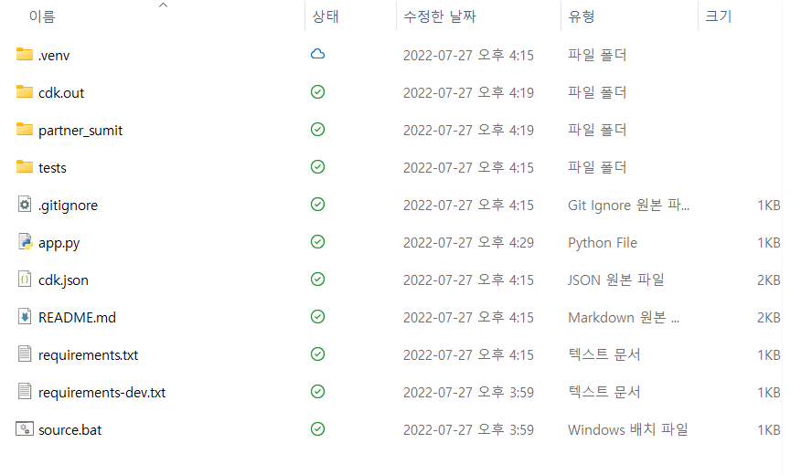

# AWS CDK 란?
---
 
AWS CDK를 사용하면 프로그래밍 언어의 뛰어난 표현력으로 클라우드에서 안정적이고 확장 가능하며 비용 효율적인 애플리케이션을 구축할 수 있습니다. 
이 접근 방식은 다음과 같은 많은 이점을 제공합니다.

- AWS 리소스에 대해 합리적이고 안전한 기본값을 자동으로 제공하는 상위 수준 구성으로 빌드하여 더 적은 코드로 더 많은 인프라를 정의합니다.

- 매개변수, 조건부, 루프, 구성 및 상속과 같은 프로그래밍 관용구를 사용하여 AWS 및 기타 업체에서 제공하는 빌딩 블록에서 시스템 설계를 모델링합니다.

- 인프라, 애플리케이션 코드 및 구성을 모두 한 곳에 배치하여 모든 이정표에서 완전한 클라우드 배포 가능 시스템을 확보하십시오.

- 코드 검토, 단위 테스트, 소스 제어와 같은 소프트웨어 엔지니어링 방식을 사용하여 인프라를 더욱 강력하게 만드십시오.

- AWS 리소스를 함께(스택 간에도) 연결하고 간단한 의도 지향 API를 사용하여 권한을 부여하십시오.

- 기존 AWS CloudFormation 템플릿을 가져와 리소스에 CDK API를 제공합니다.

- AWS CloudFormation의 강력한 기능을 사용하여 오류 시 롤백과 함께 인프라 배포를 예측 가능하고 반복적으로 수행하십시오.

- 조직 내 팀 또는 일반 대중과도 인프라 설계 패턴을 쉽게 공유할 수 있습니다.

AWS CDK는 TypeScript, JavaScript, Python, Java, C#/.Net 및 Go를 지원합니다. 
개발자는 이러한 지원 프로그래밍 언어 중 하나를 사용하여 Constructs 로 알려진 재사용 가능한 클라우드 구성 요소를 정의할 수 있습니다 . 
이를 스택 및 앱 으로 함께 구성합니다 .

# AWS CDK 환경설치
---
## CDK python 사전조건
- [Node.js 설치](https://nodejs.org/en/download/)
- AWS CLI 설치
- AWS CDK Toolkit 설치
- Python 3.6 이상
- 필요한 패키지
```python
python -m ensurepip --upgrade
python -m pip install --upgrade pip
python -m pip install --upgrade virtualenv
```
- [자격증명](https://docs.aws.amazon.com/general/latest/gr/aws-sec-cred-types.html)

## 설치
---
1. npm install -g aws-cdk
   a. 윈도우 client에서 실행하고 있다면 스크립트 보안설정을 해제해야만 정상적으로 작동합니다.
[참고 : about_Execution_Policies](https://docs.microsoft.com/ko-kr/powershell/module/microsoft.powershell.core/about/about_execution_policies?view=powershell-7.2)

```powershell
PS C:\Users\wyahn\OneDrive\자료\11. Netapp\파트너서밋준비> cdk --version
cdk : 이 시스템에서 스크립트를 실행할 수 없으므로 C:\Users\wyahn\AppData\Roaming\npm\cdk.ps1 파일을 로드할 수 없습니다. 자세한 내용은 about_Execution_Policies(https://go.microsoft.com/fwlink/?LinkID=135170)를 참조하십시오.
위치 줄:1 문자:1
+ cdk --version
+ ~~~
    + CategoryInfo          : 보안 오류: (:) [], PSSecurityException
    + FullyQualifiedErrorId : UnauthorizedAccess
PS C:\Users\wyahn\OneDrive\자료\11. Netapp\PartnerSumit> Get-ExecutionPolicy
Restricted
PS C:\Users\wyahn\OneDrive\자료\11. Netapp\PartnerSumit> Set-ExecutionPolicy -ExecutionPolicy Remotesigned
PS C:\Users\wyahn\OneDrive\자료\11. Netapp\PartnerSumit> cdk --version
2.33.0 (build 859272d)
```


2. python -m venv .venv
3. cdk init app --language python
4. cdk bootstrap aws://<AWSAccountNumber>/ap-northeast-2

```powershell
Initializing a new git repository...
'git'은(는) 내부 또는 외부 명령, 실행할 수 있는 프로그램, 또는
배치 파일이 아닙니다.
Unable to initialize git repository for your project.
Please run 'python -m venv .venv'!
Executing Creating virtualenv...
✅ All done!

PS C:\Users\wyahn\OneDrive\자료\11. Netapp\PartnerSumit> python -m venv .venv
PS C:\Users\wyahn\OneDrive\자료\11. Netapp\PartnerSumit> cdk bootstrap aws://<번호는 비밀>/ap-northeast-2                                                                         ⏳  Bootstrapping environment aws://037660834288/ap-northeast-2...
Trusted accounts for deployment: (none)
Trusted accounts for lookup: (none)
Using default execution policy of 'arn:aws:iam::aws:policy/AdministratorAccess'. Pass '--cloudformation-execution-policies' to customize.
CDKToolkit: creating CloudFormation changeset...
CDKToolkit | 0/6 | 오후 4:19:29 | UPDATE_IN_PROGRESS   | AWS::CloudFormation::Stack | CDKToolkit User Initiated
CDKToolkit | 0/6 | 오후 4:19:34 | UPDATE_IN_PROGRESS   | AWS::SSM::Parameter   | CdkBootstrapVersion 
CDKToolkit | 0/6 | 오후 4:19:35 | UPDATE_IN_PROGRESS   | AWS::ECR::Repository  | ContainerAssetsRepository 
CDKToolkit | 1/6 | 오후 4:19:36 | UPDATE_COMPLETE      | AWS::SSM::Parameter   | CdkBootstrapVersion
CDKToolkit | 2/6 | 오후 4:19:38 | UPDATE_COMPLETE      | AWS::ECR::Repository  | ContainerAssetsRepository
CDKToolkit | 3/6 | 오후 4:19:57 | UPDATE_COMPLETE_CLEA | AWS::CloudFormation::Stack | CDKToolkit 
CDKToolkit | 4/6 | 오후 4:19:57 | UPDATE_COMPLETE      | AWS::CloudFormation::Stack | CDKToolkit 
 ✅  Environment aws://<번호는 비밀>/ap-northeast-2 bootstrapped.

PS C:\Users\wyahn\OneDrive\자료\11. Netapp\PartnerSumit> 
```

### 결과물 확인

이제 신나게 즐길 수 있습니다.!

# 참고자료
---
[CDK guide](https://docs.aws.amazon.com/ko_kr/cdk/v2/guide/home.html)


