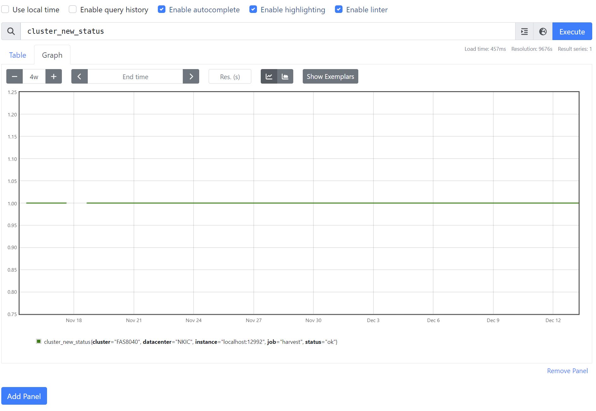

# Prometheus API로 데이터 용량관리 
프로메테우스를 운영중 예상치 못한 데이터 저장공간 부족으로 긴급하게 데이터를 관리가 필요한 경우가 있습니다.</br>
데이터 관리를 위한 관련 python 스크립트를 만들어 배포합니다.</br>
스파케티 코드라 부끄럽지만 업무하시는데 도움이 됬으면 좋겠습니다.


# 전제조건
1. Python 버전 3.x 이상
2. 필요한 파이선 패키지 설치
```bash
$ pip install -r requirements.txt
```

```
PS C:\Users\wooyeoun\OneDrive\자료\11. Netapp\NetappKR Github\NetappkrGit\py-RestAPI\Prometheus> python --version          
Python 3.11.7
PS C:\Users\wooyeoun\OneDrive\자료\11. Netapp\NetappKR Github\NetappkrGit\py-RestAPI\Prometheus> pip list
Package                           Version
--------------------------------- ----------
requests                          2.31.0
six                               1.16.0
typeguard                         2.13.3
typing_extensions                 4.8.0
urllib3                           2.1.0
```
3. prometheus 실행 시 ```--web.enable-admin-api``` 옵션이 활성화 되어 있어야 합니다.
- 이 옵션은 기본값이 아님으로 실행파일을 수정하고 프로메테우스를 재시작하세요.
```bash
 cat /etc/systemd/system/prometheus.service
```
```bash
[Unit]
Description=Prometheus
Wants=network-online.target
After=network-online.target

[Service]
User=prometheus
Group=prometheus
Type=simple
ExecStart=/usr/local/bin/prometheus \
    --config.file=/etc/prometheus/prometheus.yml \
    --storage.tsdb.path=/var/lib/prometheus/ \
    --storage.tsdb.retention.time=1y \
    --storage.tsdb.retention.size=900GB \
    --web.enable-admin-api \
    --web.console.templates=/etc/prometheus/consoles \
    --web.console.libraries=/etc/prometheus/console_libraries
[Install]
WantedBy=multi-user.target
```

# 설치
1. Prometheus 폴더의 파일들을 다운로드 받습니다.

# 사용법
1. 리눅스의 경우 ```--help`````` 옵션 입력 시 도움말 출력
```bash
./PromCli.py --help 
```
```bash
[root@harafana PromCli]# ./PromCli.py --help
usage: PromCli.py [-h] [-url SERVER_URL] {admin,series,target} ...

PromAPI 문서 참조

positional arguments:
  {admin,series,target}
                        sub-command help
    admin               used admin api "promcli admin --help"
    series              used series api "promcli series --help"
    target              used series api "promcli targets --help"

optional arguments:
  -h, --help            show this help message and exit
  -url SERVER_URL, --server-url SERVER_URL
                        prometheus server url default http://127.0.0.1:9090
```

## 예시
1. 데이터 확인 명령
```bash
 ./PromCli.py -url http://localhost:9090 series --series cluster_new_status --query "job=~'harvest'" -st 2023-11-18 -et 2023-11-19
```

```bash
Namespace(endtime='2023-11-19', kind='series', query="job=~'harvest'", series='cluster_new_status', server_url='http://localhost:9090', starttime='2023-11-18')
200
{
   "status": "success",
   "data": [
      {
         "__name__": "cluster_new_status",
         "cluster": "FAS8040",
         "datacenter": "NKIC",
         "instance": "localhost:12992",
         "job": "harvest",
         "status": "ok"
      }
   ]
}
```
2. 데이터 삭제 명령
```bash
./PromCli.py admin delete_series --series cluster_new_status -st 2023-11-18 -et 2023-11-19
```
```bash
Namespace(command='delete_series', endtime='2023-11-19', kind='admin', query="job='harvest'", series='cluster_new_status', server_url='http://127.0.0.1:9090', starttime='2023-11-18')
url: http://127.0.0.1:9090 starttime: 2023-11-18
204
```
