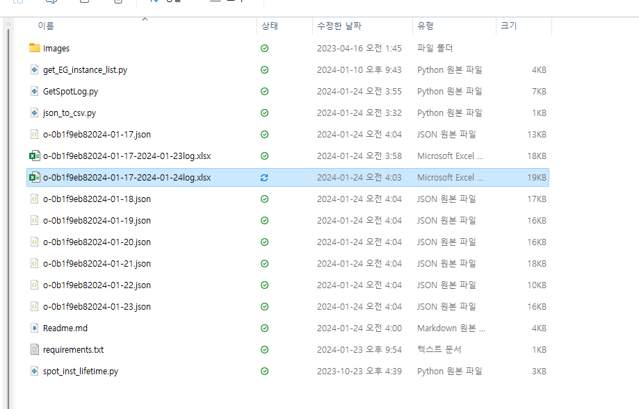

# python으로 Spot api 질의
로그 받아오거나 특정 데이터를 반복적으로 받아로려고 할 때 너무 피로도가 큽니다.</br>
로그 추출 관련 python 스크립트를 만들어 배포합니다.


# 전제조건
1. 필요한 파이선 패키지 설치
2. python version : 3.11 이상
```bash
$ pip install -r requirements.txt
```

# GetSpotLog.py
API 또는 S3에서 다운로드 받던 로그를 python 스크립트를 통해 빠르게 다운로드 받을 수 있습니다.

## 출력
```json``` 또는 ```Excel``` 파일이 생성됩니다. excel 파일의 경우 2가지 시트를 보여줍니다. </br>


1. ```{groupid}```</br>
#### {groupid}의 로그 파일
|message|severity|createdAt|
|---|---|---|
|Can't scale down nodes from Virtual Node Groups: [c-large-vng (ols-7c0bdc14), c-xlarge-vng (ols-b1638b27), m-large-vng (ols-1aa7de19), m-xlarge-vng (ols-9f9b0edc), m-2xlarge-vng (ols-f371e586), c-2xlarge-vng (ols-04054a82)]. These Virtual Node Groups have reached the minimum capacity|WARN|2024-01-17T14:59:11.000Z
|Can't scale down nodes from Virtual Node Groups: [c-large-vng (ols-7c0bdc14), c-xlarge-vng (ols-b1638b27), m-large-vng (ols-1aa7de19), m-xlarge-vng (ols-9f9b0edc), m-2xlarge-vng (ols-f371e586), c-2xlarge-vng (ols-04054a82)]. These Virtual Node Groups have reached the minimum capacity|WARN|2024-01-17T14:44:10.000Z

2. ```instance_lifetime_history```</br>
#### instance 별 시작시간 과 종료시간

| InstanceId | lanch_at| detach_at | message |
|---|---|---|---|
|i-0041f2d110d428d68|2024-01-17T10:40:55.000Z| |		
|i-005752cc0b4583a89|2024-01-22T20:39:03.000Z|2024-01-23T05:23:29.000Z|Reason: Scale down as part of instance recovery
|i-005752cc0b4583a89|2024-01-22T20:39:03.000Z|2024-01-23T05:23:08.000Z|Reason: Detach instances due to interruption
|i-00b5eb8b4e8a2c8a5|2024-01-23T03:07:30.000Z|2024-01-23T05:50:12.000Z|Reason: Auto scale
|i-00c0e0d858a1b22b8|2024-01-17T10:31:55.000Z|2024-01-21T08:45:59.000Z|Reason: Scale down as part of instance recovery
|i-00c0e0d858a1b22b8|2024-01-17T10:31:55.000Z|2024-01-21T08:45:38.000Z|Reason: Detach instances due to interruption

## command
```bash
python get-spot-eg-log.py -gid <group id> -aid <account id> -token <Bear token> -fromDay <%Y-%m-%d> -toDay %Y-%m-%d -level ALL
```

```bash
python GetSpotLog.py --help
usage: GetSpotLog.py [-h] [-token TOKEN] {eg,ocean} ...

eg group-id,token,fromData,toData,severity 입력 자세한 내용은 spot api 문서에 eg 로그 조회 참조

positional arguments:
  {eg,ocean}            sub-command help
    eg                  used eg api "GetSpotLog eg --help"
    ocean               used Ocean api "GetSpotLog ocean --help"

options:
  -h, --help            show this help message and exit
  -token TOKEN, --token TOKEN
                        bear token
```
```bash
python GetSpotLog.py eg --help
usage: GetSpotLog.py eg [-h] -gid GROUP_ID -aid ACCOUNT_ID -from FROMTIME -to TOTIME [-level LEVEL]

options:
  -h, --help            show this help message and exit
  -gid GROUP_ID, --group-id GROUP_ID
                        Elastigroup id
  -aid ACCOUNT_ID, --account-id ACCOUNT_ID
                        Account id
  -from FROMTIME, --fromtime FROMTIME
                        from time yyyy-mm-dd hh:mm:ss example '2023-12-09 13:31:00'
  -to TOTIME, --totime TOTIME
                        to time yyyy-mm-dd hh:mm:ss example '2024-01-08 13:31:00'
  -level LEVEL, --level LEVEL
                        severity default is ALL / you can only insert ALl,INFO,DEBUG,ERROR
```
### 명령어 예시
- bash
```bash
python GetSpotLog.py eg \
    -gid sig-3e6f72ac \
    -aid act-8e1eda41 \
    -token 000000000000000000000000000000000000000 \
    -from 2024-01-17 00:00:00 \
    -to 2024-01-23 00:00:00 \
    -level INFO
```
- powershell
```powershell
python GetSpotLog.py eg `
    -gid sig-3e6f72ac `
    -aid act-8e1eda41 `
    -token 000000000000000000000000000000000000000 `
    -from '2024-01-17 00:00:00' `
    -to '2024-01-23 00:00:00' `
    -level INFO `
    -o excel
```

```powershell
python GetSpotLog.py ocean `
    -gid o-0b1f9eb8 `
    -aid act-8e1eda41 `
    -token 000000000000000000000000000000000000000 `
    -from '2024-01-17 00:00:00' `
    -to '2024-01-23 00:00:00' `
    -level INFO `
    -o excel
```

<details>
<summary>추가 스크립트</summary>

<!-- summary 아래 한칸 공백 두어야함 -->
# get_EG_instance_list.py
1. command
```
python get_EG_instance_list.py -gid <group id> -aid <account id> -token <Bear token>
```
### 명령어 예시
```
PS Netapp\NetappKR Github\NetappkrGit\py-RestAPI> python get_EG_instance_list.py -gid sig-060b82d2 -aid act-7b8c3f1d -token 000000000000000000000000000000000000000
response code:200
```

## 추가 스크립트
## Json 파일 CSV로 변환

1. 단순 변환
Pandas 로 단순변환
디렉토리내에 떨어진 EG log를 CSV형식으로 변환합니다.

### 사용방법
```
python json_to_csv.py
```

2. 인스턴스 LifeTime 추출
디렉토리내에 모든 json파일들을 읽어서 결과를 xlsx 파일로 변환합니다.

### 사용방법
```
python spot_inst_lifetime.py
```
</details>

# 참고
- [elastigroup Aws Get Logs](https://docs.spot.io/api/#tag/Elastigroup-AWS/operation/elastigroupAwsGetLogs )
